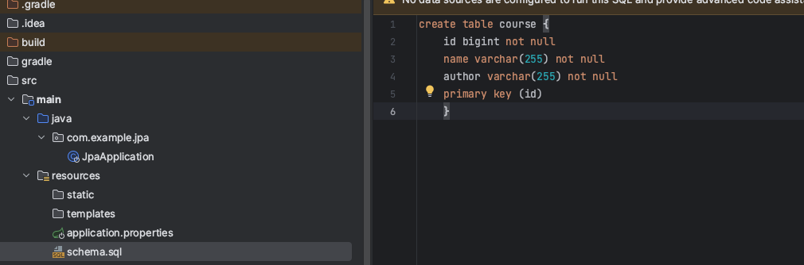
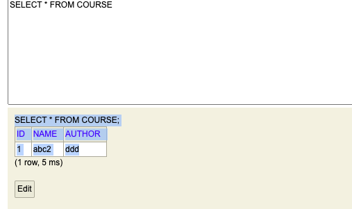

# Spring JDBC 

<br />

## Spring JDBC 

{: .highlight } 
> - `runtimeOnly 'com.h2database:h2'` : 데이터 베이스 설치 h2
> -  `implementation 'org.springframework.boot:spring-boot-starter-jdbc'` : jdbc설치

<br />

> resource/application.properties 아래 내용 적으면 db접근 가능

> localhost:8080/h2-console

```json
# application.properties ??

# h2 database web?? ??
spring.h2.console.enabled=true
spring.h2.console.path=/h2-console
# spring - h2 ??
spring.datasource.driverClassName=org.h2.Driver
spring.datasource.url=jdbc:h2:mem:testdb#spring.datasource.url=jdbc:h2:mem:test
spring.datasource.username=sa
spring.datasource.password=

spring.sql.init.mode=always

server.port=8090
```

<br />



{: .highlight } 
> - h2에 테이블 생성하기
> - `src/main/ressource/schema.sql`
> - Spring Data JPA starter를 활용할 때 마다 자동으로 schema.sql파일을 가져와서 H2에 테이블 생성해줌

```sql
create table course
(
    id bigint not null,
        name varchar (255) not null,
        author varchar (255) not null,
        primary key (id)
);
```

<br />
<br />

{: .highlight } 
> - 데이터 베이스에 데이터 넣기
> - repository 생성
>   - JdbcRepository.java

```java
@Repository
public class JdbcRepository {


    @Autowired
    private JdbcTemplate jdbcTemplate;

    private static String INSERT_QUERY =
            //텍스트 블록의 좋은 점은 쿼리 형식을 그대로 유지할 수 있다.
            """
                insert into course (id, name, author)
                VALUES (1, 'asdasd', 'asdasd');
            """;

    public void insert(){
        //update쿼리는 업데이트, 삽입, 삭제 모두에 쓰인다.
        jdbcTemplate.update(INSERT_QUERY);
    }
}
```

<br />
<br />

{: .highlight } 
> - 앱 구동 시 실행될 sql문 정의하기 `CommandLineRunner` 구현
> - MyCommandLineRunner.java 생성

```java
@Component
public class MyCommandLineRunner implements CommandLineRunner {

    @Autowired
    private JdbcRepository jdbcRepository;

    @Override
    public void run(String... args) throws Exception {
        jdbcRepository.insert();
    }
}
```

<br />
<br />


> 끝

---

<br />
<br />
<br />

# 하드코딩 말고 값을 받아와 데이터 베이스에 넣은 방법



<br />
<br />

{: .highlight } 
> - dto 생성 (1)

```java
@Setter
@Getter
@NoArgsConstructor
@AllArgsConstructor
@ToString
public class Course {
    private long id;
    private String name;
    private String author;
}
```

{: .highlight } 
> - repository에 db데이터 삽입 로직 넣기 (2)
>   - update : 삭제/삽입/수정에 사용
>   - queryForObject : select문에 사용 `두번째 인자로 어떤 클래스로 매핑해 결과를 받을지 결정(DTO)`

```java
@Repository
public class JdbcRepository {


    @Autowired
    private JdbcTemplate jdbcTemplate;

    private static String INSERT_QUERY =
            //텍스트 블록의 좋은 점은 쿼리 형식을 그대로 유지할 수 있다.
            """
                insert into course (id, name, author)
                VALUES (?,?,?);
            """;

    private static String SELECT_QUERY =
            """
                select * from course
                where id = ?    
            """;


    public void insert(Course course){
        //update쿼리는 업데이트, 삽입, 삭제 모두에 쓰인다.
        jdbcTemplate.update(INSERT_QUERY,course.getId(),course.getName(),course.getAuthor());
    }

    
    public Course findById(long id){
        return jdbcTemplate.queryForObject(SELECT_QUERY,new BeanPropertyRowMapper<>(Course.class),id);
        //BeanPropertyRowMapper를 이용해 결과를 매핑함
        //매핑하는 클래스는 Course.class
    }
}
```

{: .highlight } 
> - 어플 구동 시 실행할 코드 삽입 implements로 구현 (끝)

```java
@Component
public class MyCommandLineRunner implements CommandLineRunner {

    @Autowired
    private JdbcRepository jdbcRepository;

    @Override
    public void run(String... args) throws Exception {
        jdbcRepository.insert(new Course(1,"abc2","ddd"));

        System.out.println(jdbcRepository.findById(1));
    }
}

```