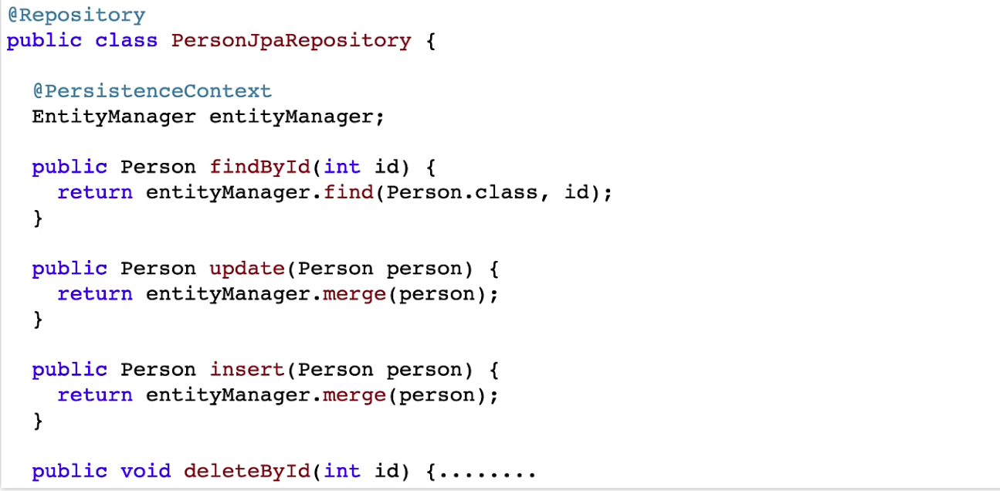

# Spring JPA

<br />

## Spring JPA




{: .new }
> - JPA를 이용하면 직접 매핑이 가능
> - @Entity적용된건 Bean에서 테이블로 연결되는 매핑

<br />

{: .new }
> - Entity (DTO 생성하기) (1)

```java
@Setter
@Getter
@AllArgsConstructor
@ToString
@NoArgsConstructor
@Entity
public class Course {
    @Id
    private long id;
    //데이터 베이스와 이름이 다르다면 (name="name") 같다면 굳이 작성할 필요없다.
    @Column(name="name")
    private String name;
    @Column(name="author")
    private String author;
}

```

<br />

{: .new }
> - JPARepository.java
>   - `entityManager`로 매니징 (2)

```java
@Repository
public class JPARepository {

    @Autowired
    private EntityManager entityManager;

    //행삽입 메소드
    public void insert(Course course){
        entityManager.merge(course);
    }

    //조회 메소드
    public Course findById(long id){
        return entityManager.find(Course.class, id);
    }
}
```

<br />

{: .new }
> - MyCommandLineRunner.java (3)
>   - 끝


```java
//jpa로 쿼리를 실행할 때 트랜잭션을 허용해야한다/ 이때 필요한 것이
@Transactional
@Component
public class MyCommandLineRunner implements CommandLineRunner {

//    @Autowired
//    private JdbcRepository jdbcRepository;

    @Autowired
    private JPARepository jpaRepository;

    @Override
    public void run(String... args) throws Exception {
        jpaRepository.insert(new Course(1,"jpa","jpajpa"));

        System.out.println(jpaRepository.findById(1));
    }
}
```

<br />

{: .new }
> - application.properties

```json
spring.jpa.show-sql=true
```

<br />
<br />
<br />

## 끝

---

<br />
<br />
<br />

# JDBC Data JPA 방식

<br />


{: .new }
> - `Data JPA` : 사용할 때 interface로 JpaRepository를 상속 받아 구현한다.
>   - entitymanager를 통해 관리 할 필요 없음
> - spring data jpa 사용하면 적은 코드로 구현이 가능
>   - 인터페이스만 생성하면 됨

<br />


{: .new }
> - Course.java
>   - dto 생성

```java
@Setter
@Getter
@AllArgsConstructor
@ToString
@NoArgsConstructor
@Entity
public class Course {
    @Id
    private long id;
    //데이터 베이스와 이름이 다르다면 (name="name") 같다면 굳이 작성할 필요없다.
    @Column(name="name")
    private String name;
    @Column(name="author")
    private String author;
}

```

<br />


{: .new }
> - MyJpaRepository.java
>   - 레포지토리 생성 (db통신, dto 연결)

```java
public interface DataJpaRepository extends JpaRepository<Course, Long> {
}
```


<br />

{: .new }
> - MyCommandLineRunner.java 
>   - `save` : insert 기능
>   - `findById(id).get()` : select 기능
>   - `count()` : select * count 같은 기능
>   - `deleteById` : 삭제 기능

```java
@Transactional
@Component
public class MyCommandLineRunner implements CommandLineRunner {

    @Autowired
    private DataJpaRepository dataJpaRepository;

    @Override
    public void run(String... args) throws Exception {
        dataJpaRepository.save(new Course(1,"jpa-data","jpajpa-data"));

        System.out.println(dataJpaRepository.findById(1l));
    }
}
```

<br />
<br />
<br />
<br />
<br />
<br />

---

## 커스텀 함수 생성하기

{: .note }
> - SpringDataJpaRepository에서 커스텀 메서드 추가하기
> - 특정 `column`의 value의 값으로 엔티티 찾아내기!

<br />

{: .note }
> - Course (데이터 베이스와 연결되는 엔티티) , 테이블

```java
@Setter
@Getter
@AllArgsConstructor
@ToString
@NoArgsConstructor
@Entity
public class Course {
    @Id
    private long id;
    //데이터 베이스와 이름이 다르다면 (name="name") 같다면 굳이 작성할 필요없다.
    @Column(name="name")
    private String name;
    @Column(name="author")
    private String author;
}
```

<br />

{: .note }
> - DataJpaRepository.interface
>   - 커스텀 메소드 만들기
>   - 특정 컬럼의 value값과 같은 엔티티만 결과로 반환하기
> - `명명 규칙`
>   - `findBy`+ 컬럼 이름(`id`,`name`,`author`)

```java
public interface DataJpaRepository extends JpaRepository<Course, Long> {

    //파라미터로 들어온 값과 컬럼(author)이 같은 엔티티만 반환
    List<Course> findByAuthor(String author);
    //파라미터로 들어온 값과 컬럼(Name)이 같은 엔티티만 반환
    List<Course> findByName(String Name);

}
```

<br />

{: .note }
> - JpaRepository 사용


```java
//jpa로 쿼리를 실행할 때 트랜잭션을 허용해야한다/ 이때 필요한 것이
@Transactional
@Component
public class MyCommandLineRunner implements CommandLineRunner {

    @Autowired
    private DataJpaRepository dataJpaRepository;

    @Override
    public void run(String... args) throws Exception {
        dataJpaRepository.save(new Course(1,"jpa-data","jpajpa-data"));
        dataJpaRepository.save(new Course(2,"jpa-data2","AAAA"));
        dataJpaRepository.save(new Course(3,"jpaasd-data2","BBBB"));

        //Optional[Course(id=1, name=jpa-data, author=jpajpa-data)]
        System.out.println(dataJpaRepository.findById(1l));
        //[Course(id=2, name=jpa-data2, author=AAAA)]
        System.out.println(dataJpaRepository.findByAuthor("AAAA"));
    }
}
```