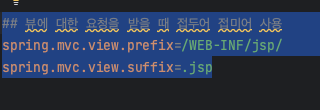

# Spring JSP

<br />

## Spring JSP

- 
- 
- 

{: .new }
> - JSP에서는 Spring에서 정해진 폴더에 생성해야한다.
> - META-INF/resources/WEB_INF/jsp/안에 파일.jsp
> - jsp뷰라고 한다.

<br />

{: .new }
> - 아래는 컨트롤러 파일
> - `@ResponseBody가` 없어야 jsp로 자동 리다이렉션 해줌

```java
    //html를 통채로 반환하기
    //StringBuffer 이용
    @RequestMapping("hi-html")
    public String sayHelloJsp(){
        return "sayHello";
    }
```

<br />

{: .new }
> - 의존성 두개 추가
>   - 'org.apache.tomcat.embed:tomcat-embed-jasper'
>   - 'javax.servlet:jstl:1.1.2'

```java
    implementation 'org.apache.tomcat.embed:tomcat-embed-jasper'
    implementation 'javax.servlet:jstl:1.1.2'
```

<br />

{: .new }
- jsp 파일 생성

```html
<html>
<head>hihi</head>
<body>asdnasdns</body>
</html>
```


<br />
<br />

## 끝


---


## controller -(model)-> view

{: .new }
> - controller에서 view(화면)에 데이터를 전송할 때 model에 넣어서 전송함
> - jsp에 전송할 값은 모두 model에 넣어서 전송하면 됨

<br />
<br />

{: .note }
> - controller에서 받기

```java
@Controller
public class loginController {

    //html를 통채로 반환하기
    @RequestMapping("v1/login")
    public String sayHelloJsp(@RequestParam String name, ModelMap modelMap){
        //name이라는 이름으로 name변수 전달
        modelMap.put("name",name);
        return "sayHello";
    }
}

```

<br />

{: .note }
> - jsp에서 컨트롤러에서 보낸 데이터 받기

```jsp
${name}
```

---

## jsp이용해서 간단 로그인 구현

<br />

{: .note }
> - 로그인 인증 클래스 생성
> - `AuthenticationService.java`

```java
//AuthenticationService.java
//bean으로 등록 spring관리하게
@Service
public class AuthenticationService {
    //인스턴스 메서드
    public boolean authentication(){
        boolean isValidUserName = username.equalsIgnoreCase("id");
        boolean isValidPassword = password.equalsIgnoreCase("password");

        return isValidUserName && isValidPassword;
    }
}
```


<br />

{: .note }
> - `controller.java`

```java
@Controller
public class loginController {

    //spring이 AuthenticationService 인스턴스 생성
    //후 연결하려면 authenticationService bean에 등록해야함
    //@@service로 하면 됨
    private AuthenticationService authenticationService;

    //html를 통채로 반환하기
    //StringBuffer 이용
    @GetMapping("v1/login")
    public String sayHelloJsp(@RequestParam String name, @RequestParam String password, ModelMap modelMap){

        if(authenticationService.authenticaticate(name, password)){
            model.put("name", name)
            model.put("password", password)
            
            //웰컴 페이지 이동
            return "welcome"
        }
        //로그인 페이지 이동
        return "login";
    }
}
```