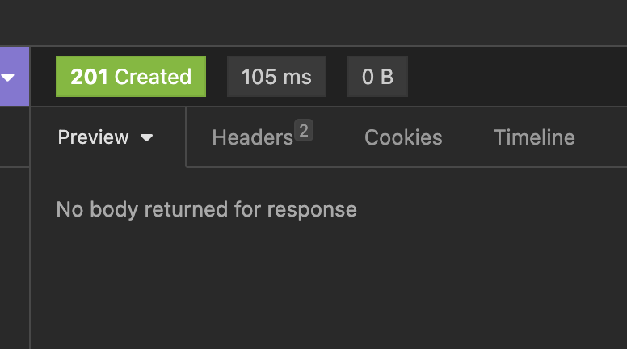

# Spring 상태 코드



{: .highlight } 
> - 400 : 요청이 좋지 않다.
> - 401 : 토큰 에러
> - 404 : 리소스가 없음
> - 500 : 서버 에러
>   - `ResponseEntity`
>       - accepted
>       - badRequest
>       - created
>       - noContent
>       - notFound

<br />
<br />
<br />

---

# Spring 201 반환 + 헤더 추가

```java
// 201 응답코드엣 location이라는 헤더를 추가해서 반환하는 예시
    @PostMapping("users")
    public ResponseEntity<UserDTO> inputtodo(@RequestBody UserDTO userDTO ){
        UserDTO userDTO1 = service.save(userDTO);
                     //현재 요청에 해당하는url 반환
        URI location = ServletUriComponentsBuilder.fromCurrentRequest()
                //현재 url에서 /id를 추가하고 싶다.
                .path("/{id}")
                //위의 id값을 바꿔줌
                .buildAndExpand(userDTO1.getId())
                //url로 변경
                .toUri();
        //헤더에 location을 추가해서 반환할 수 있다.
        return ResponseEntity.created(location).build();
    }
```

<br />
<br />
<br />

---

# Spring 404 반환 

<br />

> 에러 클래스 생성 `UserNotFoundException.java`

```java
//404반환
@ResponseStatus(code = HttpStatus.NOT_FOUND)
public class UserNotFoundException extends RuntimeException {
    public UserNotFoundException(String message){
        super(message);
    }
}

```

<br />

> controller.java

```java
    //todo 하나의 사용자 조회
    @GetMapping("/users/{id}")
    public UserDTO retrunFind(@PathVariable int id){
        UserDTO userDTO = service.findOne(id);
        // 조회가 안된다면 error exception 호출
        if(userDTO == null) throw new UserNotFoundException("id:"+id);
        return service.findOne(id);
    }
```


<br />
<br />
<br />
<br />

---

# Spring RestAPI TodoList


{: .new }
> - RestApi로 todo list 구현하기
> - 이형식으로 데이터 받음

> DTO데이터를 받는 부분 `UserDTO.java`

```java
@Getter@Setter
@AllArgsConstructor
@NoArgsConstructor
@ToString
public class UserDTO {
    private Integer id;
    private String name;
    private LocalDate birthDate;
}
```

<br />

> dao (service.java)

```java
//빈 주입
@Component
public class UserDaoService {
    //더미 데이터
    private static List<UserDTO> Users = new ArrayList<>();
    private static int USER_COUNT = 0;

    static {
        //더미 데이터
        Users.add(new UserDTO(++USER_COUNT,"admin", LocalDate.now().minusYears(30)));
        Users.add(new UserDTO(++USER_COUNT,"Eve", LocalDate.now().minusYears(25)));
        Users.add(new UserDTO(++USER_COUNT,"Jim", LocalDate.now().minusYears(20)));
    }

    //TODO모든 사용자 찾는 메서드
    public List<UserDTO> findAll(){
        return Users;
    }

    //TODO 하나의 사용자만 찾기
    public UserDTO findOne(int id){
        Predicate<? super UserDTO> predicate = user -> user.getId().equals(id);
        //orElse : 값이 있으면 값을 반환, 없으면 정한 다른 값 반환
        return Users.stream().filter(predicate).findFirst().orElse(null);
    }

    //TODO 하나 추가하기
    public UserDTO save(UserDTO userDTO){
        userDTO.setId(++USER_COUNT);
        Users.add(userDTO);
        return userDTO;
    }

    //TODO 하나 삭제 하기
    public void delebyid(int id){
        //id가 같은게 있다면 predicate에 담김
        Predicate<? super UserDTO> predicate = userDTO -> userDTO.getId().equals(id);
        Users.removeIf(predicate);
    }
}
```

<br />

> controller.java

```java
@RestController
@RequestMapping("v1")
public class ResController {
    //생성자 주입
    private UserDaoService service;
    public ResController(UserDaoService service){
        this.service = service;
    }
    //todo 모든 사용자 조회
    @GetMapping("/users")
    public List<UserDTO> returnAll(){
        return service.findAll();
    }
    //todo 하나의 사용자 조회
    @GetMapping("/users/{id}")
    public UserDTO retrunFind(@PathVariable int id){
        return service.findOne(id);
    }
    //todo 하나 추가하기
    @PostMapping("users")
    public void inputtodo(@RequestBody UserDTO userDTO ){
        service.save(userDTO);
    }
}

```

<br />

> controller.java

```java
@RestController
@RequestMapping("v1")
public class ResController {
    //생성자 주입
    private UserDaoService service;
    public ResController(UserDaoService service){
        this.service = service;
    }

    //todo 모든 사용자 조회
    @GetMapping("/users")
    public List<UserDTO> returnAll(){
        return service.findAll();
    }
    
    //todo 하나의 사용자 조회
    @GetMapping("/users/{id}")
    public UserDTO retrunFind(@PathVariable int id){
        UserDTO userDTO = service.findOne(id);
        //없을 때 에러 반환
        if(userDTO == null) throw new UserNotFoundException("id:"+id);
        return service.findOne(id);
    }

    //todo 하나 추가하기
    @PostMapping("users")
    public ResponseEntity<UserDTO> inputtodo(@RequestBody UserDTO userDTO ){
        UserDTO userDTO1 = service.save(userDTO);
        URI location = ServletUriComponentsBuilder.fromCurrentRequest()
                .path("/{id}")
                .buildAndExpand(userDTO1.getId())
                .toUri();
        return ResponseEntity.created(location).build();
    }
    
    //todo 삭제 하기
    @DeleteMapping("/users/{id}")
    public void deleteUser(@PathVariable int id){
        service.delebyid(id);
    }
}
```

<br />
<br />
<br />
<br />

> post 요청은 아래처럼!

```java
{
    "name": "Ravi",
    "birthDate": "1997-08-11"
}
```