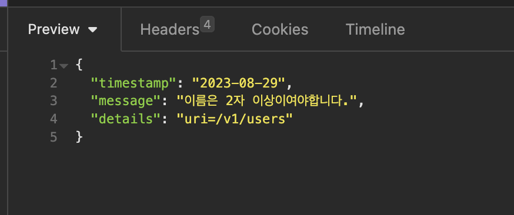

# Spring Rest Validation 에러 처리



{: .highlight } 
> - validation + error 반환 커스텀 하기
> - `spring-boot-starter-validation`
<br />
<br />
<br />

---

# Spring Rest Validation 에러 처리


{: .highlight } 
> - validation + 커스텀 에러 처리하기
> - validation 추가
>   - 의존성 설치
>   - `@Size`로 validation 추가 , message는 validation 안 맞을 시 반환 되는 메세지

<br />

```java
// Entity
@Getter@Setter
@AllArgsConstructor
@NoArgsConstructor
@ToString
public class UserDTO {
    private Integer id;
    @Size(min=2,message = "이름은 2자 이상이여야합니다.")
    private String name;

    private LocalDate birthDate;
}
```

<br />

{: .highlight } 
> - 에러 시 반환 하고 싶은 필드들
>   - `ErrorDetail.java`

```java
@AllArgsConstructor
@NoArgsConstructor
@Getter@Setter@ToString
public class ErrorDetails {
    // 에러로 반환할 필드들
    private LocalDate timestamp;
    private String message;
    private String details;
}
```

<br />

{: .highlight } 
> - 커스텀 에러 적용하기
>   - 커스텀 에러 처리하기
>   - `@RestControllerAdvice`: 모든 컨트롤러에 대해 적용된다.
>   - `ResponseEntityExceptionHandler`를 오버라이딩해서 `handleMethodArgumentNotValid`오버라이딩 한다.

```java
//모든 컨트롤러에 대해서 적용된다.
@RestControllerAdvice
public class CustomResponseException extends ResponseEntityExceptionHandler {


//ResponseEntityExceptionHandler클래스의 handleMethodArgumentNotValid를 오버라이딩 한다.
    @Override
    protected ResponseEntity<Object> handleMethodArgumentNotValid(
        MethodArgumentNotValidException ex, HttpHeaders headers, HttpStatusCode status, WebRequest request) {

        // 반환할 커스텀 에러 타입
        ErrorDetails errorDetails = new ErrorDetails(LocalDate.now(), ex.getFieldError().getDefaultMessage(), request.getDescription(false));

        //명시한 커스텀 에러 타입, 상태코드를 반환한다.
        return new ResponseEntity(errorDetails, HttpStatus.BAD_REQUEST);
    }
}
```