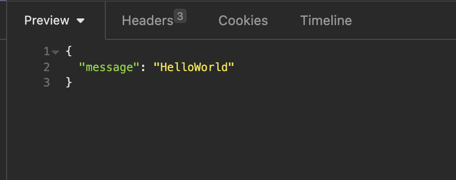

# 자바 crud

<br />

## 자바 crud

{: .new } 
> - `@RequestMapping("/api/v1")` : 공통된 api앞 경로를 넣을 때 사용
> - `get 요청` 받기
>   - `@GetMapping`
>   - `@PostMapping`
>   - `@PutMapping`
>   - `@DeleteMapping`


<br />

```java
@RestController
//공통된 api앞 경로를 넣을 때 사용
@RequestMapping("/api/v1")
public class GetController {
    //http://localhost:8080/api/v1/home - get
    @GetMapping("/home")
    public String getName(){
        return "get name";
    }
    //get 요청
    //path variable
    //http://localhost:8080/api/v1/variable/[변수]
    @GetMapping("/variable/{variable}")
    public String getVariable1(@PathVariable String variable){
        return variable;
    }
    @GetMapping("/variable2/{variable}")
    public String getVariable2(@PathVariable("variable") String var){
        return var;
    }
    // get 요청 쿼리 스트링 받기
    // http://localhost:8080/api/v1/request1?
    // name=flature&
    // email=thinkground.flature@gmail.com&
    // organization=thinkground
    @GetMapping(value = "/request1")
    public String getRequestParam1(
            @RequestParam String name,
            @RequestParam String email,
            @RequestParam String organization) {
        return name + " " + email + " " + organization;
    }
    // DTO 용헌 RESTAPI 응답
    // http://localhost:8080/api/v1/get-api/request3?name=flature&email=thinkground.flature@gmail.com&organization=thinkground
    @GetMapping(value="/request3")
    public String getRequestParam3(MemberDTO memberDTO){
        return memberDTO.toString();
    }
}
```

<br />
<br />
<br />

---

## api요청에 params값 받기

{: .new } 
> - `@RequestParam` : 쿼리 파라미터(Query Parameter)를 처리하는 데 사용되는 어노테이션
> - `@PathVariable` : 요청의 경로 변수(Path Variable)를 처리하는 데 사용
> - `@RequestBody` :  요청의 본문(body)을 처리하는 데 사용

<br />

> 예제 `@RequestParam`

```java
@RestController
public class TestRequestApi {

    // Request Parameter 방식
    @GetMapping("/test/param")
    public String requestParam(
            @RequestParam("name") String name,
            @RequestParam("age") Integer age
    ) {
        return "Hello, Request Param, I am " + name + ", " + age;
    }
}
```


<br />

> 예제 `@PathVariable`

```java
@RestController
public class TestRequestApi {
    // Path Variable 방식
    @GetMapping("/test/path/{name}/{age}")
    public String requestPathVariable(
            @PathVariable("name") String name,
            @PathVariable("age") Integer age
    ) {
        return "Hello, Path Variable, I am" + name + ", " + age;
    }
}
```

<br />

> 예제 `@RequestParam`

```java
@RestController
public class TestRequestApi {
    // Request Body 방식
    @PostMapping("/test/body")
    public String requestBody(
            @RequestBody TestRequestBody request
    ) {
        return "Hello, Request Body, I am " + request.name + ", " + request.age;
    }

    public static class TestRequestBody {
        String name;
        Integer age;

        public TestRequestBody(String name, Integer age) {
            this.name = name;
            this.age = age;
        }
    }
}
```

<br />

---

# DTO를 이용한 CRUD

{: .new } 
> - `controller` : url로 받기 (service 호출)
> - `repository` : 데이터 베이스에 값 삽입 
> - `service` : 비즈니스 로직 (repository 호출)

<br />

> controller 

```java
@RestController
@RequestMapping("/users")
public class HomeController {

    //의존성 주입
    @Autowired
    UserService userService;

    //url 설계
    //insert
    @PostMapping("/")
    public UserDTO insertUser(@RequestBody UserDTO user){
        return userService.insertUser((user));
    }

    //Delete
    @DeleteMapping("{userId}")
    public void delete(@PathVariable String userId){
        userService.deleteUser(userId);
    }
}
```

<br />

> repository (db연결)

```java
//DB랑 실제로 연결하는 코드
@Repository
public class UserRepository {
    //db 연동하는 코드
    static public ArrayList<UserDTO> users;

    //static{}은 한번만 실행됨
    static {
        users = new ArrayList<>();
        users.add(new UserDTO("Kim", "test1", "1324"));
        users.add(new UserDTO("lee", "tes", "1345624"));
        users.add(new UserDTO("Yoo", "es", "4"));
    }

    //데이터 베이스 대신 데이터 조작 함수
    //Insert 반환 값 UserDTO , 인자 String
    public UserDTO insertUser(UserDTO user){
        users.add(user);
        return user;
    }
    //Delete 반환값 void , params : userId
    public void deleteUser(String userId){
        users.removeIf(userDTO -> userDTO.getUserId().equals(userId));
    }
}
```

<br />

> service (비즈니스 로직)

```java
@Service
public class UserService {

    //UserService와 userRepository 연결 (의존성 주입)
    @Autowired
    UserRepository userRepository;

    //insert 비즈니스 로직
    //repository연결
    public UserDTO insertUser(UserDTO user){
        return userRepository.insertUser(user);
    }
    //delete 비즈니스 로직
    //repository연결
    public void deleteUser(String userId){
        userRepository.deleteUser(userId);
    }
}
```

<br />

> dto

```java
// 생성자 , getter , setter 만듦
@Getter@Setter
@AllArgsConstructor
public class UserDTO {
    private String userName;
    private String userId;
    private String userPw;
}
```

<br />
<br />

---

## html 반환하기

```java
    //html를 통채로 반환하기
    //StringBuffer 이용
    @RequestMapping("hi-html")
    public String Hihtml(){
        //문자열을 연속적으로 붙일때 보통 StringBuffer를 이용한다.
        StringBuffer sb = new StringBuffer();
        sb.append("<html>");
        sb.append("<head>");
        sb.append("<title>My first Html Page</title>");
        sb.append("</head>");
        sb.append("<body>");
        sb.append("html return");
        sb.append("</body>");
        sb.append("</html>");
        return sb.toString();
    }
```


<br />
<br />
<br />
<br />


---

## Json 타입으로 리턴하기




{: .note } 
> - class를 하나 생성해서 Json으로 리턴이 가능하다.

<br />

> HelloDTO.java

```java
@Getter@Setter
@AllArgsConstructor
@NoArgsConstructor
@ToString
public class HelloDTO {
    private String Message;
}
```

<br />

> Controller.java

```java
@RestController
@RequestMapping("v1")
public class ResController {

    //Json으로 리턴하기
    @GetMapping("hello-json")
    public HelloDTO HelloJson(){
        return new HelloDTO("HelloWorld");
    }
}
```