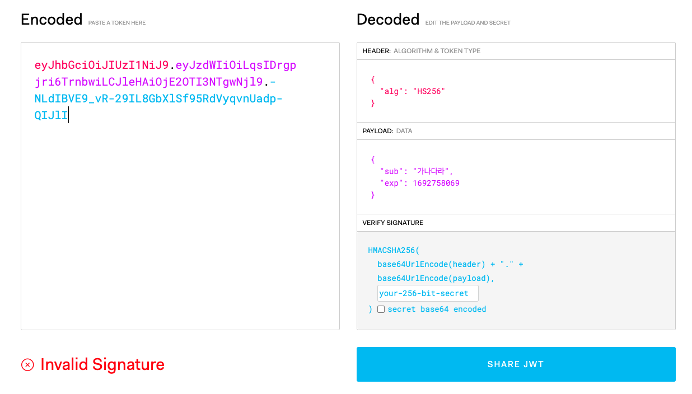
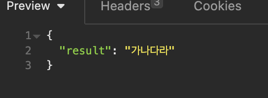
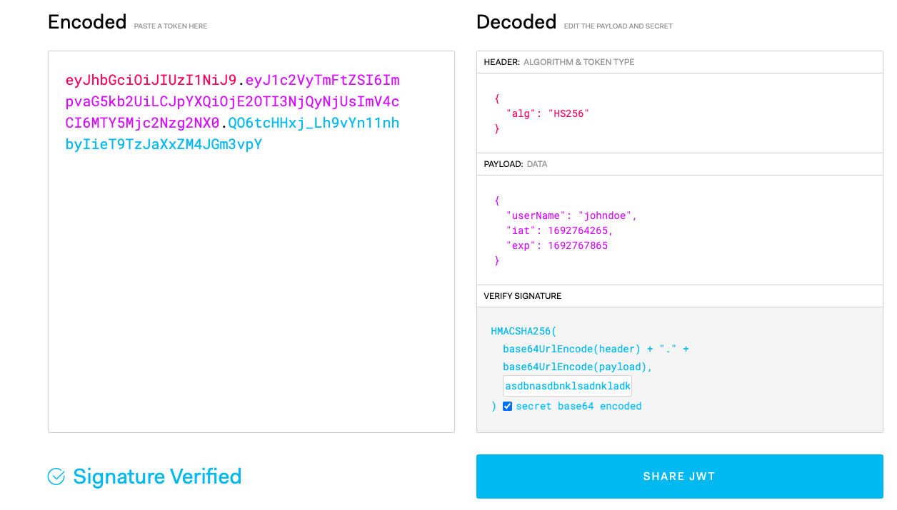
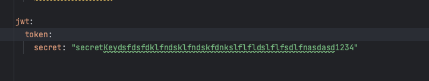
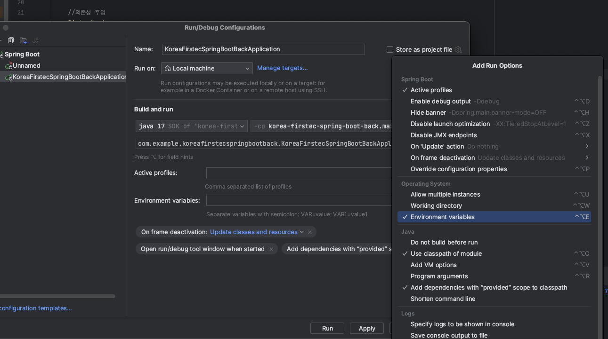

# Spring JWT

<br />

## Spring JWT



{: .new } 
> - Spring JWT 구현하기
> - 4개 build.gradle 추가
>   - `implementation 'javax.xml.bind:jaxb-api:2.3.1'`
>   - `implementation 'io.jsonwebtoken:jjwt-api:0.11.2'`
>   - `runtimeOnly 'io.jsonwebtoken:jjwt-impl:0.11.2'`
>   - `runtimeOnly 'io.jsonwebtoken:jjwt-jackson:0.11.2'`

<br />

{: .note } 
> - security/SecurityService.java

```java
@Service
public class SecurityService {

    //SECRET_KEY는 많이 길어야함
    private static final String SECRET_KEY="asdasdadsadasdasdsadsadassasldmasldmasdsadasddasdas";


    //토큰 발행하는 메소드
    //subject는 보통 유저 id
    public String createToken(String subject, long expTime){
        if(expTime<=0) throw new RuntimeException("만료시간은 0보다 커야합니다.");

        //토큰만들때 사용할 알고리즘 선택
        SignatureAlgorithm signatureAlgorithm = SignatureAlgorithm.HS256;
        //string형태의 키를 byte로 만들어줌 byte로 만들어줘야함
        byte[] secretKeyBytes = DatatypeConverter.parseBase64Binary(SECRET_KEY);
        //키 생성
        Key signinKey = new SecretKeySpec(secretKeyBytes, signatureAlgorithm.getJcaName());

        return Jwts.builder()
                .setSubject(subject)
                .signWith(signinKey,signatureAlgorithm)
                .setExpiration(new Date(System.currentTimeMillis() + expTime))
                .compact();
    }


    //토큰 가져오는 메소드 (jwt해석해서 꺼내오는 것)
    public String getSubject(String token){
        //Claims : 페이로드에 담길 정보
        Claims claims = Jwts
                .parserBuilder()
                //key key선택
                .setSigningKey(DatatypeConverter.parseBase64Binary(SECRET_KEY))
                .build()
                //값을 풀어줌
                .parseClaimsJws(token)
                .getBody();
        return claims.getSubject();
    }

}
```

<br />

{: .note } 
> - controller.java

- 

```java
@RestController
public class HomeController {

//의존성 주입
@Autowired
private SecurityService securityService;

//jwt사용
@GetMapping("/create/token")
public Map<String, Object> createToken(@RequestParam(value = "subject") String subject){
        //2분짜리 토큰 발급 / securityService클래스의 메소스 사용
        String token = securityService.createToken(subject, (2*1000*60));

        //Map 인스턴스 생성
        Map<String, Object> map = new LinkedHashMap<>();
        map.put("result",token);
        return map;
    }

    //jwt subject확인
    @GetMapping("/get/subject")
    public Map<String, Object> getSubject(@RequestParam(value = "token") String token){
        //2분짜리 토근 발급 / securityService클래스의 메소드 사용
        String subject = securityService.getSubject(token);

        //Map 인스턴스 생성
        Map<String, Object> map = new LinkedHashMap<>();
        map.put("result", subject);
        return map;
    }
}
```

<br />
<br />

---

## jwt 두번째 발행 방법



{: .note } 
> - `implementation group: 'io.jsonwebtoken', name: 'jjwt', version: '0.9.1''` 의존성 추가

<br />

> Util/JwtTokenUtil.java

```java
public class JwtTokenUtil {
    //static 이라서 바로 사용 가능
    public static String createToken(String userName, String Key , long expireTimeMs){
        //claims 일종의 map같은거 필요한 정보는 claims에 넣으면 됨
        Claims claims = Jwts.claims();
        // claims에 유저 네임을 넣음 claims를 풀면 다시 유저 네임 확인 가능
        claims.put("userName", userName);

        return Jwts.builder()
                //claims지정
                .setClaims(claims)
                //만든 날짜 지정
                .setIssuedAt(new Date(System.currentTimeMillis()))
                //만료 날짜 지정
                .setExpiration(new Date(System.currentTimeMillis() + expireTimeMs))
                //HS256알고리즘으로 key를 암호화 한다는 의미
                .signWith(SignatureAlgorithm.HS256,Key)
                .compact();
    }
}
```

<br />

> 메인 메소드에서 사용

```java
@RestController
public class HomeController {

    //lomboc아님 스프링 프레임웍크임
    @Value("${jwt.token.secret}")
    private String key;

    //만료시간 정의
    private long expireTimeMs= 1000 * 60 * 60l;


    //토큰 발급
    @GetMapping("/cometoken")
    public String ComeToken(){
        String token = JwtTokenUtil.createToken("johndoe",key, expireTimeMs);
        return token;
    }
}
```

<br />

> resources/application.yml



<br />

> 디버깅 옆에 클릭

