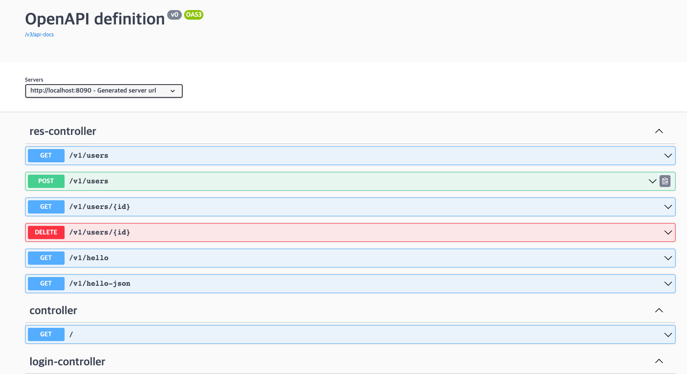
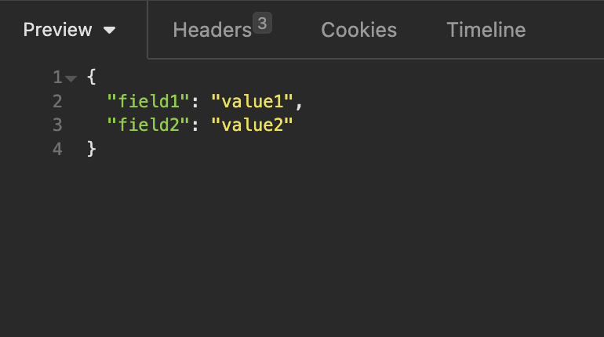

# Spring Rest API 필터링



{: .new }
> - 필드의 이름을 커스터 마이징 : `@JSONProperty`
> - 필터링 
>   - 정적 필터링 : 항상 모든 api에 필터링 적용
>   - 동적 필터링 : 어떤 api에는 필터링 하고 , 어떤 api는 필터링 x


---

<br />
<br />
<br />
<br />
<br />
<br />

---

# 정적 필터링 구현하기

<br />
<br />

{: .note }
> - dto.java
>   - 정적 필터링 구현
>   - `@JsonIgnore` : 이필드는 리턴값에 반환되지 않는다.

```java
// 필터링 dto
@AllArgsConstructor
@NoArgsConstructor
@Getter@Setter
@ToString
public class FilterDTO {
    private String field1;
    @JsonIgnore
    private String field2;
    private String field3;
}
```

<br />

{: .note }
> - controller.java
>   - 컨트롤러 

```java
@RestController
@RequestMapping("v1")
public class ResController {
    //filtering하기
    @GetMapping("/filtering")
    public FilterDTO filterDTO(){
        return new FilterDTO("fleid1","flied2","flied3");
    }
}
```

<br />
<br />
<br />
<br />
<br />
<br />

---

# 동적 필터링 구현하기



{: .new }
> - 동적으로 필터링 구현하기
> - 필터링할 필드
> - Filter.java

```java
@AllArgsConstructor
@NoArgsConstructor
@Getter@Setter
@ToString
@JsonFilter("FilterAAA")
public class FilterDTO {
    private String field1;
    private String field2;
    private String field3;
}
```

<br />


{: .new }
> - `MappingJacksonValue` - 필터링 클래스
> - `addFilter("")` : `@JsonFilter`의 이름이 같아야 함
> - `filterOutAllExcept` : 반환할 필드
> - controller.java 

```java
@RestController
@RequestMapping("v1")
public class ResController {

    //filtering하기
    @GetMapping("/filtering")
    public MappingJacksonValue filterDTO(){
        FilterDTO filterDTO = new FilterDTO("value1", "value2", "value3");
        //필터링 클래스
        MappingJacksonValue mappingJacksonValue = new MappingJacksonValue(filterDTO);
        
        //field1, field2의 필드가 반환
        SimpleBeanPropertyFilter filter = SimpleBeanPropertyFilter.filterOutAllExcept("field1","field2");
        FilterProvider filters = new SimpleFilterProvider().addFilter("FilterAAA",filter);

        //필터 적용
        mappingJacksonValue.setFilters(filters);
        return mappingJacksonValue;
    }

}
```
