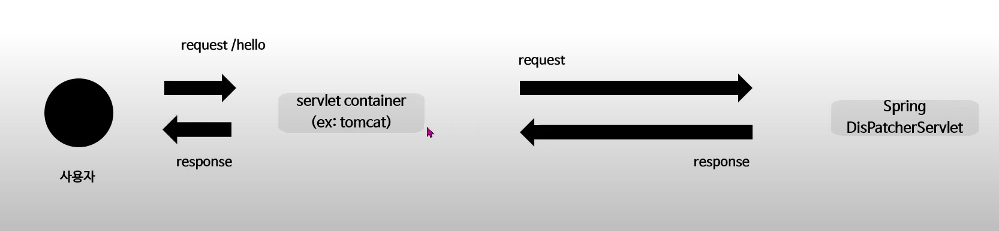
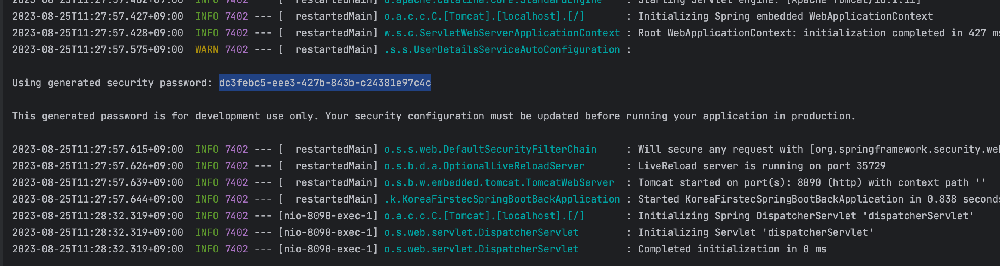
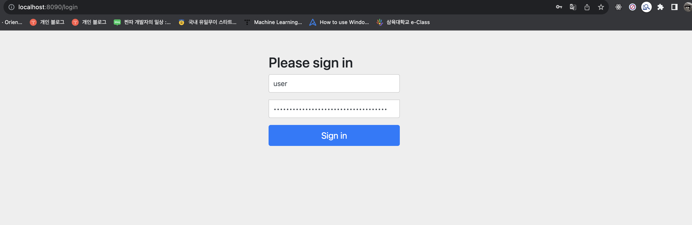

# Spring 인증 인가 구현 하기 (JWT)

<br />

## 스프링 시큐리티



{: .new }
> - 원리: 서블릿 필를 이용
> - 스프링시큐리티 bean은 필터들로 구성되어 있고, 이 필터들의 모듬을 securityfilterchain이라고 부른다.
>   - 필터는 각각 고유한 역할을 담당하며 default로 등록되는 필터가 존재한다.
>   - 아래 방법은 일부 흐름만 커스터 마이징 하는 방법
> - `스프링 시큐리티의 default설정은 /login, /logoutapi를 제외한 모든 api는 로그인이 필요하다`

<br />

- 
- 

{: .new }
> - 스프링 시큐리티 설치하면 기본적으로 로그인 페이지를 제공해준다. (`/`로 접근하면 됨)
>   - 아이디 : user 
>   - 비밀번호 : 서버 구동시 알려줌 위 사진 참고

```java
@Configuration
public class SpringSecurityConfiguration{

    @Bean
    public SecurityFilterChain filterChain(HttpSecurity http) throw Exception{
        //모든 요청 승인
        http.authorizeHttpRequests(
            auth -> auth.anyRequest().authenticated());
        //승인 되지 않는 요청은 formLogin실행
        http.formLogin(withDefaults());

        //csrf비활성화해서 프레임사용 비활성화
        http.csrf().disable();
        http.headers().frameOptions.disble();
        return http.build
    }
}
```