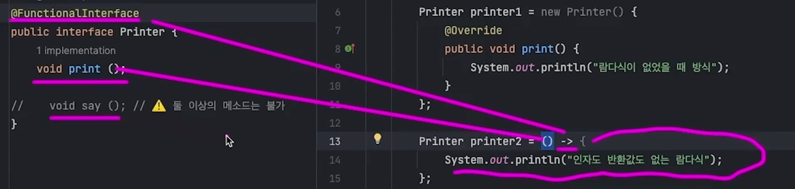

# 자바 함수형 프로그래밍

<br />

## 함수형 인터페이스



{: .highlight } 
> - 자바에서는 인터페이스의 익명 클래스를 간략히 표현하는데 사용됨
> - `@FunctionalInterface` : 딱 하나만 존재 해야한다.
>   - 람다식과 `1:1`로 대응해야하므로 

<br />

```java
@FunctionalInterface
public interface Printer {
    //@FunctionalInterface
    //@FunctionalInterface이게 있으면 추상 메소드는 하나만 있어야한다
    void print()
}
```

> 익명 함수 사용

```java
public class Main {
    public static void main(String[] args){
        // 익명함수 사용법
        // 어쩌피 FunctionalInterface로 메소드가 하나 이기 때문에 메소드 호출도 필요없음
        Printer printer2 = () ->{
            System.out.println('인자도 반환값도 없는 람다식')
        }
        Printer printer3 = () ->
            System.out.println('인자도 반환값도 없는 람다식')


        // for문
        for (var p : new Printer[] {printer2, printer3}){
            p.print();
        }
    }
}
```

<br />
<br />
<br />

## 익명함수에 인자가 들어가는 경우

{: .highlight }
> - 익명함수에 인자가 하나 들어가는 경우

<br />


```java
@FunctionalInterface
public interface DoubleParam {
    int func(int a, int b);
}
```

> 익명함수 사용

```java
public class Main {
    public static void main(String[] args){

        //익명함수에 i를 넣고 i를 제곱한 뒤 반환
        SingleParam square = (i) -> i * i
        //익명함수에 i를 넣고 i를 제곱한 뒤 반환
        SingleParam cube = (i) -> i * i * i

        //9
        var _3_squared = square.func(3);
        //64
        var _3_cubed = cube.func(4);
    }
}
```


<br />
<br />
<br />

## 익명함수에 인자가 두개 들어가는 경우

{: .highlight }
> - 익명함수에 인자가 두개 들어가는 경우

<br />

```java
@FunctionalInterface
public interface DoubleParam {
    int func(int a, int b);
}
```

> 익명함수 사용

```java
public class Main {
    public static void main(String[] args){

        DoubleParam add = (a, b) -> a + b;
        var added = add.func(2, 3);

    }
}
```