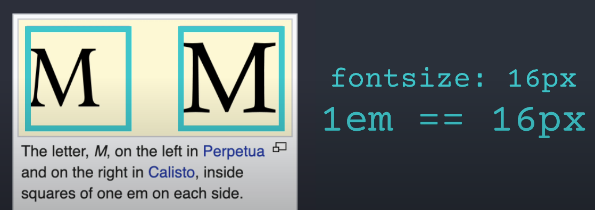
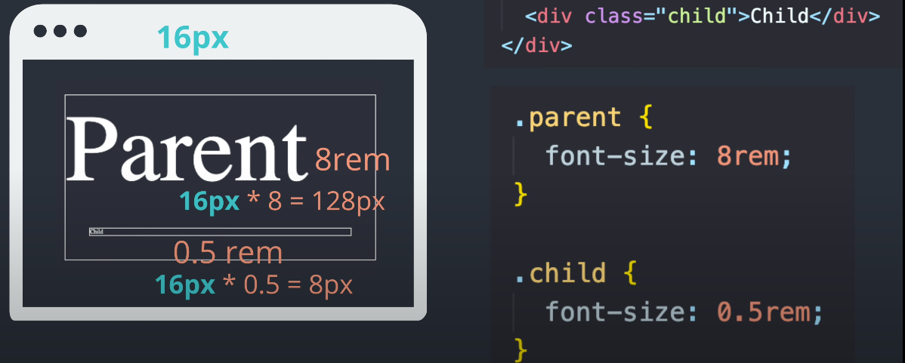
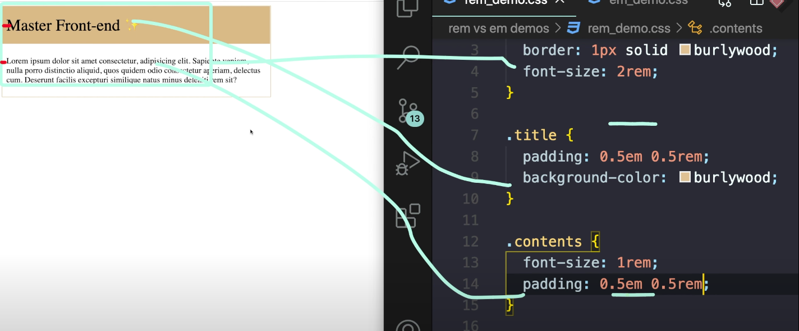
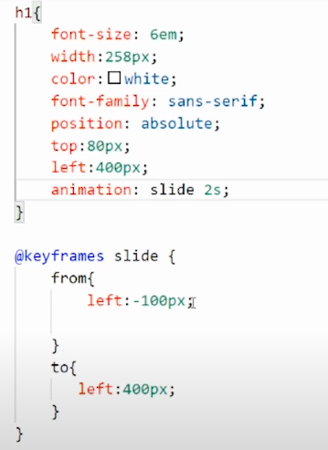

# CSS 반응형 구현 

<br />

---

## CSS 반응형 구현하기

{: .highlight } 
> - 반응형 단위 정리하기
> - 절대적인 유닛
>   - `px`의 문제점은 컨테이너가 변경되어도 px이 그대로 유지된다는 단점이 있다.
> - 상대적인 유닛
>   - em : 지금 폰트사이트를 나타냄
>     - 어떤 폰트를 사용하나에 따라 사용자가 보는 폰트의 크기는 달라질 수 있다.
>     - em은 폰트 사이즈에 상관없이 고정된 폰트사이즈를 가지고 있다.
>   - rem : `root`에 지정된 폰트사이즈에 따라서 크기가 결정되는 것
>   - vw : 브라우저의 너비 사용 (`50vw` : 뷰포트 50%사용 / `100vw` : 뷰포트 100%사용 )
>   - vh : 브라우저 높이 사용 (`50vh` : 뷰포트 50% 사용 / `100vh` : 뷰포트 100% 사용 )
>   - % : %로 적용


<br />
<br />

---

## em

{: .highlight } 
> - 부모에 em단위를 곱한 것이 적용


<br />

- 
- 


<br />
<br />

---

## rem

{: .highlight } 
> - `root` px값에 곱한 것(`부모아님`) 

<br />

- 


<br />
<br />
<br />

--- 


# 반응형 단위 사용 예제

<br />

{: .highlight } 
> - `부모의 요소에 따라 달라져야 할 때` : %, em
> - `브라우저 크기에 따라 달라져야 할 때` : vw, vh, rem


<br />
<br />


{: .highlight } 
> - `요소의 높이와 너비에 따라 사이즈 변경이 되야한다면` : %, vw , vh
> - `폰트 사이즈에 따라 요소가 변경 되야한다면` : em, rem


<br />
<br />

## em의 활용 예제

<br />

{: .highlight } 
> - 좋아요 버튼을 만들 때 em를 이용하면 컴포넌트 크기 마다 크기를 조정할 수 있다.
> - 부모요소에 따라 변경되기 때문에
> - `rem` : 페이지 어디서든 동일한 크기를 가져야할 때 사용
> - `em` : 부모의 요소에 따라 사이즈가 유동적으로 변경되야하면 사용


<br />
<br />

> font-size , padding 반응형 예제
> 글자크기마다 반응형으로 padding이 작아진다.



```css
/* 글자크기마다 반응형으로 padding이 작아진다. */
h1 {
  font-size: 5em;
  padding: 1em;
}
```

<br />
<br />
<br />

# Media Queries로 반응형 구현하기


{: .new } 
> - `모바일` : 320px~480px
> - `테블릿` : 768px~1024px
> - `데스크탑` : 1024px~

<br />

```css
/* 데스크탑 1024보다 커지는 순간부터 적용*/
@media screen and (min-width:1024px){
  .container{
    width: 50%
  }
}
/* 데스크탑 1024보다 작아지는 순간부터 적용*/
@media screen and (max-width:1024px){
  .container{
    width: 50%
  }
}

/* 태블릿 768보다 커지는 순간부터 적용*/
@media screen and (min-width:768px){
  .container{
    width: 50%
  }
}

/* 모바일 (768보다 작아지는 순간부터 적용)*/
@media screen and (max-width:768px){
  .container{
    width: 50%
  }
}

```

<br />

```html

<style>
/* 모바일 */
@media all and (min-width:320px) {
    #wrap div{
      width:100%;
    }
  }
/* 태블릿 */
  @media all and (min-width:768px) {
    #wrap div{
      width:50%;
    }
    #wrap div:nth-child(5){width:100%;}
  }
/* 테스크탑 */
  @media all and (min-width:1024px) {
    #wrap div{
      width:20%;
    }
    #wrap div:nth-child(5){width:20%;}
  }
</style>
```





<br />
<br />
<br />

---


{: .new }
> - `font-size` : rem
>   - root 값지정 안했을때 1rem : 16px
> - `padding` : em
>   - 부모가 16px이면 1em은 16px
> - 폰트는 `rem`사용 , 박스내 padding은 `em`사용
> - padding은 컴포넌트 내 글자의 크기에 따라 달라져야하기 때문에
