# CSS 레이아웃 정리 display, position

{: .note }
> - `block` : 기본적으로 한 줄에 하나씩
> - `span` : 한 줄에 여러가 삽입 가능
> - `display` : `inline-block` (한줄에 여러개 정렬 가능)
> - `display` : `block` (한줄에 하나씩만)
> - `display` : `inline` (안에 담긴 크기에 맞춰서 보여줌)

<br />


- 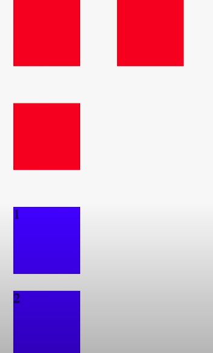
- 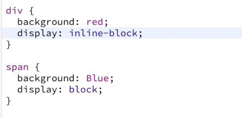

<br />
<br />
<br />

---

## position 다루기

{: .note }
> - `position` 기본값은 `static`
> - `relative` : 원래 있어야 하는 자리에의 자리 이동
> - `absolute` : 상위에 가장 가까운 relative속성을 가진 부모를 기준으로 이동
> - `fixed` : 웹페이지를 기준으로 이동


<br />

> relative 예제


```css
.container {
  left: 20px;
  top: 20px;
  position: relative;
}
```


```css
.container {
  left: 20px;
  top: 20px;
  position: relative;
}
.box{
  background: blue;
  left:20px;
  top:20px;
  position: relative;
}
```

<br />
<br />

> absolute 예제

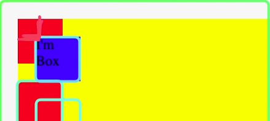

```css
.container {
  left: 20px;
  top: 20px;
  position: relative;
}
.box{
  background: blue;
  left:20px;
  top:20px;
  position: absolute;
}
```

<br />
<br />

> fixed 예제

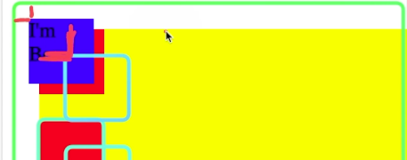

```css
.container {
  left: 20px;
  top: 20px;
  position: relative;
}
.box{
  background: blue;
  left:20px;
  top:20px;
  position: fixed;
}
```

<br />
<br />
<br />

# 시맨틱 태그

{: .highlight }
> - div를 사용보단 상황에 맞는 태그를 사용하는 것이 좋다.
> - 아래 사진 참고

<br />

- 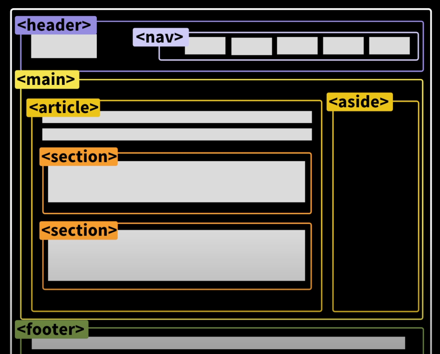
- 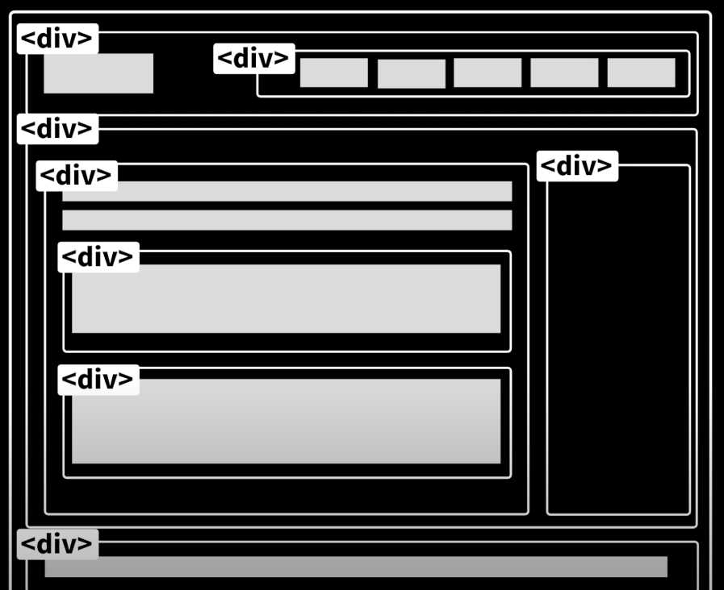

<br />
<br />

{: .highlight }
> - `article` : 신문 기사하나를 나타낼 때 많이 사용한다.
>   - 독립적으로 article로 보여졌을때 문제가 없을때 사용한다.

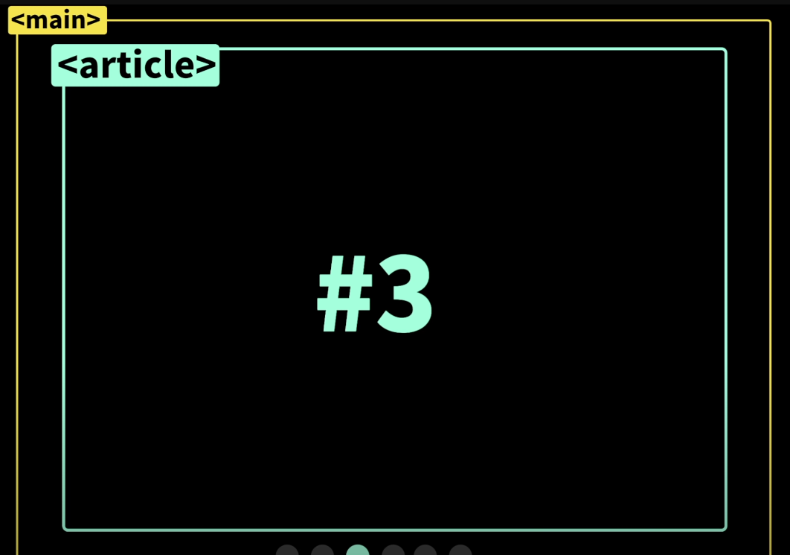

<br />
<br />

{: .highlight }
> - section : `article`안에 공통적인 부분을 묶어주는 역할을 한다.
>   - 연관있는 내용을 묶어줄때 사용한다.

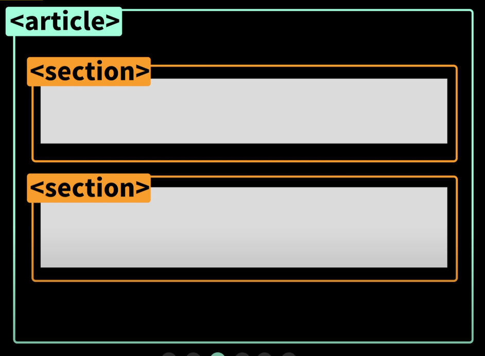


<br />
<br />

{: .highlight }
> - Img vs background-image
>   - `Img 태그` :  웹페이지 내에서 이미지가 하나의 중요한 요소로 자리 잡고 있을때 사용
>   - `background-image` : 스타일링 목적으로 배경으로 사용될 경우

<br />

- 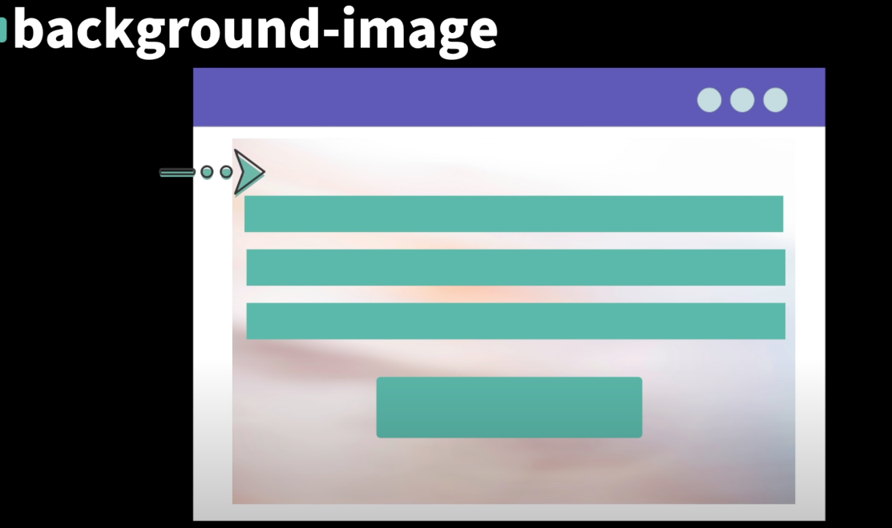
- 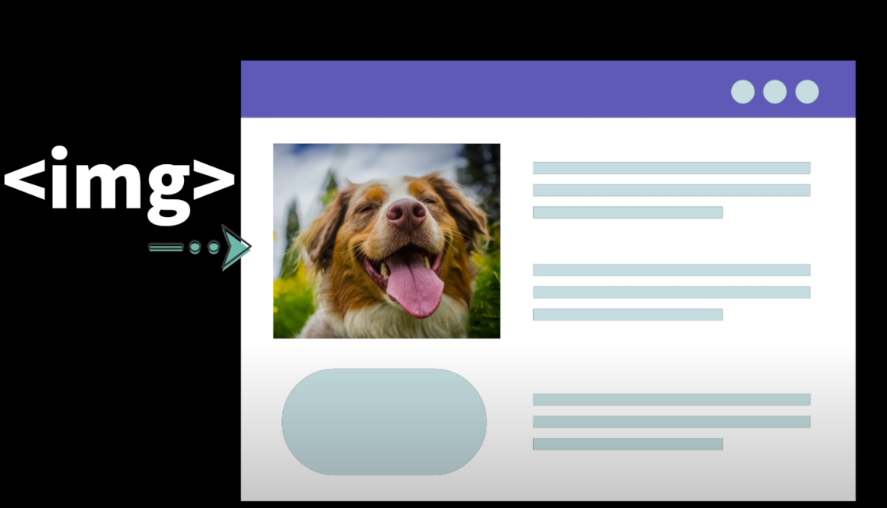
- 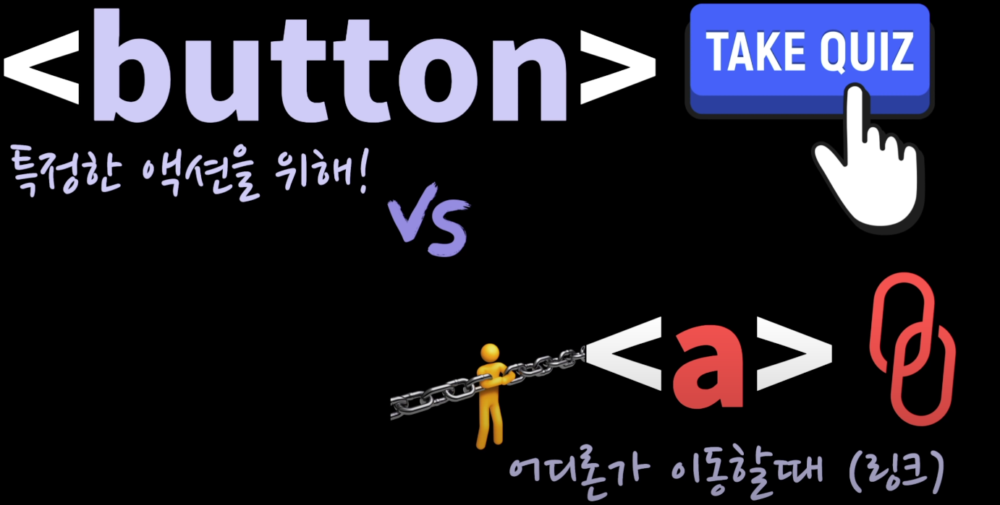