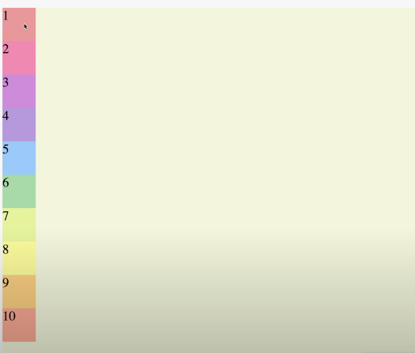
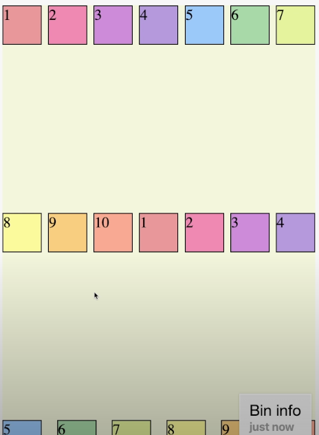
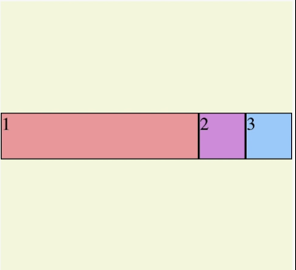
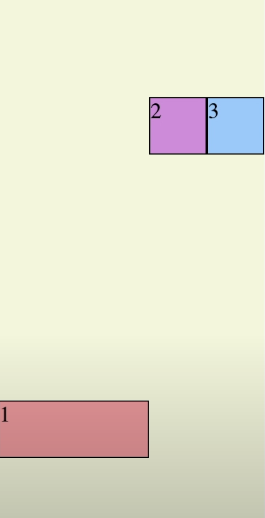

# Flex, Float 정리

{: .note }
> - container에 적용할 수 있는 값
>   - `display`
>   - `fiex-direction`
>   - `flex-wrap`
>   - `flex-flow`
>   - `justify-content`
>   - `align-items`
>   - `align-content`
> - item에 적용할 수 있는 값
>   - `order`
>   - `flex-grow`
>   - `flex-shrink`
>   - `flex`
>   - `align-self`


<br />
<br />

{: .new } 
> - `flex-direction` 적용

<br />


```css
.container {
  display : flex;
  flex-direction: row-reverse;
}
```

<br />
<br />

{: .new } 
> - `flex-direction : column` 적용

<br />



```css
.container {
  display : flex;
  flex-direction: column;
}
```


<br />
<br />

{: .new } 
> - `flex-wrap : wrap` 적용
> - 한줄이 꽉 차면 다음줄로 이동

<br />


```css
.container {
  display : flex;
  flex-direction: wrap;
}
```


<br />
<br />

{: .new } 
> - `flex-wrap : wrap-reverse` 적용
> - 한줄이 꽉 차면 다음줄로 이동 (반대로)

<br />


```css
.container {
  display : flex;
  flex-direction: wrap-reverse;
}
```

<br />
<br />

{: .new } 
> - `justify-content : space-around` 적용
>   - `space-around` : 박스를 둘러싸게 공간을 넣어줌(시작,끝 위치는 공간이 적음)
>   - `flex-end` : 끝에 위치 시킴 
>   - `space-evenly` : 박스를 둘러싸게 공간을 넣어줌(시작,끝 위치도 공간 동일)
>   - `space-between` : 박스를 양끝에 붙이고 나머지 아이템들 space-around로 정렬
> - `align-items` : `center` (가운데 정렬)
>   - `baseline` : 아래 사진 참고 베이스 라인에 맞춰 정렬
> - `align-content` : 아래 사진 참고

<br />


```css
.container {
  display : flex;
  justify-content : space-around
}
```


<br />
<br />

> align-item : baseline 적용


```css
.container {
  display : flex;
  align-items : baseline;
}
```


<br />
<br />

> align-content : space-between , center ,  적용




```css
.container {
  display : flex;
  align-content : center;
}
```


<br />
<br />
<br />
<br />
<br />
<br />

---

# Flex 자식요소에 사용할 수 있는 값

{: .new }
> - item에 적용할 수 있는 값
>   - `order`
>   - `flex-grow` : 전체 비율 적용
>   - `flex-shrink` : 줄어들때 얼마나 많이 줄어들지
>   - `flex-basis` : 각각 상자들이 몇 퍼센트씩 차지할 지 
>   - `align-self` : 컨테이너를 벗어나 아이템 하나만 위치 조정이 필요할 때

<br />
<br />

> flex-grow 사용 (비율 적용)




```css
.container {
  padding-top: 100px;
  display: flex
}

.item1{
  background : #ef9a9a
  flex-grow : 1
}
.item2{
  background : #ef9a9a
}
.item3{
  background : #ef9a9a
}
```

<br />
<br />

> flex-shrink (줄어들고, 늘어날때 얼마나 많이 줄어들지)


```css
.container {
  padding-top: 100px;
  display: flex
}

.item1{
  background : #ef9a9a;
  flex-shrink: 2;
}
.item2{
  background : #ef9a9a;
  flex-shrink: 1;
}
.item3{
  background : #ef9a9a;
  flex-shrink: 1;
}
```

<br />
<br />

> flex-basis (몇퍼센트 차지 할지)


```css
.container {
  padding-top: 100px;
  display: flex
}

.item1{
  background : #ef9a9a;
  flex-basis: 60%;
}
.item2{
  background : #ef9a9a;
  flex-basis: 30%;
}
.item3{
  background : #ef9a9a;
  flex-basis: 10%;
}
```


<br />
<br />

> align-self (컨테이너를 벗어나 아이템 하나만 위치 조정이 필요할 때)





```css
.container {
  padding-top: 100px;
  display: flex
}

.item1{
  background : #ef9a9a;
  align-self: center;
}
.item2{
  background : #ef9a9a;
  flex-basis: 30%;
}
.item3{
  background : #ef9a9a;
  flex-basis: 10%;
}
```


<br />
<br />
<br />

---

> float 에시

