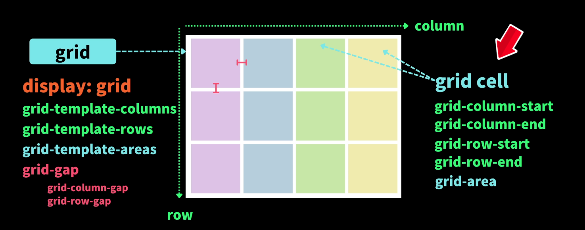
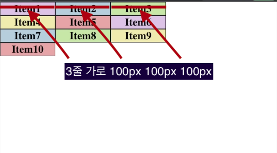
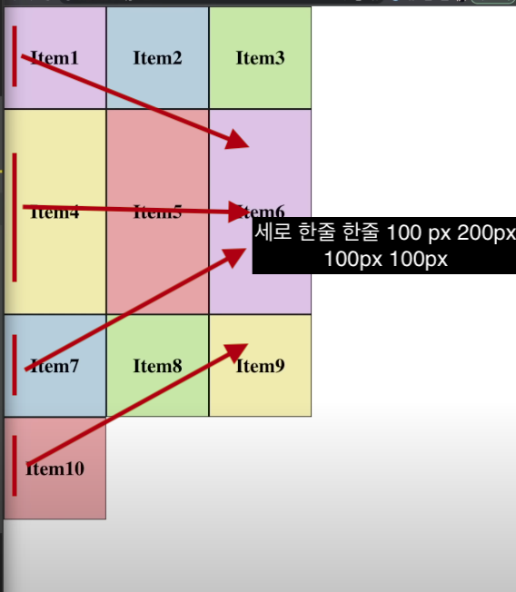
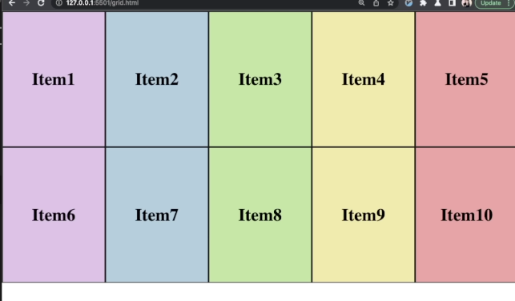
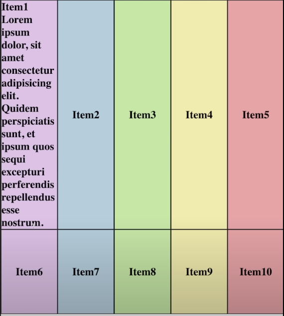
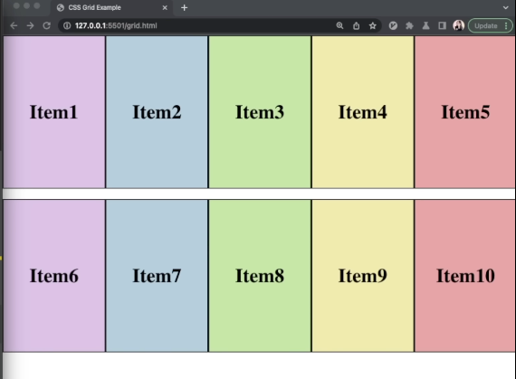
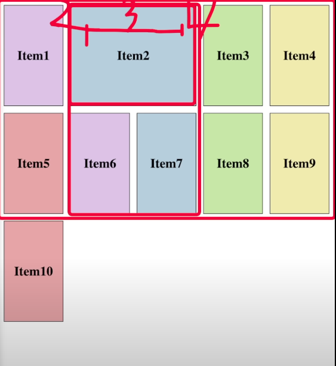
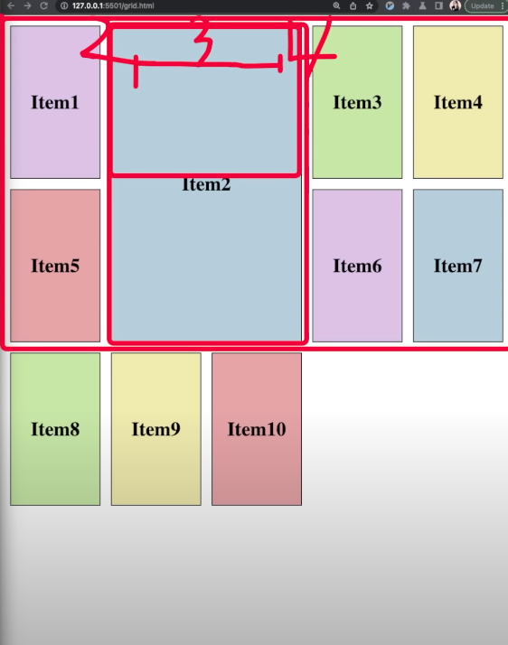
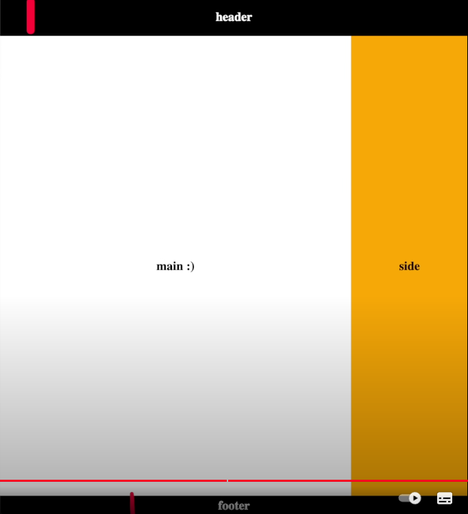

# Grid 정리

{: .note } 
> - 2차원적으로 요소 배치에 유용하다.
> - `display:grid`
>   - `grid-template-columns` : 가로
>   - `grid-template-rows` : 세로
>   - `grid-gap` : 요소간의 간격



<br />
<br />
<br />



{: .highlight } 
> - 열의 픽셀 정의 grid-template-columns

```css
.container{
  display:grid;
  grid-template-columns:20% 20% 20%;
}
```

<br />
<br />



{: .highlight } 
> - 행의 픽셀 정의 grid-template-rows

```css
.container{
  display:grid;
  grid-template-columns:100px 200px 100px 100px;
}
```


<br />
<br />

{: .highlight } 
> - 배율로 지정 `fr사용`
>   - `1fr 2fr 1fr` : 1대 2대 1대로 화면 차지


<br />
<br />

{: .highlight } 
> - `grid-auto-rows`
>   - `열에 따라 행이 자동으로 지정되는 속성`
>   - 지정된 열에 따라 자동으로 행 몇개인지 지정

<br />




```css
.container {
  display:grid;
  grid-template-columns : 1fr 1fr 1fr 1fr 1fr;
  grid-auto-columns : 150px
}
```

<br />
<br />

{: .highlight } 
> - `grid-auto-rows`
>   - `minmax(150px,auto)` : 기본적으로 150px를 이루고, 150px를 넘어갈 시 넘어간 px로 자동 조정

<br />




```css
.container {
  display:grid;
  grid-template-columns : 1fr 1fr 1fr 1fr 1fr;
  grid-auto-columns : minmax(150px, auto)
}
```


<br />
<br />

{: .highlight } 
> - `grid-column-gap`
>   - column만 gap를 주는 속성 (요소 사이사이 gap를 줌)

<br />


```css
.container {
  display:grid;
  grid-template-columns : 1fr 1fr 1fr 1fr 1fr;
  grid-column-gap : 10px;
}
```


<br />
<br />

{: .highlight } 
> - `grid-row-gap`
>   - row만 gap를 주는 속성 (요소 사이사이 gap를 줌)

<br />



```css
.container {
  display:grid;
  grid-template-columns : 1fr 1fr 1fr 1fr 1fr;
  grid-row-gap : 10px;
}
```


<br />
<br />

{: .highlight } 
> - `grid-row-gap`
>   - row만 gap를 주는 속성 ()

<br />


```css
.container {
  display:grid;
  grid-template-columns : 1fr 1fr 1fr 1fr 1fr;
  grid-row-gap : 10px;
}
```


<br />
<br />
<br />

---

# grid item 속성 적용




<br />

{: .highlight }
> - gird 컨테이너안에 자식 요소 스타일 적용
>   - grid-column-start
>   - grid-column-end


```css
.container{
  display:grid;
  grid-template-columns : 1fr 1fr 1fr 1fr 1fr;
  grid-row-gap : 10px;
}
.item{
  grid-column-start:2;
  grid-column-end:4;
}
```

<br />
<br />
<br />



<br />

{: .highlight }
> - gird 컨테이너안에 자식 요소 스타일 적용
>   - grid-row-start
>   - grid-row-end

```css
.container{
  display:grid;
  grid-template-columns : 1fr 1fr 1fr 1fr 1fr;
  grid-row-gap : 10px;
}
.item{
  grid-column-start:2;
  grid-column-end:4;
  grid-row-start:1;
  grid-row-end:3;
}
```


# grid-area 지정하기

{: .highlight }
> - container에 지역 이름을 명시 후 item에서 container 어디 지역을 차지 할 지 명시
> - 간편하게 grid 사용가능
>   - 각 셀마다 이름을 지정

<br />
<br />


```css
.container {
  display : grid;
  grid-template-columns: 1fr 1fr 1fr;
  grid-auto-rows: 150px;
  grid-template-areas: 
    'a a a'
    'b b b'
    'd b g'
    'e f g'
}

/* 위에 명시한 a 지역에 할당 */
.item {
  grid-area : a;
}

/* 위에 명시한 b에 위치 */
.item {
  grid-area : b;
}
```


<br />
<br />
<br />

--- 

# grid 실용 예제

{: .highlight }
> - grid 실용 예제

<br />



```css
body {
  display : grid;
  /* main 3배 , side 1배 */
  grid-template-columns: 3fr 1fr;
  /* header(100px), 가운데(auto), footer(50px) */
  grid-template-rows: 100px auto 50px;
  grid-template-areas:
    'header header'
    'main side'
    'footer footer'
}


header {
  grid-area : header;
}
footer {
  grid-area : footer;
}
```