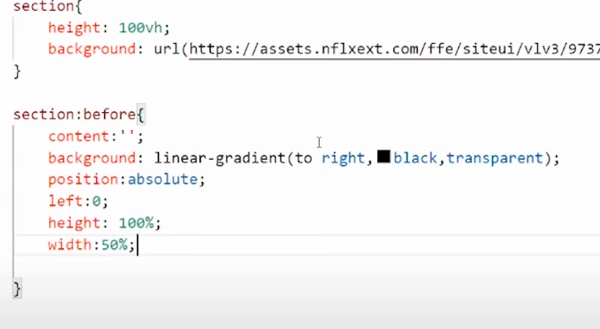
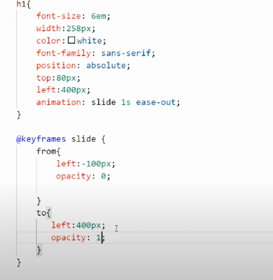
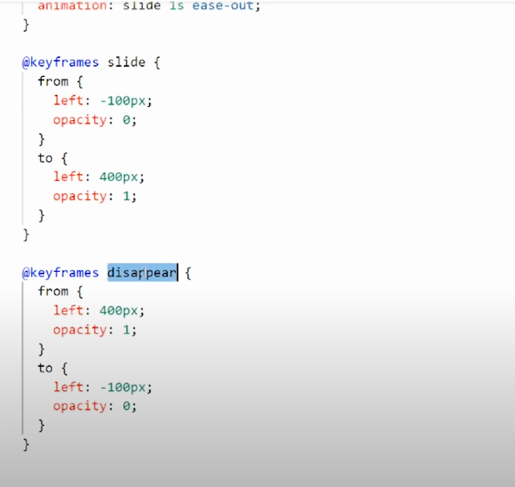

# 그라데이션과 키프레임

{: .note } 
> - 그라데이션 예시
>   - `linear-gradient(to right,#000,transparent);`



<br />
<br />
<br />

---

{: .note } 
> - keyframe 사용 예시
>   - `keyframe` , `animation` 사용
>   - 왼쪽에서 오른쪽으로 이동 및 , 투명도 0 -> 1로 증가

<br />

- 

<br />
<br />
<br />

---

{: .note } 
> - 스크롤에 따라 이벤트 주기



<br />

```js
// 스크롤 위치에 따라 keyframe 애니메이션 주기
// 애니메이션 이름은 disappear , slide 두가지가 있다.
window.addEventListener("scroll", function () {
  //윈도우 스크롤 위치
  let value = window.scrollY;
  if(value > 300) 
  //keyframe 이름 : disappear
    mainText.style.animation = "disappear 1s ease-out forwards"
  else
  //keyframe 이름 : slide
    mainText.style.animation = "slide 1s ease-out"
})
```