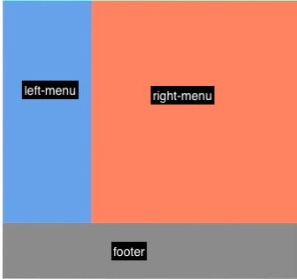
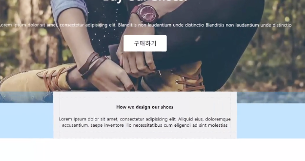
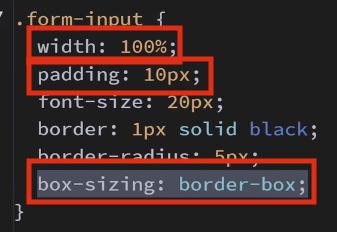
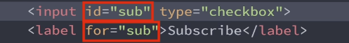
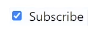

# HMTL / CSS

### `display : block`

> `<div>`, `<p>` ,`<h>` 기본으로 내장되어있음, 가로행을 전부 차지한다는 의미

<br />

### `float : left`

> 요소를 붕 띄어서 왼쪽 정렬 (공중에 떠 있는 상태)

> float : right , float: left ---> 요소 붕 떠있는 요소 아래 위치하고 싶다면 `clear:both` 속성 사용

<br />

### `display: inline-block`

> 내 크기 만큼 차지 , 공백을 제거해야됨 <br /> 안에 글씨를 작성할 경우 vertical-align: top속성이 있어야 레이아웃이 깨지지 않는다.

<br />

### `Image Tag`

> 배경이미지는 꽉차지 않으면 기본적으로 반복된다.

- `background-size` : cover >>> div Tag에 꽉채움
- `background-repeat` : no-repeat >>> 배경 요소 반복 안됨
- `background-position` : center >>> 가운데부터 배경을 채운다.
- `filter` : brightness(70%) saturate(200%) >>> 검은색 brightness(필터) saturate(채도) 적용
- `background-image`: linear-gradient( rgba(0,0,0,0.5), rgba(0,0,0,0.5) ), url(이미지경로~~) >>> 그라데이션

<br />

## `display : inline`

- 항상 옆으로 채워지는 요소 (폭과 너비가 없는 요소)
- `ex) <span> TAG`

<br />

## `hover`

- `:hover`
- `:active`
- `:focus`

> 마우스 올렸을때 스타일

<br />

```css
/*마우스 올렸을 때*/
.btn:hover {
  background-color: red;
}
/*마우스 클릭했을 때*/
.btn:active {
  background-color: red;
}
/*마우스 클릭한 이후*/
.btn:focus {
  background-color: red;
}
```

<br />

## 이미지,텍스트 가운데 정렬

```html

<h3 style="text-align: center">Text</h3>
```

<br />

## .css 선택자

```html
<head>
  <link href="css/main.css" rel="stylesheet" />
</head>
```

```css
/*class class="a"*/
.a {
  font-size: 10px;
}
/*id  id="b"*/
#b {
  font-size: 10px;
}
/*tag*/
h1 {
  font-size: 10px;
}
```

<br />

## float 사용

- 

```html
<div class="container">
  <div class="left-menu" style="float:left"></div>
  <div class="right-menu" style="float:right"></div>
  <div class="footer" style="clear:both"></div>
</div>
```

<br />

## Position

- absolute : 부모 요소 중 가장 가까운 relative를 기준으로 절대 적인 위치를 가진다.

<br />

> absolute요소 가운데 정렬 코드

```html
<div>
  <div
    style="
    position:absolute;
    left:0;
    right:0;
    margin:auto"
  ></div>
</div>
```

<br />

## min-width 와 box-sizing

> box-sizing:border-box; 속성을 추가하면 padding,maring 모두 포함해서 max-width가 적용된다.

> max-width:600px; box-sizing:border-box; --> padding , margin값을 다 포함해서 최대600px이 된다.

- `max-width` : 지정한 width 값보다 커질 수 없다.
- `min-width` : 저장한 width 값보다 작아질 수 없다.
- `max-height` : 지정한 height보다 커질 수 없다.

<br />

- 
- 
  - 100% + 20px정도 차지하게 됨, 100%만 차지하게 하기 위해 box-sizing: border-box 속성을 부여한다.

```html
<div
  style="
    width:80%;
    max-width:600px;
    box-sizing:border-box;
    "
></div>
```

<br />

## input css 속성 지정

> input css 속성 지정

```bash
# css
input[type=email]{
  padding : 10px;
  font-size : 20px;
}

# html
<input type="email" />
```

<br />

## label tag

> `for` , `id` 이용

> label 테그를 이용해서 checkout click , radiobox click를 구현

- 
- 

<br />

## 세로 상하 정렬 (vertical-align)

### vertical-align : top / middle / bottom

- `inline/inline-block` 요소에서 세로 정렬할 때 사용

  - 옆에 높이가 큰 요소가 있을때 텍스트를 `아래/중간/위로` 정렬할 때 사용한다.

<br />

- 
- 

  <br />

```html
<div style="vevertical-align: top">22222</div>
```
