# CSS (2)

<br />

## 폰트 적용하기

> 폰트의 용량을 줄이기 위해 .woff를 사용하는 게 좋다

- `@font-face` 폰트이름과 경로 지정
- `font-family`에 지정한 폰트 이름 사용

<br />

```css
/*main.css*/
/*폰트 경로*/
@font-face {
  font-family: "작명1234";
  src: url("폰트 경로A.woff");
}
@font-face {
  font-family: "작명1234";
  font-weight: 800;
  src: url("폰트 경로.woff");
}

body {
  margin: 0px;
  font-family: "작명1234";
}
/*font-weight: 800; 주면 아래 폰트 적용*/
div {
  font-weight: 800;
  font-family: "작명1234";
}
```

<br />

## font alising

> font alising란 픽셀의 각진 부분을 부드럽게 바꿔주는 것을 뜻한다.

- 맥은 알아서 처리
- 윈도우는 따로 설정을 해야한다.
  - 글자를 아주 살짝 돌리는 것으로 해결한다. (`transform`)

<br />

```css
h1,
span,
div,
h2,
a {
  transform: rotate(0.04deg);
}
```

<br />

## `display : flex`

> 아이템 정렬하기

- 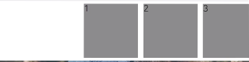

  - 오른쪽 정렬
  - 부모 요소 : `display:flex;` , `justify-content:flex-end;`

- 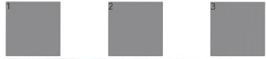

  - 간격 동일하게
  - 부모 요소 : `display:flex;` , `justify-content:space-between`

- 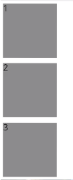

  - 새로 정렬
  - 부모 요소 : `display:flex;` , `flex-direction:column`

- 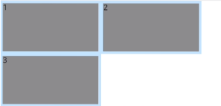

  - block이 꽉차면 밑에 줄에 이어서 출력
  - 부모 요소 : `display:flex;` , `flex-direction:column`

- 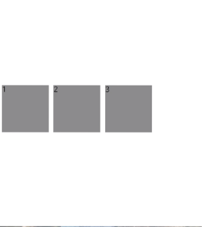
  - 세로 가운데 정렬
  - 부모 요소 : `display:flex;` , `align-items: center`

<br />

```html
<div class="flex-container">
  <div class="flex-item"></div>
  <div class="flex-item"></div>
  <div class="flex-item"></div>
</div>
```

<br />
<br />

## display : flex (2) 비율 차지

> flex요소 비율로 차지하게끔 하는 속성

> `flex-grow:1 ---> 1비율 차지`

> `flex-grow:2 ---> 2비율 차지`

<br />

- 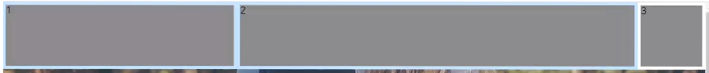

```html
<div class="flex-container" style="display:flex">
  <div class="flex-item" style="flex-grow:1"></div>
  <div class="flex-item" style="flex-grow:2"></div>
  <div class="flex-item"></div>
</div>
```

<br />

## display : flex (3) top nav 만들기

- 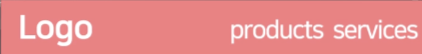

> 예시 코드

```html
<nav style="display:flex; align-items:center">
  <div>Logo</div>
  <div style="flex-grow"></div>
  <div>products</div>
  <div>services</div>
</nav>
```

<br />

## row, col

> 가로로 쪼개기

> 전체 12 / row : 내부를 12개의 칸으로 쪼개줌

```html
<div class="row">
  <div class="col-4"></div>
  <div class="col-4"></div>
  <div class="col-4"></div>
</div>
```

<br />

## 반응형 레이아웃 만들기

- 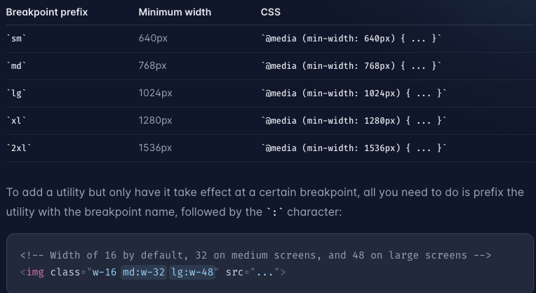
- `vw` 단위 : 브라우저 폭에 비례 (viewport)
- `vh` 단위 : 브라우저 높이에 비례 (viweport)
  - 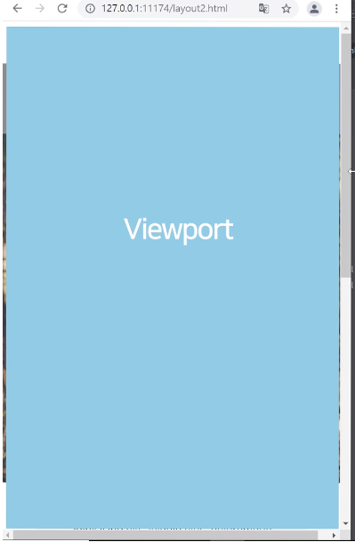
  - 50vw : 현재 브라우저 폭에 50퍼센트만 차지
- `en` 단위 : 내 폰트 사이즈의 x배

- 1200px - 태블릿
- 992px - 태블릿
- 768px - 모바일
- 576px - 모바일

<br />

> 반응형 적용 시 헤더 추가

```html
<head>
  <meta name="viewport" content="width=device-width,initial-scale=1.0" />
</head>
```

> css

```css
/*주로 3가지 사용*/
/*1200이하 30px 적용*/
@media screen and (max-width: 1200px) {
  .main-title {
    font-size: 30px;
  }
}
/*768이하 20px 적용*/
@media screen and (max-width: 768px) {
  .main-title {
    font-size: 20px;
  }
}
/*576이하 10px 적용*/
@media screen and (max-width: 576px) {
  .main-title {
    font-size: 10px;
  }
}
```

<br />

## 애니메이션 만들기 (transition)

1. 시작 스타일 만들기
2. 최종 스타일 만들기
3. 언제 최종스타일로 변하는지
4. transition으로 애니메이션

<br />
<br />

- 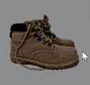
  - 서서히 어두어지는 애니메이션

```css
/*transition: all 1s; 위에 았는 속성 중 무엇인가 변하면 1초 동안 서서히 변하는 것*/
/*시작 스타일*/
.overlay {
  position: absolute;
  width: 100%;
  height: 100%;
  background: rgba(0, 0, 0, 0.5);
  opacity: 0;
  transition: all 1s;
}
/*최종 스타일*/
/*언제 최종으로 변경될 지 ::: hover*/
.overlay:hover {
  opacity: 1;
}
```

## 애니메이션 만들기 (transition) (2)

> 아래에서 서서히 올라오는 애니메이션

```html
<div style="position: relative">
  <div
    class="overlay-wrap"
    style="
          position:absolute;
          width:100%; 
          height:100%; 
          overflow: hidden"
  ></div>
  <div
    class="overlay-black"
    style="
          width:100%;
          height:100%;
          background-color:rgba(0,0,0,0.3);
          margin-top:50;
          transition:all 1s"
  ></div>
</div>
```

```css
/*overlay-wrap hover 했을때 overlay-black마진이 50퍼로 변경된다.*/
.overlay-wrap:hover .overlay-black {
  mergin-top: 50%;
}
```

<br />

## 첫번째 글자, 첫줄만 텍스트 색상 변경 pseudo

- pseudo-class : 내부의 다른 상태일 떼
- pseudo-element : 내부 일부만 스타일 주고 싶을 때 사용

- 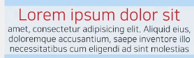

> 위 예시

```css
/*첫번째 줄만 적용*/
.pseudo::first-line {
  color: red;
  font-size: 30px;
}
/*첫번째 글자만 적용*/
.pseudo::first-letter {
  color: red;
  font-size: 30px;
}
```

<br />

- 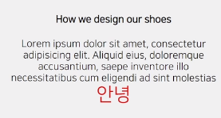

> 위 예시

```css
/* css 이용해서 맨뒤에 텍스트 삽입 */
.pseudo::after {
  content: "안녕";
  color: red;
  font-size: 30px;
}
/* css 이용해서 맨앞에 텍스트 삽입 */
.pseudo::before {
  content: "안녕";
  color: red;
  font-size: 30px;
}
```

> float 아래요소가 자리를 못찾는 버그를 해결하기 위한 css속성

```css
/*container안의 요소가float를 사용했을때 다음 요소가 재 자리를 잘 잘게 하기 위한 both 추가*/
.container: {
  width: ;
}
.container::after {
  content: "";
  display: block;
  clear: both;
  float: none;
}
```

<br />

- 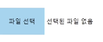

> `input type=file에 스타일 줄 때 pseudo-element 사용`

```html
<input type="file" class="input-file" />
```

```css
/*input type=file에 스타일 줄 때 pseudo-element 사용*/
.input-file::file-selector-button {
  background: skyblue;
  border: none;
  padding: 20px;
  transition: all 1s;
}
/*hover도 적용 가능*/
.input-file::file-selector-button:hover {
  background: blue;
}
```

<br />

## Shadow DOM (1)

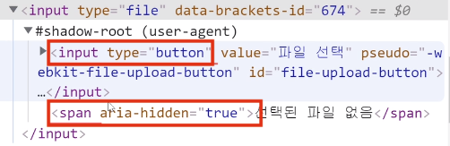

> `<input type="file />"`를 만들었는데 같이 만들어지는 숨겨진 button , span 테그들을 뜻한다.

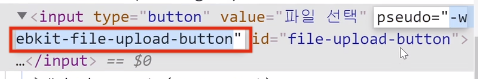

> `<input type="file />"` 내 안에 버튼에 스타일을 주고 싶다면 pseudo를 지정해서 css속성을 줄 수 있다 위 예시

<br />

- `<input type=file />`만 에서 버튼만 따로 속성 적용
- 

```css
input[type="file"]::-webkit-file-upload-button {
  background: skyblue;
  border: none;
}
```

```
-webkit-이란? 사파리,edge,크롬에서 적용되는 스타일
```

<br />

## Shadow Dom (2)

- input type=range 속성 주기

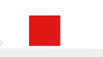

```html
<input type="range" />
```

```css
/*
 * appearance : none ->css기본 제공 속성 보이지 않게 하기
 * 위에 적용해야 바뀜
 */
input[type="range"] {
  appearance: none;
}

input[type="range"]::-webkit-slider-thumb {
  appearance: none;
  background: red;
  width: 50px;
  height: 50px;
}
```

<br />

## video , audio 다루기

> video 생성 자동재생(muted) , 적당히 다운(preload="metadata") , 썸네일 (poster)

```html
<video controls type="video/mp4">
  <source src="..." type="video/mp4" />
</video>
```

> audio 자동재생(muted) , 적당히 다운(preload="metadata")

```html
<audio src="bass.mp3" controls muted></audio>
```

<br />
<br />

# 애니메이션 다루기

## transition

> 단순 이동

- retate(30) ::: 회전
- translateY(-100px) ::: Y축 이동
- translateX(100px) ::: x축 이동
- scale(2) ::: 2배 증가

## @keyframe

> 복잡한 애니메이션 정의 가능

```css
.ani-text {
  text-align: center;
  /*적용할 애니메이션 아름 명시*/
  animation-name: 왔다갔다;
  /*몇 초 동안 애니메이션 진행할지*/
  animation-duration: 1s;
}

/*복잡한 애니메이션 왼쪽 오른쪽으로 움직이는 애니메이션 정의*/
@keyframe 왔다갔다 {
  /*애니메이션 0퍼센트 진행 했을때*/
  0% {
    transform: translateX(0px);
  }
  /*애니메이션 50퍼센트 진행 했을떼*/
  50% {
    transform: translateX(100px);
  }
  /*애니메이션 100퍼센트 진행 했을때*/
  100% {
    transform: translateX(-100px);
  }
}
```

<br />

## 브라우저가 그림그리는 순서

1. Render Tree 생성하기 : css 정리 참고 자료
2. Layout 잡기 : ex) width, height, margin, padding
3. Paint 하기 : ex) background-color
4. Composite 처리 : Composite단계 css 처리 ex) transform , opacity

```
Layout 변경되면 -> paint, composite 작업 다시
Paint 변경되면 -> composite 작업 다시
composite 변경 -> 종료

-- composite 속성을 변경하는 것이 성능에 가장 좋다.
-- 또한 composite 단계의 속성은 다른 쓰레드를 이용하기 때문에 성능이 좋다.
```

<br />

## 양쪽 위아래로 흔들리는 애니메이션

> 코드 예시

```css
/* 양쪽 위아래로 흔들리는 애니메이션 */
.ani-buttom:hover {
  animation-name: 흔들;
  animation-duration: 1s;
  /*3번 적용*/
  animation-iteration-count: 3;
}
/*keyframe 정의*/
@keyframes 흔들흔들 {
  0% {
    transform: rotate(0deg);
  }
  25% {
    transform: rotate(-8deg);
  }
  50% {
    transform: rotate(8deg);
  }
  75% {
    transform: rotate(-8deg);
  }
  100% {
    transform: rotate(0deg);
  }
}
```

<br />

## @keyframe 두개 적용 및 종료 상태 유지 속성

> 애니메이션 종료 상태 유지 속성 : animation-fill-mode:forwords

```css
@keyframes turn {
  0% {
    transform: rotate(0deg);
  }
  25% {
    transform: rotate(-15deg) scale(0.8);
  }
  100% {
    transform: rotate(45deg) scale(1.5);
  }
}

.ani-x:hover {
  animation-name: turn;
  animation-duration: 1s;
  /*애니메이션 종료 모션 계속 유지*/
  animation-fill-mode: forwards;
}
```

<br />
<br />
<br />

## grid (모눈 종이)

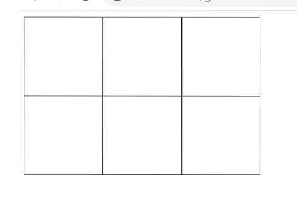

> grid 속성 , 격자 모양의 레이아웃 만들기

```
아래 속성을 가로로 3칸 , 세로로 2칸 모눈종이 레이아웃
```

```html
<div class="grid-container">
  <div></div>
  <div></div>
  <div></div>
  <div></div>
  <div></div>
  <div></div>
</div>
```

```css
.grid-container {
  display: grid;
  /*가로 -- 1행 100 2행 100 3행 100*/
  grid-template-columns: 100px 100px 100px;
  /*세로 -- 1열 100 2열 200*/
  grid-template-rows: 100px 100px;
}
```

<br />

- grid 다음 예시
  - 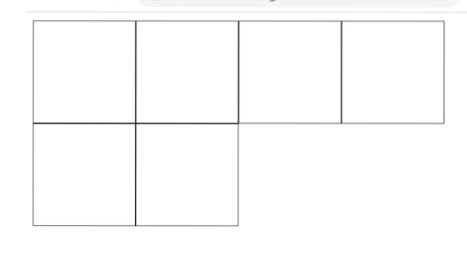
  - 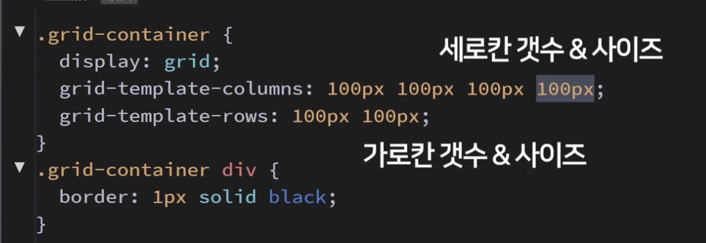

<br />

## grid 격자 사이 간격 주기

- 3d 처럼 작동하기 : transform-style : preserve-3d
- 뒷면을 안 보이게 처리 : back-visibility : hidden
- 간격 속성 : grid-gap : 10px;
- 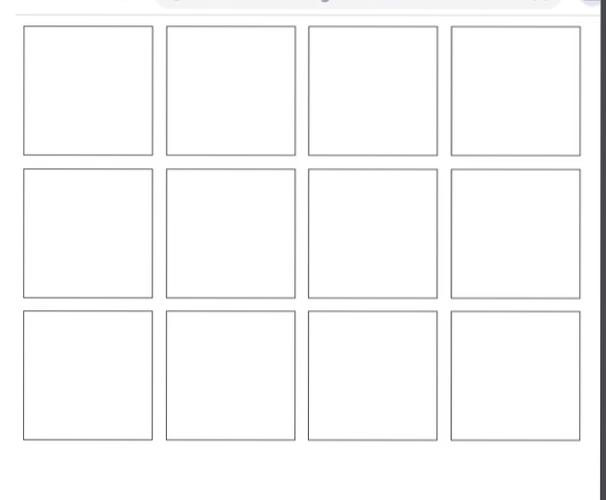

<br />

> 위 예시

```css
.grid-container {
  display: grid;
  /*가로 4개*/
  grid-template-columns: 100px 100px 100px 100px;
  /*세로 3개*/
  grid-template-rows: 100px 100px 100px;
  /*간격 10px*/
  grid-gap: 10px;
}
```

<br />

## grid 자식 요소 관리 하기 (grid-colums , grid-row)

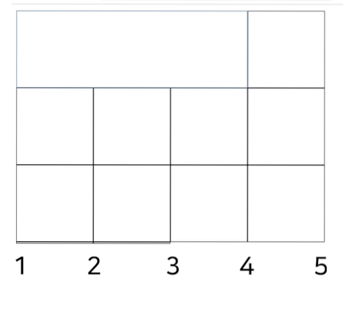
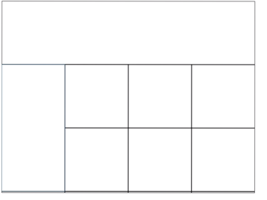

<br />

> 위 예시

```html
<div class="grid-container">
  <div style="grid-column:1/4">위 사진 처럼 1~4 가로선 까지 차지</div>
  <div style="grid-row: 2/4">위 사진 2~4세로선 차지</div>
  <div></div>
  <div></div>
  <div></div>
  <div></div>
  <div></div>
  <div></div>
  <div></div>
</div>
```

<br />

## grid 활용 예시 (grid-area 활용)

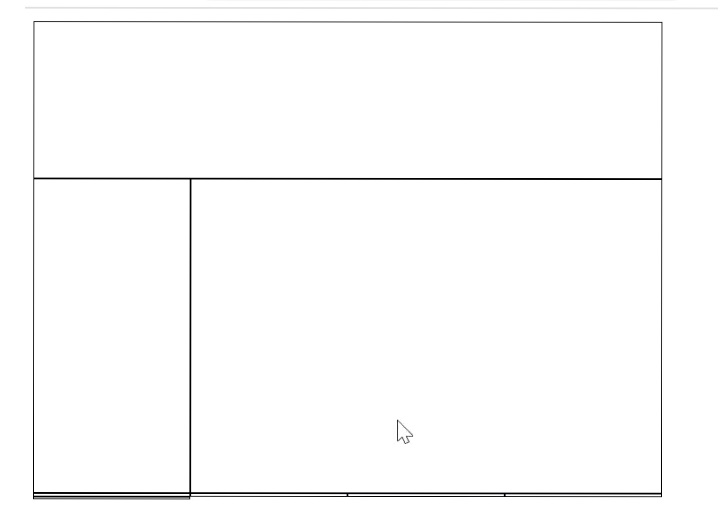

> `grid-area` 활용 모눈 종이 처럼 활용 가능 위 예시

```html
<div
  style='
          display:grid;
          gird-template-columns: 100px 100px 100px 100px;
          gird-template-rows: 100px 100px 100px;
          grid-template-areas:
            "A A A A"
            "B C C C"
            "B C C C"
          '
>
  <div style="grid-area : A"></div>
  <div style="grid-area : B"></div>
  <div style="grid-area : C"></div>
</div>
```

<br />
<br />

## position : sticky 활용하기

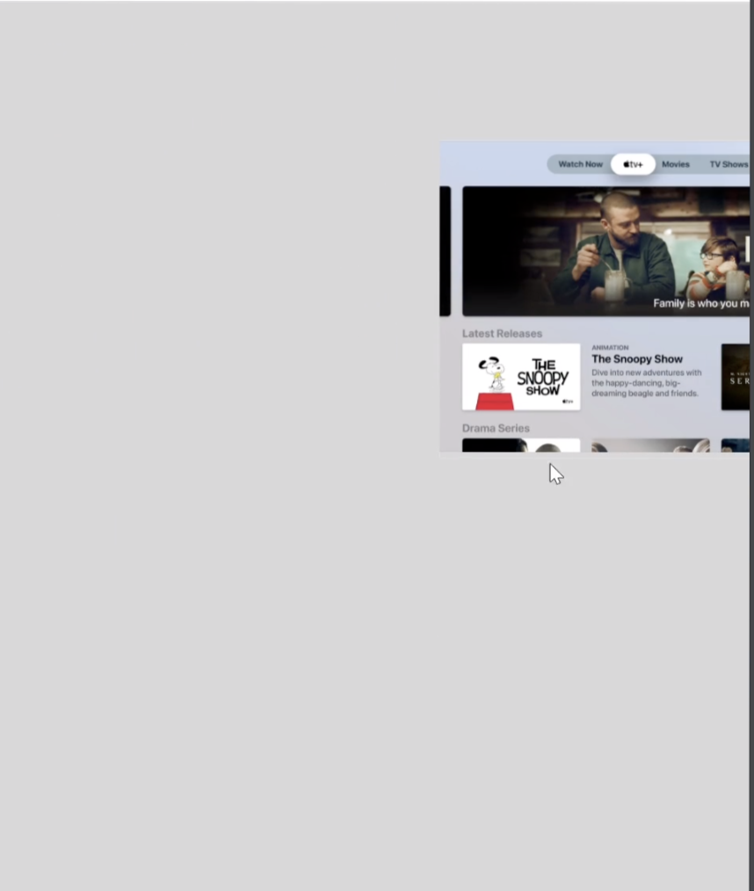

> 스크롤 됐을 때 이미지를 고정하는 기능

> 조건부 fixed (부모박스를 넘어갔을 때 속성이 해제된다.)

```css
/*스크롤 하다가 top100위치에서 스크롤이 멈추는 기능*/
.image {
  float: right;
  width: 400px;
  position: sticky;
  top: 100px;
}
```

<br />
<br />
