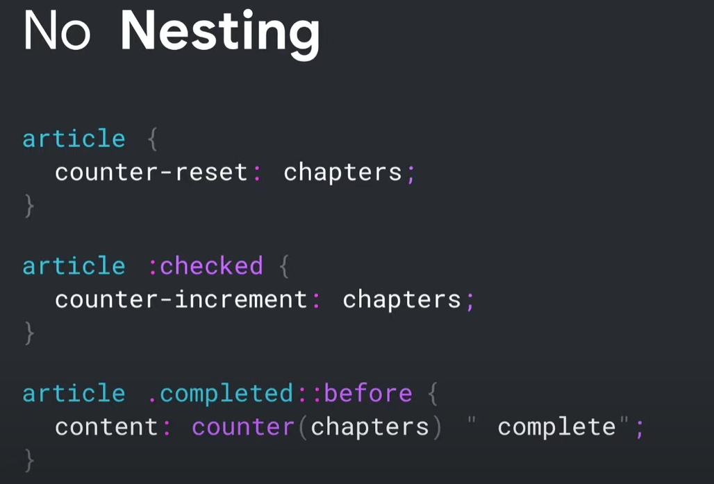
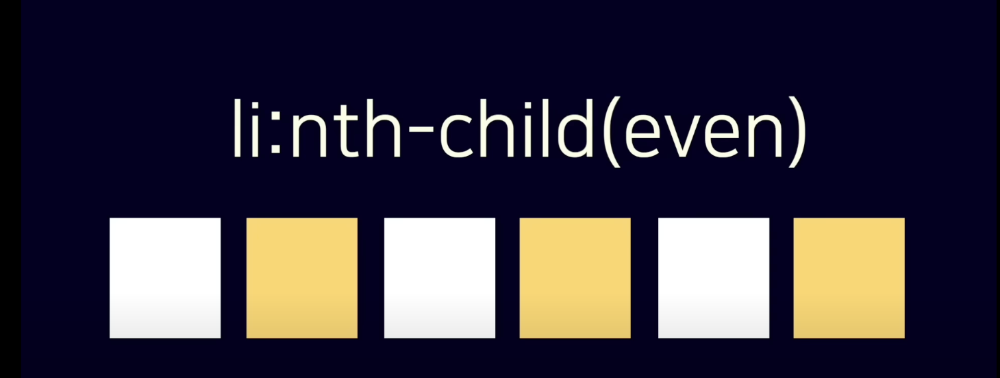
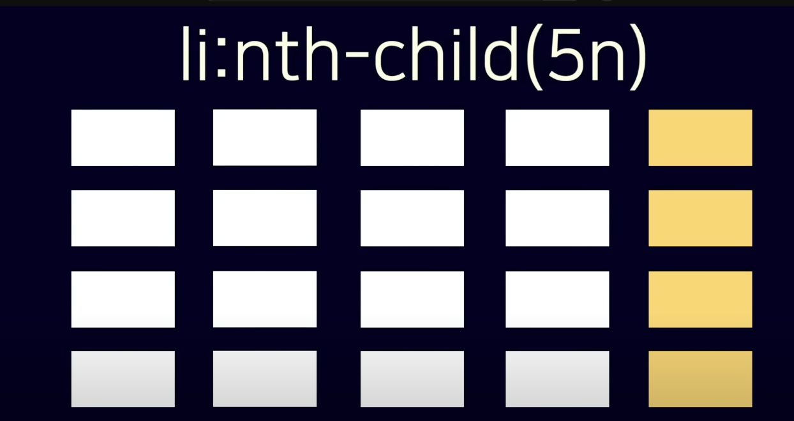
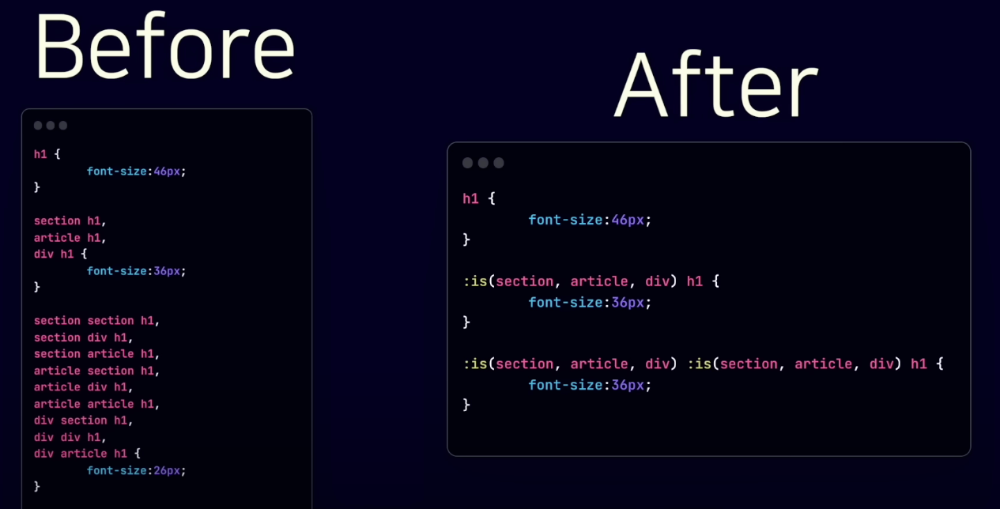

# Nesting 

<br />

{: .note } 
> - 선택자 정리하기

<br />

> `& 선택자`

```css
.btn { background: blue; }
.btn.active { background: red; }
```

```css
.btn {
  background: blue;
  &.active {
    background: red;
  }
}
```


<br />

> `: 선택자(상태나 가상 클래스)`

```css
a { color: blue; }
a:hover { color: red; }
```

```css
a {
  color: blue;
  &:hover {
    color: red;
  }
}
```


<br />

> `>: 직계 자식 선택자`

```css
ul > li { list-style: none; }
```

```css
ul {
  > li {
    list-style: none;
  }
}
```


<br />

> `>: 직계 자식 선택자`

```css
ul > li { list-style: none; }
```

```css
ul {
  > li {
    list-style: none;
  }
}
```


<br />

> `~: 일반 형제 선택자`

```css
.highlight ~ p { color: gray; }
```

```css
.highlight {
  ~ p {
    color: gray;
  }
}
```


<br />

> `+: 인접 형제 선택자`

```css
h2 + p { margin-top: 10px; }
```

```css
h2 {
  + p {
    margin-top: 10px;
  }
}
```


<br />

> `#: ID 선택자`

```css
div#header { background: black; }
```

```css
div {
  &#header {
    background: black;
  }
}
```

<br />

> `[ ]: 속성 선택자`

```css
input[type="text"] { border: 1px solid black; }
```

```css
input {
  &[type="text"] {
    border: 1px solid black;
  }
}
```


<br />

> `*: 전체 선택자`

```css
.container * { box-sizing: border-box; }
```

```css
.container {
  * {
    box-sizing: border-box;
  }
}
```


<br />
<br />
<br />

---

## Nesting 사용 미사용 비교

{: .note } 
> - nesting 사용 미사용 비교
> - `&`은 무조건 부모를 뜻하게 된다.

<br />

> nesting 미사용 시 (`& : 이전 선택자를 나타낸다.`)

- 

> nesting 사용 (`& : 이전 선택자를 나타낸다.`)

- 
- 

<br />

```css
/* 코드로 알아보기 */

article {
  background-color : red;
  /* article 자식의 p 태그 */
  & p {
    color : white;
      /* article 자식의 p 태그 자식의 a태그 */
    & a {
      color : gray;
    }
  }
}


.card {
  .featured & & & {
    /* featured가 최상위 부모가 됨 */ 
    /* .featured .card .card .card */
  }
}


.card {
  .featured & {
    /* featured가 최상위 부모가 됨 */ 
    /* .featured .card */
  }
}

.demo{
  .sm {
    .blue{
      /* blue 최상위 부모가 됨 */ 
      /* .blue > .demo > .sm 선택 */
    }
  }
}


.logo{
  /* header가 최상위 요소가됨 header > logo 선택 */
  .header & {
    border: 1px solid red;
  }
  .footer & {
  /* footer가 최상위 요소가됨 footer > logo 선택 */
    filter: grayscale(100%);
  }
}

```

<br />
<br />
<br />

---

## Nesting (@media 쿼리 사용)


{: .note } 
> - 미디어쿼리를 이용해서 반응형으로 만들기
> - `& : 이전 선택자를 나타낸다.`


<br />

> - 500px이상일때 배경 색 블루로 바꿈

```css
article {
  background-color: red;

  @media (min-width: 500px){
    & {
      background : blue
    }
  }
}

/* 모든 브라우저 사용 가능 */
/* 1024px보다 클 때 배경색 변경 */
.demo {
  @media (120px <= width <= 1024px){
    background : red;
  }
}
```


<br />
<br />
<br />

---

## Nesting에 대해 (nth-child)


- 
- 
- 

{: .note } 
> - `nth-child of 문법 주목`
> - nesting 예제
> - nth-child(?)

<br />

```css
/* 4번째 요소 */
li:nth-child(4)


/* 짝수요소 */
li:nth-child(event)


/* 홀수요소 */
li:nth-child(odd)

/* 5의 배수의 요소 */
li:nth-child(5n)

/* li 자식 중에 link 클래스를 가진 2번째 요소*/
li:nth-child(2 of .link){}
```

<br />
<br />
<br />

---

## `Is 선택자`

{: .note } 
> - 중복되는 태그를 줄일 수 있다 (아래 사진 참고)
> - 모든 브라우저에서 지원되고 있다.

<br />



<br />

{: .note } 
> - is말고 다른 방식으로도 표현 할 수 있다.
> - 아래 예시 참고

```css
/* nesting 전 */
.demo .triangle,
.demo .square {
  opacity: 0.25;
  filter: blur(25px);
}

/* is 연산자 사용 */
.demo :is(.triangle, .square){
  opacity : 0.25;
  filter: blur(25px);
}

/* nesting 사용 1 */
.demo {
  & .triangle,
  & .square {
      opacity : 0.25;
      filter: blur(25px);
  }
}

/* nesting 사용 2 */
.demo {
  .triangle , .square {
      opacity : 0.25;
      filter: blur(25px);
  }
}

```