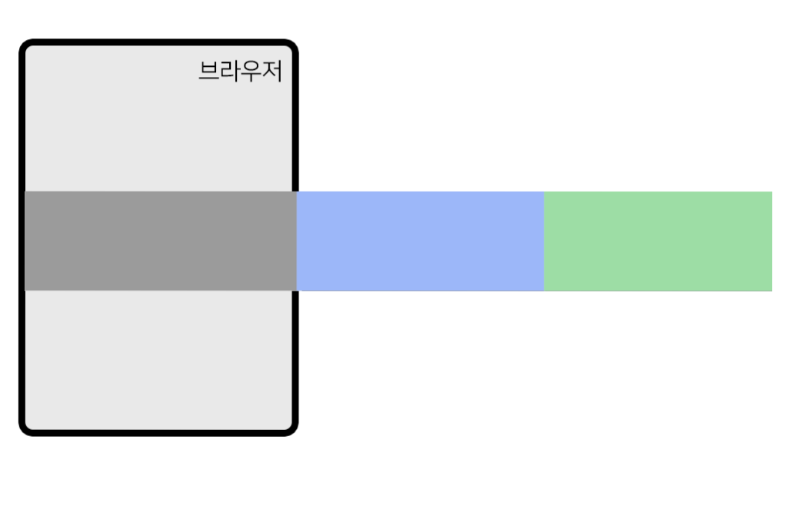
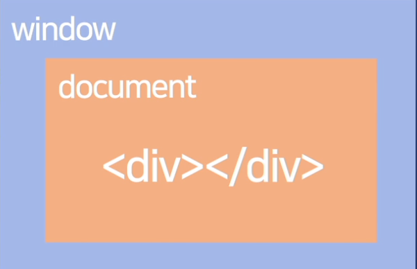
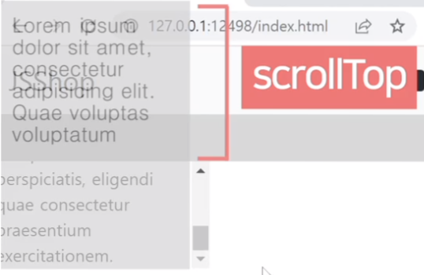
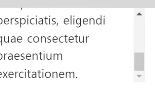
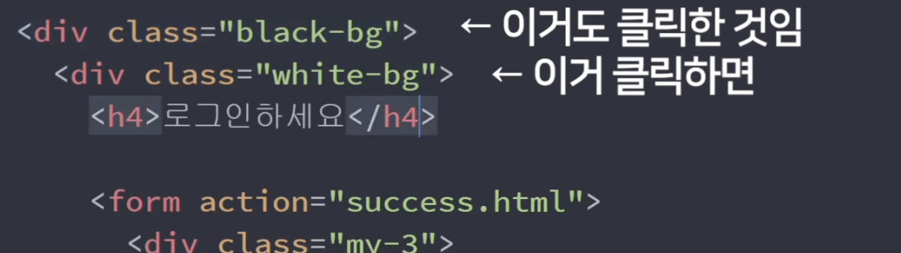
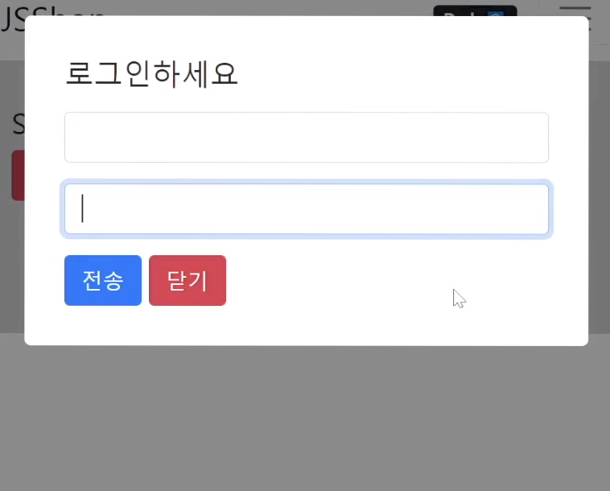

# JAVASCPIRT

## HTML tag 변동

> Javascript 이용해서 태그 변경하기

### 응용 (html, style, class , href 변경)

1. document.getElementById("아이디").
2. document.getElementById("아이디").무엇을 바꿀지
3. document.getElementById("아이디").무엇을 바꿀지 = 어떻게 바꿀지

```js
document.geElementById("hello").innerHTML = "안녕";
document.geElementById("hello").style.color = "red";
document.geElementById("hello").src = "./domain.png";
document.geElementById("hello").style.fontsize = "16px";
```

<br />

## 버튼 누르면 보이는 Alert 창 만들기

- div 보이게 `display : block;`
- div 보이지 않게 `display : none;`

<br />

> html요소 예시

```html
<div style="disply: none" id="alert"></div>
<button onClick="document.getElementById('alert').style.display">버튼</button>
```

<br />

## addElementById (이벤트 부여)

> sciprt 태그 이용 예시

```html
<div id="alert">alert 창</div>
<button id="close">버튼</button>
<script>
  // 클릭 이벤트
  document.getElementById("close").addeventlistener("click", function () {
    document.getElementById("alert").style.display = "none";
  });
  // 키보드 이벤트
  document.getElementById("close").addeventlistener("keydown", function () {
    document.getElementById("alert").style.display = "none";
  });
  // 스크롤 이벤트
  document.getElementById("close").addeventlistener("scroll", function () {
    document.getElementById("alert").style.display = "none";
  });
</script>
```

<br />

## getElementsByClassName (class 변경)

> class는 맨 오른쪽으로 갈 수록 적용 우선 순위가 높다

- `getElementsByClassName` : 여러 요소를 찾기 때문에 [0] 0번째 인덱스를 찾아야한다.
- `classList.add("show")` : 선택한 요소에 show라는 클래스를 추가해준다.

<br />

> 예시 코드

```html
<!-- 가장 오른쪽에 있는 class가 우선 적용 (show 적용) -->
<ul class="list-group show">
  <li class="list-group-item">An item</li>
  <li class="list-group-item">A second item</li>
  <li class="list-group-item">A third item</li>
  <li class="list-group-item">A fourth item</li>
  <li class="list-group-item">And a fifth one</li>
</ul>
<button class="navbar-toggler">버튼</button>

<script>
  document
    .getElementsByClassName("navbar-toggler")[0]
    .addEventListener("click", function () {
      document.getElementsByClassName("list-group")[0].classList.add("show");
    });
</script>
```

<br />

> querySelector (class이름 , id이름 으로 요소 선택)

- 맨위에 나오는 한개만 찾아주기 때문에 [0]을 사용할 필요없다.

```js
document.querySelector(".클래스 이름");
document.querySelector(".id 이름");
```

<br />

## one way UI 애니메이션 만들기

1. 시작 스타일
2. 최종 스타일
3. 원할 때 최종스타일로 변하라고 코드 작성
4. transition 추가

> 흐려지고 선명해지는 애니메이션 추가

<br />

> js코드

```js
//black-bg 요소에 class 추가
document.querySelector(".black-bg").classList.add("show-modal");
```

<br />

> css 속성 추가

```css
.black-bg {
  /*애니메이션 줄 때 display:none 대용*/
  visibility: hidden;
  opacity: 0;
  /*모든 css속성이 변할 때 1초에 걸쳐서 변함*/
  transition: all 1s;
}
.show-modal {
  /*애니메이션 보이게*/
  visibility: visible;
  opacity: 1;
}
```

<br />

## form내 iput창 공백 시 alert 띄우기

> 예시코드

```html
<!-- html 코드-->
<form action="success.html">
  <input type="text" class="form-control" />
  <button type="submit" class="btn btn-primary">전송</button>
</form>
```

```js
//js 코드
//form 태그에서 subit 이벤트가 발생했을 때 email value가 ""이면 이벤트 막기
document.getElementById("form").addeventlistener("submit", function (e) {
  if (document.getElementById("email").value == "") {
    e.preventDefault();
    alert("아이디 입력하쇼");
  }
});
```

<br />

## true / false 자료형

| true       | false     |
| ---------- | --------- |
| 0제외 숫자 | 0         |
| 문자       | ''        |
| []         | null      |
| {}         | undefined |
|            | NaN       |

<br />

## true / false 자료형

| var           | let     | const   |
| ------------- | ------- | ------- |
| 재선언 O      | 재선언X | 재선언X |
| 재할당 O      | 재할당O | 재할당O |
| 범위 function | 범위{}  | 범위{}  |

<br />

## setTimeout , setInterval

- setTimeout : X초 뒤 코드 실행
- setInterval : X초 마다 코드 실행

> 위 예시

```js
setTimeout(function(){ 실행할코드~ }, 기다릴시간);
setInterval(function(){ 실행할코드~ }, 기다릴시간);
```

> setTimeout #num 요소 시간 동적으로 변화시키기

```js
var count = 5;
setInterval(function () {
  count -= 1;
  if (count >= 0) {
    document.querySelector("#num").innerHTML = count;
  }
}, 1000);
```

<br />

## 정규식

### includes

```js
"문자".includes("찾을 단어");
```

### 정규식 범위 지정

> `[a-z]` : 소문자a 부터 소문자z

> `[a-zA-Z]` : 알파벳이 포함되었는지

> `[^a]` : a로 시작하는지

> `[a$]` : a로 끝나는지

> `[a|b]` : a또는 b가 포함되는지

> `[\S]` : 모든 문자 한글자

> `[\S+]` : 왼쪽 문자 반복 검색

```js
/[a-z]/.test("abcde");
/[^a]/.test("abcde");
```

<br />

### 이메일 정규식

```js
/\S+@\S+\.\S+/.test(aaa@bbb.com)
```

<br />
<br />

## Carousel

- 숫자 반올림
  - 숫자.toFixed(몇자리)



> 슬라이드 js 구현

```html
<!-- width:300vw; 브라우저 3배 -->
<div style="overflow: hidden">
  <div
    style="
          transition: all 1s;
          width:200vw;
          transform: translateX(-100vw);
          "
  >
    <div style="width:100vw" />
    <div style="width:100vw" />
  </div>
</div>
```

> js css 애니메이션

```js
document.querySelector(".slide-2").addEventListener("click", function () {
  document.querySelector(".slide-container").style.transform =
    "translateX(-100vw)";
});
```

<br />

## scroll 이벤트



> scroll 이벤트 감시 하기

```js
// 스크롤 일어날때마다 아래 코드 실행
window.addEventListener("scroll", function () {
  ...
});
```

> 유저가 얼마나 스크롤을 내렸는지

```js
window.addEventListener("scroll", function () {
  console.log(window.scrollY);
});
```

<br />

> 강제로 스크롤 하기

```js
window.scrollTo(x, y);
window.scrollTo(0, 100);
```

<br />

> 현재 위치에서 100만큼 이동

```js
window.scrollBy(0, 100);
```

<br />
<br />

## div 박스 내 scroll 알아내기




- `페이지 내 스크롤바 내린 위치` : scrollY 사용
- `div 내 스크롤바 내린 위치` : scrollTop

> div 박스 내 스크롤 위치 알아내기 (스크롤바 내린 위치)

```js
document.querySelector(".lorem").addEventListener("scroll", function () {
  // div 박스 내 스크롤 내린 위치
  document.querySelector(".lorem").scrollTop;
  // div 실제 높이
  document.querySelector(".lorem").scrollHeight;
  // div 눈에 보이는 div 높이
  document.querySelector(".lorem").clientHeight;
});
```

```
scrollHeight (div 실제 높이) = scrollTop(div내 내린 스크롤 양) + clientHeight (눈에 보이는 div 높이)
```

<br />
<br />

## 이벤트 버블링 (`e.stopPropagation()`)



> 이벤트가 상위 html로 퍼지는 현상(모든 브라우저는 이벤트 버블링이 일어난다.)

### 이벤트 함수

- e.target : 유저가 실제로 누른 것
- e.currentTarget : 이벤트 리스너 달린 곳 (this)
- e.preventDefault() : 이벤트 기본 동작을 막아준다
- e.stopPropagation() : 내 상위요소로 이벤트 버블링을 막아준다.

<br />
<br />
<br />



> 배경을 선택했을때만 alert창 닫기

```js
document.querySelector(".black-bg").addEventListener("click", function (e) {
  if (e.target == document.querySelector(".black-bg")) {
    document.querySelector(".black-bg").classList.remove("show-modal");
  }
});
```
