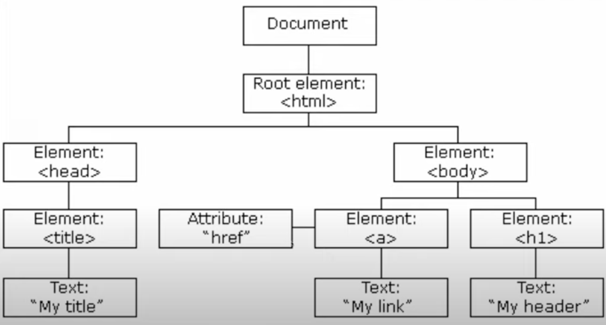
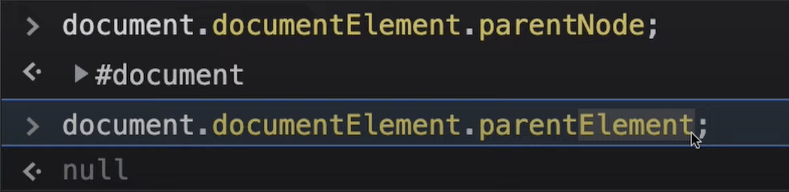
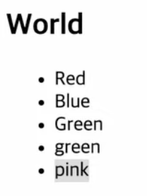
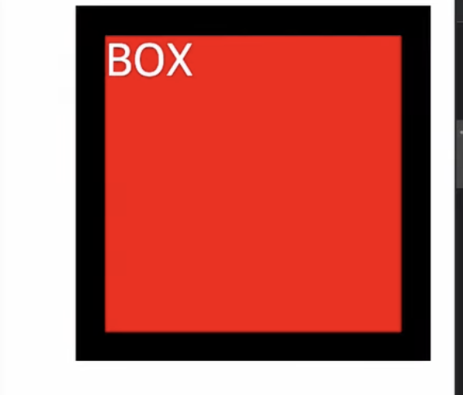
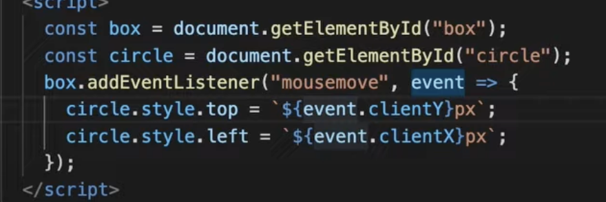

# DOM & EVENT 

## 노드에 접근하기 선택자



<br />

{: .new } 
- 개발자 도구를 열었을 때 바로 보이는 것이 DOM
- DOM(Document Object Model) html 요소들을 tree 형태로 표현해준다. 개발자는 js를 이용해서 이걸 수정,삭제,생성한다.
  - html : 최상단 노드
  - Body : 자식 노드
- 모든 html요소는 객체이다. (따라서 모두 js로 접근이 가능하다.)
- 요소들은 모두 nodeList이다. (이터러블한 자료구조이다.)
  - for of를 사용한다.
  - array가 아니기 때문에 push,pop,join,...은 사용이 불가능하다.


<br />

> html요소 style변경하는 예제

```js
// body태그의 투명도 변경
document.body.style.opacity = "0.5"

// id값으로 데이터 html 요소 가져오기
document.getElementById("idid")

//Tag값으로 요소 접근하기
document.getElementByTagName("p")

//클래스 이름으로 요소 접근하기
document.getElementByName('className')

//클래스 이름으로 요소 접근 (다 가져옴)
document.querySelectorAll(".link")

//id이름으로 요소 접근 (하나만 가져옴)
document.querySelector("#first")
```

<br />

- 

- 

{: .important-title }
> - 위 사진을 보면 두개의 반환 타입이 다르다.
>   - NodeList : Tag 추가 됐을 때 실시간 적용이 되지 않는다.
>   - HTMLCollection : Tag 추가 됐을 때 실시간 적용 가능.


<br />
<br />

---

## 노드의 종류
{: .important-title }
> - 노드는 다양한 타입이 있다. 9개 정도의 노드 종류가 있다
> - 종류로는
>   - 요소노드 , 텍스트 , 주석 , document, ...

<br />


<br />
<br />

---

## 노드에 접근하기 선택자 (자식 부모 노드)

{: .new } 
> - document.documentElement.parentNode
>   - 부모 노드를 반환
> - document.documentElement.parentElement;
>   - 부모 노드 중 요소 노드만 반환
>   - `요소노드란 html테그로 이루어진 것을 의미`한다.




<br />


> childNode , children 

```js
// 8개 반환
ul.childNodes;
> 0 : text
> 1 : li#red
> 2 : text
> 3 : comment
> 4 : text
> 5 : li#blue
> 6 : text
> 7 : li#green
> 8 : text
//3개 반환
ul.children;
[li#red, li#blue, li#green]
```

<br .>

{: .note } 
> - `childNodes` : 모든 종류의 노드를이 조회된다. (nodeList)
>   - html 변동이 실시간으로 반영이 된다. 
> - `children` : 요소 노드들만 조회된다. (HTMLCollection)
>   - html 변동이 실시간으로 반영 된다.
> - `ul.firstChild` : 첫번째 노드를 가져옴
> - `ul.lastChild` : 마지막 노드를 가져온다.
> - `ul.firstElementChild` : 요소 노드 중에 첫번째 노드를 가져온다
> - `ullastElementChild` : 요소 노드 중에 마지막 노드를 가져온다.

<br />

> 위 명령어 사용 예시


<br />
<br />
<br />

---

## 형제 노드에 접근하기

{: .note } 
> - 형제는 이전 노드와 다음 노드로 나누어진다.
> - `blue.previousSibling` : 모든 노드 중 전의 노드를 가져온다.
> - `blue.nextSibling` : 모든 노드 중 다음 노드를 가져온다.
> - `blue.perviousElementSibling` : 요소 노드 중 이전 노드를 가져온다
> - `blue.nextElementSibling` : 요소 노드 중 다음 노드를 가져온다

<br />

> 요소 접근 정리


|         | head two          | three |
|:-------------|:------------------|:------|
| 부모           | parentNode | parentElement  |
| 자식| childNodes , firstChild , lastChild   | children , firstElementChild , lastElementChild  |
| 형제 | previousSibling , nextSibling  | previousElementSibling , nextElementSibling  |

<br />
<br />
<br />

---

## 노드 생성, 추가

{: .note } 
> - `nodeValue` : 모든 node가 가지고 있지만, text 요소가 아니면 `null`를 반환한다.
>   - `textNode`에서만 `nodeValue`를 이용해 text수정이 가능하다.
> - `nodeName` : 태그의 이름을 대문자로 반환한다.
> - `innerHTML` : 이용해서 태그를 삽입할 수 있다.
> - `부모요소.appendChild` : 부모 요소 맨뒤에 html 요소 추가
> - `부모요소.insertBefore(A , B)` : 부모 요소 중 A tag 앞에 B tag를 추가한다. 

<br />

> 요소 삽입 예제

```js
//innerHTML은 중간에 값을 삽입 할 수는 없고 넣고 싶은 요소와 원래 있던 요소를 다 작성해줘야한다.
ul.innerHTML = `<li>red</li><li>blue</li>`
```


<br />
<br />

> 아래 작업 그림 도식화


{: .highlight }
요소 노드에 자식요소로 html 요소(요소 노드)를 추가하는 방법 (appendChild)


```js
//li 요소 생성
const li = document.createById("li")
//텍스트 요소 생성
const text = document.createTextNode("blue")
//li요소에 텍스트 요소 삽입
li.appendChild(text);
//ul에 방금 만든 li 삽입
ul.appendChild(li)
```

<br />

{: .highlight }
> - 부모 요소로 html 요소를 삽입하지만, red요소 앞에 넣고 싶을 때 (`insertBefore` 명령어 사용)


<br />
<br />
<br />

---

## 노드 복제 , 삭제



{: .note }
> - `복사할 요소`.cloneNode() : 명령어를 통해 노드를 복제할 수 있다.
>   - cloneNode(true) : 깊은 복사로 자식 노드까지 다 복사 된다.
>   - cloneNode() : 현재 li,div,button 노드만 딱 복사된다.
> - `부모요소`.removeChild(삭제할 노드) : 노드 삭제 하기


<br />

> 예시 코드 (복제)

```js
//노드 깊은 복사
const newBlack = li.cloneNode(true);
newBlack.appendChild(newBlack);
```
 

<br />

> 예시 코드 (삭제)

```js
// 노드 복제
const Cli = li.cloneNode(true)
// 부모요소에서 특정 노드 삭제
ul.removeChild(Cli);
// 부모요소 중에 가장 첫번째 요소 삭제
ul.removeChild(ul.firstElementChild)
// 부모요소 중에 가장 마지막 요소 삭제
ul.removeChild(ul.lastElementChild)
```

<br />
<br />
<br />

---

## CSS (style,class) 제어



{: .note }
> - 요소.style.스타일 = "" 와 같은 형식으로 스타일을 변경 할 수 있다.
> - ex) box.style.color , box.style.width , ...

<br />

> 예시 코드 css style

```js
const box = document.getElementById("Box");
box.style.color = "red"
box.style.width = "100px"
box.style["margin-left"] = "30px"
box.style.border = "10px solid #000000"
```

<br />

{: .note }
> - 요소.classList.add("클래스 이름") 으로 여러 클래스를 추가할 수 있다.
> - 요소.classList.remove("클래스 이름") 으로 하나의 클래스 제거
> - 요소.classList.replace("기존 클래스 이름" , "바꿀 클래스 이름")

<br />


> 1초에 한번씩 class 적용 , 적용 해제 하는 예시 코드

```js
//"bg-red" 클래스가 적용되어 있으면 클래스 삭제
//"bg-red" 클래스가 적용되지X 클래스 추가
setInterval(()=>{
  box.classList.toggle("bg-red")
},1000)
```

<br />
<br />
<br />

## JS event, dom
{: .note }
> - `요소.addEventListener` : html요소에 이벤트를 추가
> - `요소.removeEventListener` : html 요소에 이미 추가된 event를 삭제
> - 자주 사용하는 이벤트
>   - dblclick : 더블 클릭 했을 때
>   - keyup : 키보드를 눌렀을 때 
>   - keydown : 키보드를 눌렀다 땠을 때
>   - focus : 포커스 됐을 때
>   - blur : 포커스를 잃었을 때
>   - mousemove : 마우스를 움직을 때 호출

<br />


> 원이 마우스를 따라 다니도록 하는 코드

- 
- 

<br />
<br />

{: .important-title }
> - 창크기가 변할 때 마다 호출되는 이벤트 `resize`


<br />

```js
window.addEventListener("resize", () =>{
  document.body.innerText = `현재 창 크기 : ${window.innerWidth} * ${window.innerHeight}`
})
```


<br />
<br />
<br />

## 이벤트 버블링


{: .highlight } 
> - `이벤트 버블링` : 자식요소에서 발생된 이벤트는 부모를 통해 전파된다. (하위 -> 상위 요소로 전달된다.)
> - `이벤트 버블링이 안되는 요소`
>   - `focus`
>   - `blur`
>   - `mouseenter`
>   - `mouseleave`
> - `이벤트 버블링이 일어나게 하려면 아래 요소로 변경 시켜 준다.`
>   - `focusin`
>   - `focusout`
>   - `mouseover`
>   - `mouseout`

<br />

> 이벤트 버블링을 막는 코드

```js
box.addEventLisner("Click", (event) => {
  //이벤트 버블링을 막는 함수
  event.stopPropagation();
})
```

<br />
<br />
<br />

## 이벤트 위임

{: .highlight } 
> 자신에서 발생한 이벤트를 다른 요소에서 처리하는 것을 뜻한다.


- 
  - A tag 이벤트 위임
- 
  - target === target.currentTarget

<br />


> 사용 예시

```html
<ul id="list">
  <li id="red" href="" >Red</li>
  <li id="blue" href="" >blue</li>
  <li id="green" href="" >green</li>
</ul>


<script>
// ul 선택
const list = document.getElementbyId("list");
// ul의 li자식들
const colors = list.children;

// 클릭 이벤트
function clickHandler(event){


  /****************이벤트 위임 코드 시작*****************/
  //이벤트가 발생하는 요소 A tag
  let target = event.target;
  if(target.tagName === "A"){
    //target A 태그의 부모 요소로 옮긴 후 target의 색상 변경
    target = target.parentElement;
  }else if(target === target.currentTarget){
    //target = ul , target.currentTarget = ul이면 이벤트 위임을 발생 x
    return;
  }
  /****************이벤트 위임 코드 끝*****************/

    for(c of colors){
    // li tag 클래스들 삭제
    c.classList.remove("on");
    }
  event.target.classList.add("on")
}

// ul클릭 시 clickHandler 함수 발생
document.getElementById("list").addEventListener("click",clickHandler)

// event.currentTarget ----->>> ul
// event.target ----->>> 클릭된 요소를 가리킨다.

</script>
```


{: .warning } 
> - `event.currentTarget` : 이벤트 핸들러가 등록된 것 !!
> - `event.target` : 실제 이벤트를 발생하는 요소 !!
>   - 이벤트 위임을 사용하지 않는다면 `event.currentTarget` === `event.target`