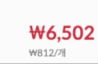
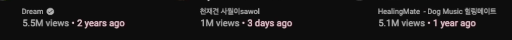
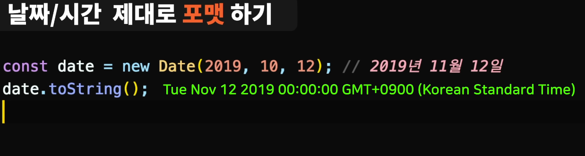
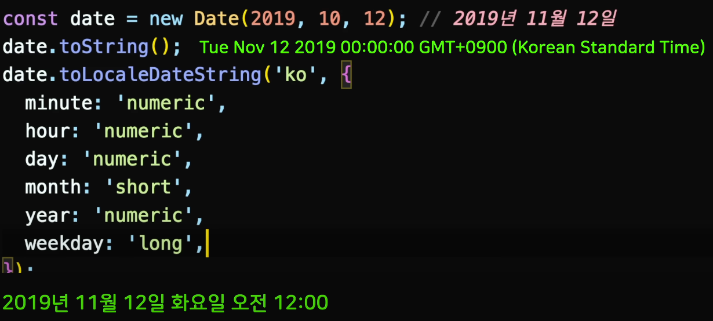

# Intl API

<br />


## 숫자 간결하게 나타내기


{: .highlight } 
> - 숫자 간결하게 나타내기

<br />

> 사용 예시

```js
const views = 9744642;

const formatter = new Intl.NumberFormat('ko');
formatter.format(view);
// 9,744,642 출력

const formatter = new Intl.NumberFormat('ko',{notation: 'compact'});
formatter.format(view);
// 974만

const formatter = new Intl.NumberFormat('en',{notation: 'compact'});
formatter.format(view);
// 9.7M

const formatter = new Intl.NumberFormat('en',{notation: 'compact', compactDisplay:'long'});
formatter.format(view);
// 9.7 million

const formatter = new Intl.NumberFormat(navigation.language,{notation: 'compact', compactDisplay:'long'});
formatter.format(view);
// 974만 (사용자 브라우저에 설정된 언어에 따라 표시됨)
```

<br />
<br />
<br />

---



{: .highlight }
> - 가격 간결하게 나타내기


<br />
<br />

> 사용 예시

```js
const price = 10000;

const formatter = new Intl.NumberFormat('ko',{
  style: 'currency',
  // 한국 통화
  currency: 'krw',
  notation: 'compact'
})
formatter.format(price);
// 1만 (출력)


const formatter = new Intl.NumberFormat('ko',{
  style: 'currency',
  // 한국 통화
  currency: 'krw',
})
formatter.format(price);
// 10,000 (출력)


const formatter = new Intl.NumberFormat('en-US',{
  style: 'currency',
  // 미국 통화
  currency: 'usd',
})
formatter.format(price);
// 10,000.00 (출력)

const formatter = new Intl.NumberFormat('en-US',{
  style: 'currency',
  // 미국 통화
  currency: 'usd',
})
formatter.format(price);
// 10K (출력)
```

---

<br />
<br />
<br />



{: .highlight }
> - 상대 시간 똑똑하게 나타내기


<br />

> 사용 예시

```js
const formatter = new Intl.RelativeTimeFormat('en');
formatter.format(1, 'day'); // in 1 day (출력)
formatter.format(2, 'day'); // in 2 days (출력)
formatter.format(-1, 'day');// 1 day ago (출력)
formatter.format(-2, 'day');// 2 day ago (출력)


const formatter = new Intl.RelativeTimeFormat('en', {numeric : 'auto'});
formatter.format(1, 'day'); // tomorrow (출력)
formatter.format(2, 'day'); // in 2 days (출력)
formatter.format(-1, 'day');// yesterday (출력)
formatter.format(-2, 'day');// 2 days ago (출력)


const formatter = new Intl.RelativeTimeFormat('ko', {numeric : 'auto'});
formatter.format(1, 'day'); // 내일 (출력)
formatter.format(2, 'hour');// 1시간 후(출력)
formatter.format(1, 'second');// 1초 후(출력)
formatter.format(-2, 'day');// 그저께 (출력)
```

<br />
<br />
<br />

---

# 상대적인 시간 나타내는 라이브러리 추천


{: .highlight }
> - `timeage.js`

<br />

> 설치

```bash
$ npm install timeage.js
```

> 사용

```js
//아래 형식으로하면 자동 포멧팅
format('2016-06-12','en-US');
```


<br />
<br />
<br />

---


# 날짜/시간 제대로 포맷하기



{: .highlight }
> - 날짜/시간 제대로 포맷하기
> - `Intl API 사용`

<br />
<br />

> 사용 예시

```js
const date = new Date(2019,10,12); // 2019년 11월 12일
date.toString(); // Tue Nov 12 2017 00:00:00 ....


// 제대로 포맷팅
new Intl.DateTimeFormat('en-US').format(data); //11/12/2017
new Intl.DateTimeFormat('ko').format(data);// 2019.11.12
new Intl.DateTimeFormat('de').format(data);// 12.11.2019
new Intl.DateTimeFormat('zh').format(data);// 2019/11/12€
```

<br />
<br />

- 
- 