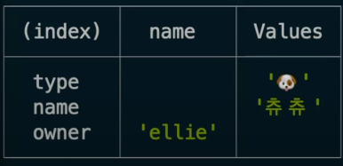
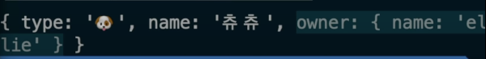
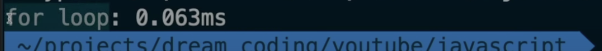
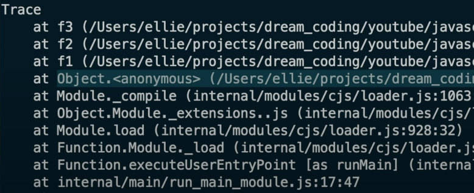

# Console.log 활용하기

{: .note }
> - `assert` : false 일때만 출력

<br />

> 사용 예시

```js
console.assert(2 === 3 , 'not same!') // not same 출력
console.assert(2 === 2 , 'same!') // XXsame 출력안됨XX
```

<br />
<br />
<br />

---



{: .note }
> - `table` : object를 가독성있게 출력하기

<br />

> 사용 예시

```js
console.table(dag)
```


<br />
<br />
<br />

---



{: .note }
> - `dir` : object 출력의 깊이, 색상 지정
>   - `{color:false, depth: 1}` : 색상 옵션 끄고, 깊이1로 지정 

<br />

> 사용 예시

```js
console.dir(dog,{color:false, depth: 0});
```

<br />
<br />
<br />

---



{: .note }
> - 함수의 걸린 시간 지정
>   - console.time("시작") : 시작 위치
>   - console.timeEnd("끝") : 종료 위치

<br />

> 사용 예제

```js
console.time("시작 위치");
for (let i = 0; i < 10; i++){
    i++;
}
console.timeEnd('종료 위치');
```

<br />
<br />
<br />

---


{: .note }
> - 함수의 걸린 시간 지정
>   - console.count("a function") : 함수가 몇번 호출 되었는지 카운트

<br />

> 사용 예제

```js
function a(){
    console.count('a function');
}

a();
a();
a();
```

<br />
<br />
<br />

---




{: .note }
> - `console.trace();` : 어디에서 누가 호출한지 알고 싶을때 사용한다.
>   -  어디에서 이 함수가 호출되었는지 확인하고 싶을 때 사용

<br />

> 사용 예제

```js
//trace 
function f1(){
    f2();
}
function f2(){
    f3();
}
function f3(){
    console.trace();
    console.log("f3호출");
}
```

<br />
<br />
<br />

---

## 심각도에 따라서 log 출력하기

{: .note } 
> - console.log();
> - console.info(); 
> - console.warn();
> - console.error();