# 웹 개발 툴

{: .note } 
> - `CSS overview`를 이용
>   - color에서 웹사이트의 색상 정보를 알 수 있다.
>   - Font info에서 웹사이트에서 이용하는 폰트
>   - Unused declarations : 사용하지 않는 class이름을 알 수 있다.

 

- 
- 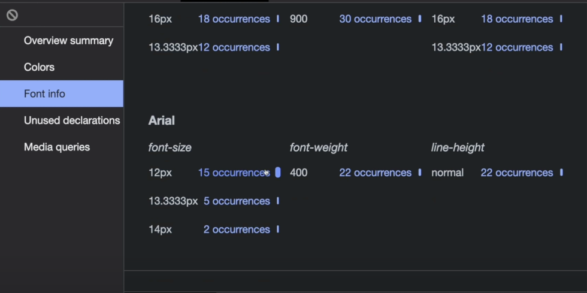

 
 
 

---

## shadow 에디터 사용하기

{: .note } 
> - shadow 에디터 이용
>   - Blur, spread를 이용해 미리 shadow값을 줄 수 있다.

 

- 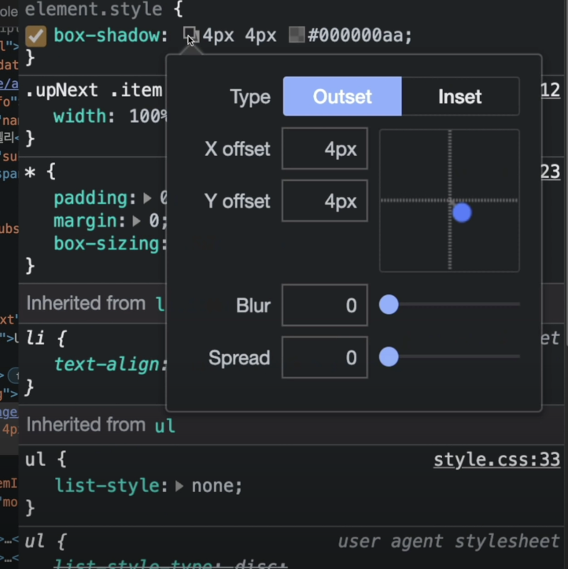

 
 
 

---

## shadow 에디터 사용하기

{: .note } 
> - 폰트 미리보기
>   - 관리자 도구툴을 이용해 폰트를 변경할 수 있음

 

- 
- 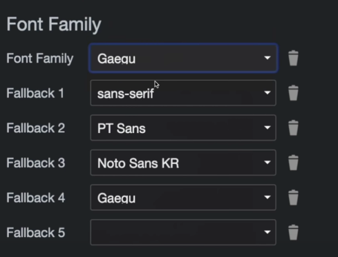

 
 
 

---

## Flexbox,Grid 에디터 사용하기

{: .note } 
> - flexbox,Gridbox 에디터를 이용해 grid박스,flex박스를 미리 적용 가능하다.

 

- 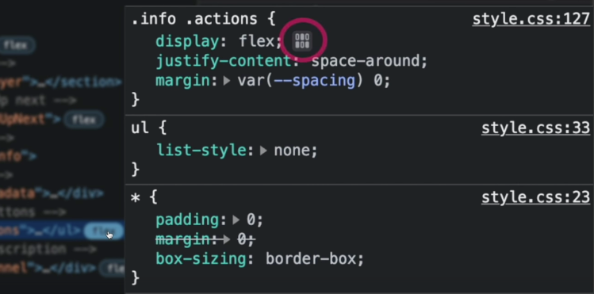
- 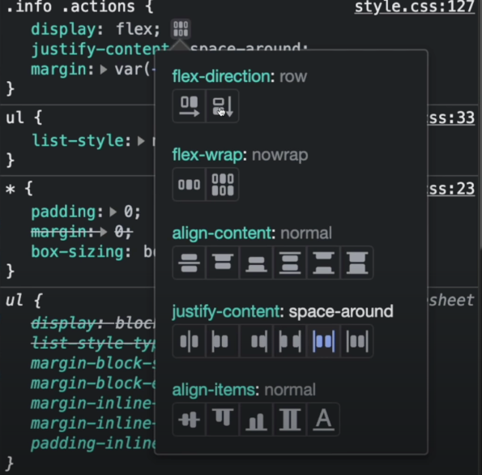
- 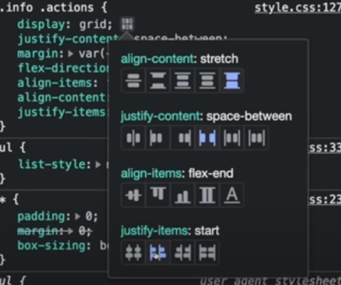

 
 
 

---

## 브라우저에서 간단하게 api 테스트 하기

{: .note } 
> - fetch함수를 이용해서 간단하게 브라우저에서 테스트가 가능하다.

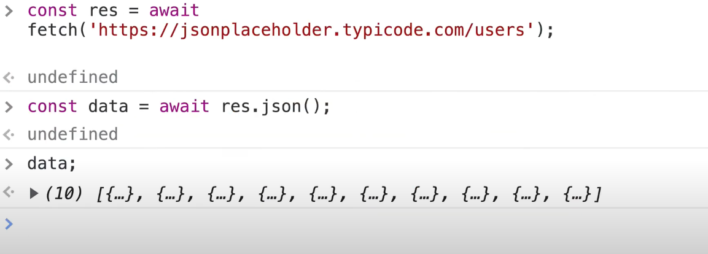

 
 
 

---

# 속도 저하 시키기

{: .note } 
> - 크롬 개발자 도구를 이용해서 속도 저하시키기

 

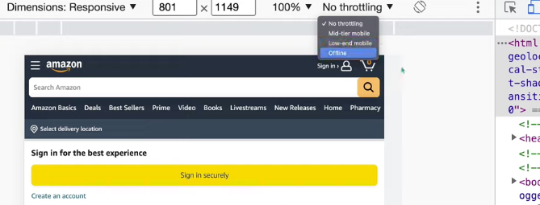

 
 
 

# 네트워크 항목 디버깅하기

{: .highlight }
> - 개발자 도구 네트워크 탭
>   - 네트워크 탭에 톱니바퀴로 자원을 다운로드하는데 얼마나 걸렸는지 알 수 있음 (`병목이 생기는 지`)
>   - api응답에 대한 자세한 정보도 관리자 도구를 통해 알 수 있다.
>   - 브라우저 응답값으로
>       - platform : `sec-ch-ua-plarform`
>       - 모바일 정보 : `sec-ch-ua-mobile`

 
 

- 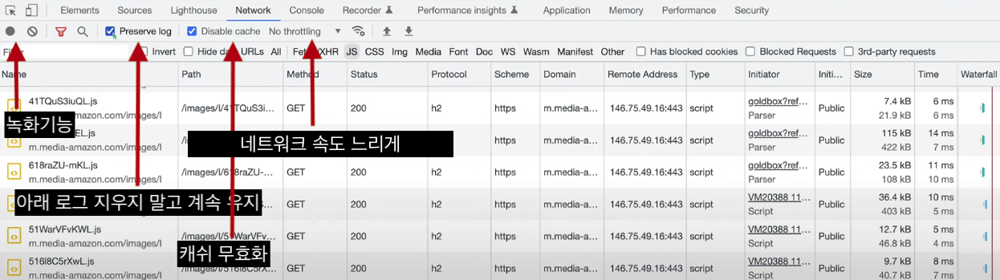
- 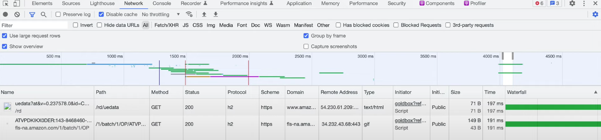
- 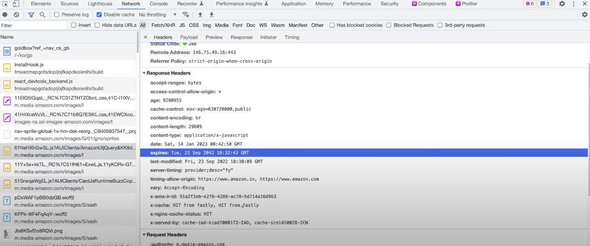
- 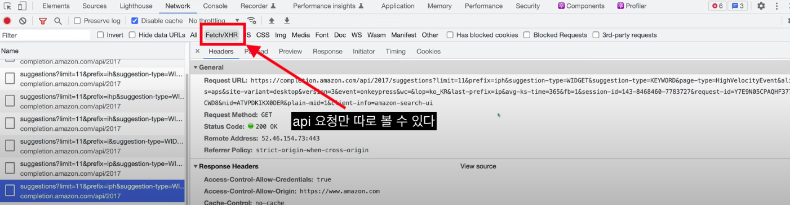