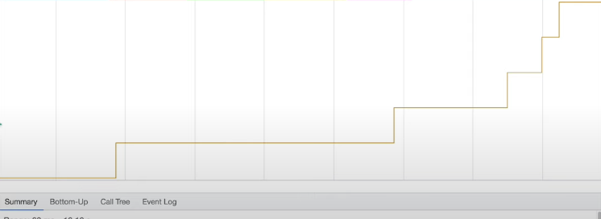
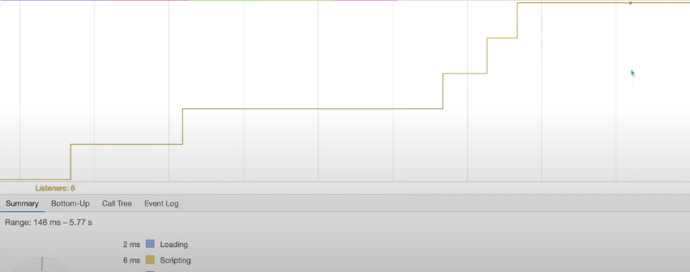
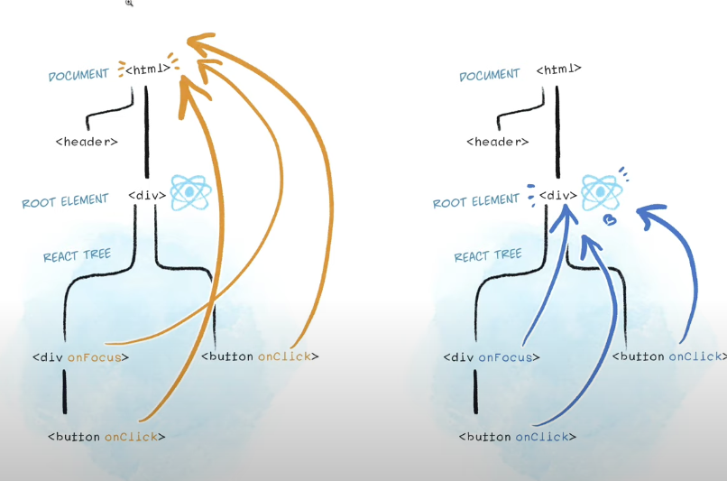

# 이벤트 관리 기본

{: .highlight }
> - `이벤트 관리의 기본` 
>   - 아래코드처럼 작성하면 새로고침할때 마다 메모리에 누적된다.(120개)

<br />

- 
- 

<br />

```js
function onEvent(){
    const itemList = document,querySelectorAll('li');
    itemList.forEach(item => {
        item.addEventListener("click", (e) => {
            e.target.classList.toggle('selected');
        })
    })
}


// 모든 li요소에 이벤트 삽입
onEvent();
```

<br />
<br />

> 위 코드는 메모리 최적화를 하면 아래 코드로 수정할 수 있다. (6개가 메모리에 쌓이면서 최적화 완료)



```js
function onEvent(){
    //container
    const container = document,querySelector(".container");
    container.addEventListener("click", (e) => {
        e.target.classList.toggle("selected");
    })
}

onEvent();
```


<br />
<br />





{: .warning } 
> - 위가 가능한 이유는 이벤트를 위임 했기 때문이다.
> - `e.target` === `li` 클릭이 일어난 요소이기 때문이다.
> - react도 상위 요소에서 이벤트를 총괄한다.
>   - 자식에게 이벤트를 걸지 않고 부모한테 위임해서 메모리를 아낄 수 있다.