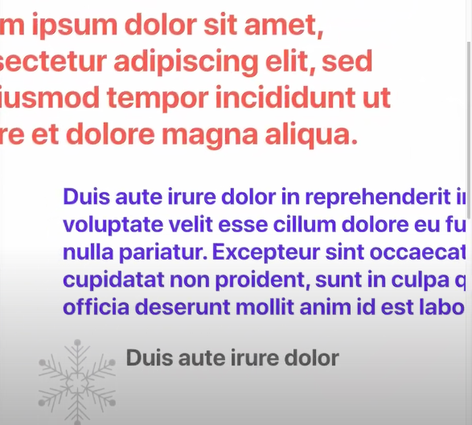
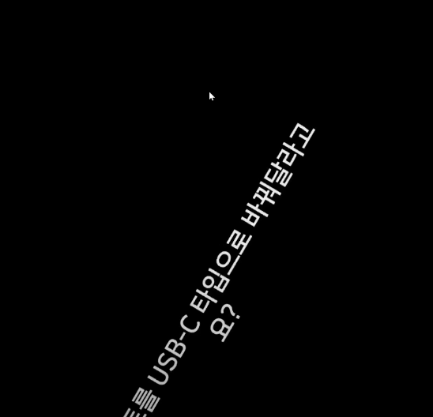

# Parallax Scrolling 구현 하기

{: .warning } 
gsap + scrolltrigger : 복잡한 애니메이션은 옆 라이브러리를 사용하는 편이 좋다.


<br />



{: .note } 
> - 마우스 위치에 따라 요소가 양 옆으로 움직이는 애니메이션 구현

<br />

{: .highlight } 
> - 스크롤 위치를 알고 있어야 하며, useEffect에 이벤트를 등록했다면,
> - clear up를 해야한다. 
>   - `컴포넌트가 언마운트 되어도 이벤트가 실행 되기 때문이다.`
>   - `메모리 누수가 발생할 수 도 있다.`
> - `transform : translateX(1.5px)` : x 축으로 1.5px 움직이는 명령어

<br />

{: .highlight } 
> - 관련 코드 (훅 관련)

```js
export default function Parallax() {
  // 스크롤 위치 추적
  const [position, setPosition] = useState(0);
  // 스크롤 값 변경
  function onScroll() {
    setPosition(window.scrollY);
  }

  useEffect(() => {
    window.addEventListener("scroll", onScroll);
    // 이 컴포넌트가 언마운트 되기 전에 이벤트 삭제
    // 메모리 누수를 없애기 위해
    return () => {
      window.removeEventListener("scroll", onScroll);
    };
  }, []);

}
```

<br />

{: .note } 
> - `transform : translateX(00px)` : 00px만큼 x축으로 움직이는 코드
>   - 스크롤의 값만큼 오른쪽 / 왼쪽으로 움직인다.
> - `opacity : (position - 보이길 원하는 스크롤 위치)`
>   - 700(보이길 원하는 위치) 보다 position(스크롤 위치)가 많아지면 텍스트가 보이게된다.

```js
// html요소
export default function Parallax() {
    // 함수는 위에 코드를 참고 해야한다.
    return(
        <div className="warpper">
            {/* 배경 요소 위치 올리기 */}
            <div style=""/>
            {/* 배경 요소 위치 아래로 내리기 */}
            <div style=""/>       
            {/* position px만큼 오른쪽으로 이동 */}  
            <p style="" />   
            {/* position px만큼 왼쪽으로 이동 */}  
            <p style=""   />   
            {/* 글자 안보이다가 서서히 보이게 하는 코드 */}  
            <p style=""  />  
            {/* 글자 안보이다가 서서히 보이게 하는 코드 */}  
            <p style=""  /> 
        </div>
    )
}
```


> 스타일 관련 코드

```html
<style>
    div[0]{
        bakgroundPositionY: position / 2
    }
    div[2]{
        transform: 'translateX(${position}px)'
    }
    div[3]{
        opacity : (position - 700) / 30
    }
</style>
```

<br />
<br />


# 관련 소스 코드 참고

```
https://github.dev/coding-angma/react-parallax-tutorial
```

<br />
<br />
<br />

---

# IntersectionObserver() 스크롤 이벤트 두번째 방법 




{: .note } 
> - IntersectionObserver를 이용한 방법
>   - `interserctionRatio` : 화면에 몇퍼센트 등장하고 있는지 확인
>   - `observer.observe()` : 요소 감시 요청
>   - `isIntersecting` : 요소가 화면에 등장할 때만 true 반환

<br />


> 스타일 코드

```html

<style>
    div{
        opacity : 0;
        transform: rotate(-720deg);
        transition : all 0.5s; 
    }
</style>
```


> 코드

```html
<!DOCTYPE html>
<head>
    <meta charset="UTF-8">
    <meta http-equiv="X-UA-Compatible">
</head>
    <body>
       <!-- 투명도 0에서 1로 증가 시키기 -->
        <div>투명도 0 -> 1로 증가 시키기</div>

        <script>
        
        // e : 에는 observer로 감시 중인 요소들의 내용이 담겨 있다.
        // 감시중인 박스의 선명도를 1로 변경
        // IntersectionObserver는 화면에 등장 , 퇴장 시 실행된다.
        let observer = new IntersectionObserver((e)=>{
            // 감시중인 박스가 화면에 보일때만 true
            if(감시중인박스.isIntersecting){
                e.forEach((감시중인박스)=>{
                    김시중인박스.target.style.opacity = 1;
                    //회전하며 등장
                    감시중인박스.target.style.opacity = 'rotate(0deg)'
                    //박스가 화면에 몇퍼센트 등장하고 있는지 확인가능하다.
                    console.log(감시중인박스.interserctionRatio)
                })
                
            }
        });
        // 전체 div박스 배열 찾기!
        let div = document.querySelectAll('div')
        // 전체 div박스 중 첫번째 div선택해서 감시
        observer.observe(div[0])
        
        </script>
    </body>
</html>
```

<br />
<br />

