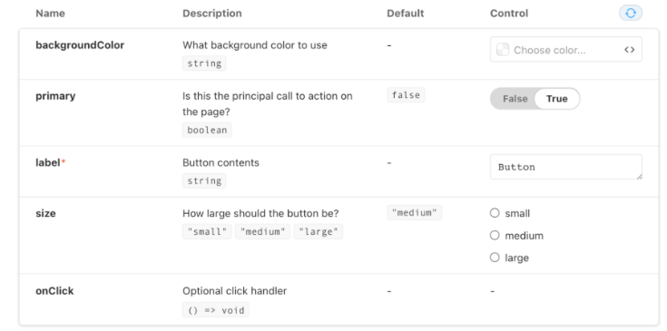
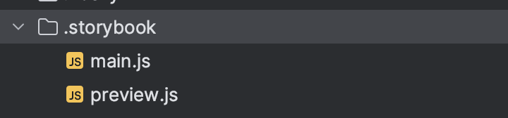
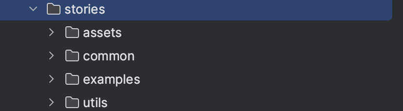

# React StoryBook

```bash
#참고#
https://velog.io/@devstone/스토리북-제대로-활용하기
```


{: .warning } 
React StoryBook 구현 하기
> - 복잡한 로직 없이 독립적인 환경에서 컴포넌트 개발 가능
> - 재사용을 위한 컴포넌트들을 story에서 조합해 테스트
> - 컴포넌트들을 문서화 가능

<br />

<br />

## 초기 세팅 




{: .highlight }
> - 초기세팅하기


<br />

```bash
npx sb init
# storybook 실행 했을때 컴포넌트 테이블을 만들기 위해
yarn add --dev react-docgen-typescript-loader 
```


<br />
<br />
<br />

---

## 실행하기

```bash
yarn storybook
or
npm run storybook 
```

<br />

{: .note }
> - 초기 세팅, 실행 설명 끝!!


<br />
<br />
<br />

---

## 폴더 구조

- 
- 

<br />

{: .new }
> - `.storybook` (자동 생성) : 전역적인 설정 관련된 것들
> - `.stories` (자동 생성) : 에시가 되는 컴포넌트와 스토리

<br />
<br />

{: .new }
> - .storybook/main.js
>   - stories를 위한 config 설정들
>   - addon : 필요한 확장 프로그램을 찾아서 npm 설치한 이후에 여기에 추가하여 사용가능


```js
import path from 'path'
const TsConfigPathsPlugin = require('tsconfig-paths-webpack-plugin')

// storybook을 위한 config설정들 
const config = {
  //stories 파일이 어디에 있는지?
  stories: ['../src/**/*.mdx', '../src/**/*.stories.@(js|jsx|ts|tsx)'],
  staticDirs: ['../public'],
  // addons 세팅 
  addons: [
    'storybook-dark-mode',
    '@storybook/addon-links',
    '@storybook/addon-essentials',
    '@storybook/addon-interactions',
    '@storybook/addon-styling',
  ],
  core: {
    disableTelemetry: true,
  },
  //프레임워크 작성
  framework: {
    name: '@storybook/nextjs',
    options: {
      strictMode: true,
    },
  },
  docs: {
    // storybook내 Docs의 이름으로 등록
    defaultName: 'Docs',
    //  Docs 자동 생성
    autodocs: true,
  },
  env: config => ({
    ...config,
    NEXT_PUBLIC_WCS_BE_API_HOST_URL: 'https://example.com/',
    // fake https for chromatic deployment
    NEXT_PUBLIC_QIII_SOCKET_URL: 'https://socket.example.com',
  }),
  // node_mules폴더와 styles 폴더 안의 모듈을 인식할 수 있게 함
  // 절대 경로 설정
  webpackFinal: async config => {
    config.resolve.alias['@'] = path.resolve(__dirname, '../src/')
    config.resolve = {
      ...config.resolve,
      plugins: [
        new TsConfigPathsPlugin({
          configFile: path.resolve(__dirname, '../tsconfig.json'),
          extensions: config.resolve.extensions,
        }),
      ],
    }
    config.module.rules.find(rule => rule.test?.test('.svg')).exclude = /\.svg$/
    config.module.rules = [
      ...config.module.rules,
      {
        test: /\.svg$/,
        use: ['@svgr/webpack'],
      },
      {
        test: /\.scss$/,
        use: ['style-loader', 'css-loader', 'sass-loader'],
        include: path.resolve(__dirname, '../'),
      },
    ]
    return config
  },
}
export default config

```

<br />


{: .new }
> - .storybook/preview.js
>   - 모든 story들에 글로벌하게 적용될 포맷 세팅
>   - 스토리북 내부에 스타일 먹이기 `decorators`


```js
import { ThemeProvider } from 'styled-components'
import React from 'react'
import { RecoilRoot } from 'recoil'
import { useDarkMode } from 'storybook-dark-mode'

import { GlobalStyles } from '../src/styles/base'
import { ToastContainer } from '../src/components/Common/Toast'
import Modals from '../src/components/Common/Modal'
import { darkTheme, lightTheme, themes } from '../src/styles/theme'

export const parameters = {
  darkMode: {
    dark: {
      ...themes.dark, // copy existing values
      appContentBg: '#202020', // override main story view frame
      barBg: '#202020', // override top toolbar
    },
  },
}
// 글로벌 스타일 적용시키고 싶다면 여기서 적용시켜줄 수 있음 (추후 decorator같은 것들)
export const decorators = [
  Story => {
    const isDarkMode = useDarkMode()

    const body = document.body

    if (isDarkMode) {
      body.style.backgroundColor = themes.dark.color.background
      if (body.classList.contains('light')) {
        body.classList.remove('light')
      }
      body.classList.add('dark')
    } else {
      body.style.backgroundColor = themes.light.color.background
      if (body.classList.contains('dark')) {
        body.classList.remove('dark')
      }
      body.classList.add('light')
    }

    return (
      <ThemeProvider theme={isDarkMode ? darkTheme : lightTheme}>
        <RecoilRoot>
          <GlobalStyles />
          <ToastContainer />
          <Modals />
          <div id={'modal-root'}></div>
          <Story />
        </RecoilRoot>
      </ThemeProvider>
    )
  },
]

const preview = {
  parameters: {
    backgrounds: {
      default: 'light',
      values: [
        {
          name: 'light',
          value: themes.light.color.background,
        },
        {
          name: 'dark',
          value: themes.dark.color.background,
        },
      ],
    },
    actions: { argTypesRegex: '^on[A-Z].*' },
    controls: {
      matchers: {
        color: /(background|color)$/i,
        date: /Date$/,
      },
    },
  },
}

export default preview

```


<br />
<br />
<br />
<br />
<br />
<br />

# 스토리 만들기

{: .new } 
> - 스토리 : 쉽게 말해 하나의 컴포넌트가 실행 가능한 하나의 케이스
>   - 특정한 props를 넘겼을 때, 그 자체가 하나의 스토리가 된다.

<br />
<br />

> Button.tsx를 생성한다.

```jsx
// 버튼 컴포넌트를 만든다.
```

<br />

> 위에서 만든 컴포넌트를 바탕으로 스토리 작성

```js
import type { Meta, StoryObj } from '@storybook/react'

import 만든컴포넌트 from '@/components/Common/Button'

const meta: Meta<typeof Button> = {
  // 옆타이틀
  title: 'Common/Button2',
  // 메인 docs에 보여줄 컴포넌트
  component: 만든컴포넌트,
  // 태그 고정 값
  tags: ['autodocs'],
}

export default meta
type Story = StoryObj<typeof Button>

// 스토리북에서 보여줄 컴포넌트
export const Enabled: Story = {
  args: {
    children: '보여줄 텍스트',
  },
}

export const Disabled: Story = {
  args: {
    children: '비활성화 텍스트',
    disabled: true,
  },
}
```