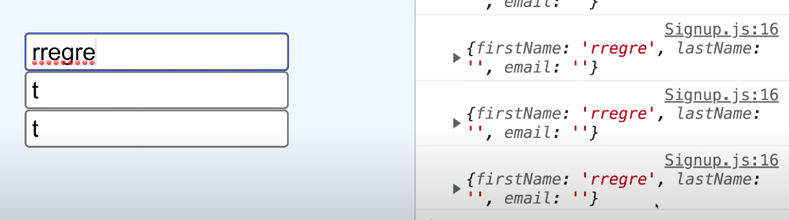
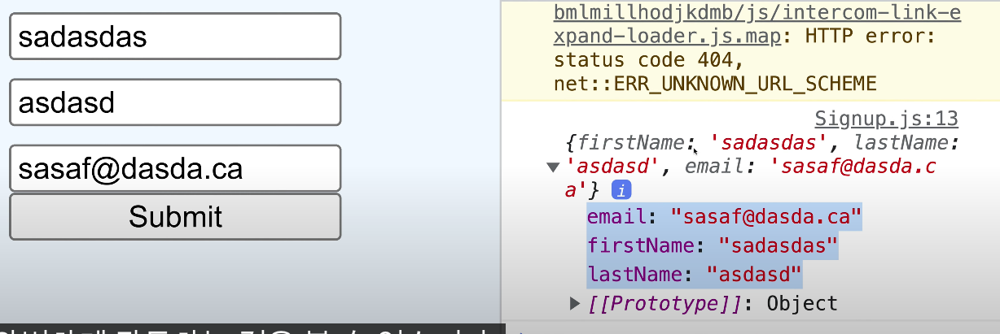
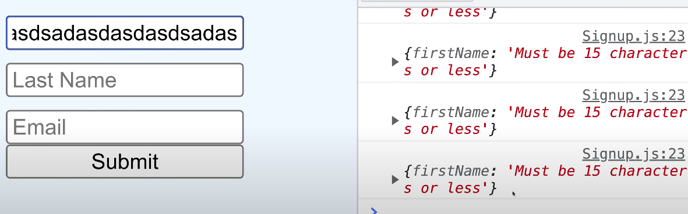
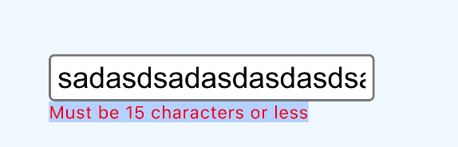
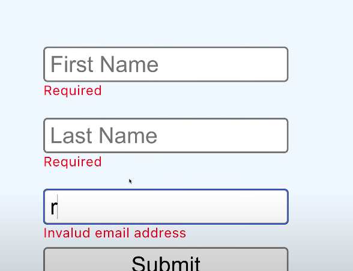
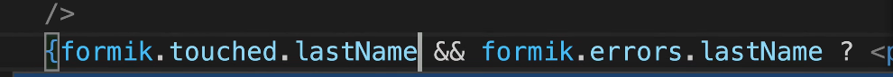

# React yup

{: .highlight } 
> - yup 라이브러리를 이용해서 유효성 검증하기

<br />
<br />


{: .new } 
> - Vaildations 검증 폴더 생성
> - Vaildations/UserValidation,js

```js
//Vaildations/UserValidation,js
import * as yup from 'yup';

// 유효성 검증 rule 생성
const userSchema = yup.object().shape({
  //이름은 공백만 아니면 됨
  name : yup.string().required();
  //이메일 검증 방법
  email: yup.string().email().required(),
  //비밀번호는 4이상 10미만이다. 공백은 사용이 불가능하다.
  name: yup.string().min(4).max(10).required();
})
```


<br />
<br />
<br />

{: .new } 
> - 유효성 검증 사용하기

```js
//App.js
import {userSchema} from 'Vaildations/UserValidation'
import * as yup from 'yup';


function App(){

const createUser = async (event) => {
  event.preventDefault();
  let formDate = {
    // input 이름 값
    name = event.target[0].value;
    // input email 값
    email = event.target[1].value;
    // input password 값
    password = event.target[2].value;
  };
  //유효성 검증이 됐는지 true false로 값을 알려줌
  const isValid = await userSchema.isValid(formDate);
}


  return (
    <form onSubmit={createUser}>
      <input type="text" placeholder="이름"/>
      <input type="text" placeholder="이메일"/>
      <input type="text" placeholder="비밀번호"/> 
    </form>
  )
}
```

<br />
<br />
<br />

# formik

{: .new } 
> - 반응에서 양식을 처리할 수 있도록 하는 라이브러리
>   - input에서 여러 useState를 만들어서 관리해야하는 불필요함을 해결할 수 있다.
>   - `formik.values` , `formik.handleChange` 이용해서 간단하게 컨트롤 가능
>   - 양방향 바인딩을 쉽게 처리 가능
>   - `onBlur={firmik.handleBlur}`를 넣어야 에러가 없음

<br />

- 
- 


```js
import {useFormik} from formik

export function SignUp(){
  const formik = useFormik({
    //초기값 설정
    initialValue: {
      firstName : "",
      lastName : "",
      email: ""
    },
    //바인딩 되어 있는 values값을 가져오게 된다.
    // VALUES : {email : "casc", firstname: "asd" , lastname: "123"}
    onSubmit: (VALUES) => {
      console.log(VALUES);
    }
  })


return (
  //formik 내부의 있는onSubmit를 호출하게 된다.
  <form onSubmit={formik.handleSubmit}>
    <input 
        id="firstName" 
        type="text" 
        onBlur={firmik.handleBlur}
        onChange={formik.handleChange}
        value={formik.values.firstName} />
    <input 
        id="lastName" 
        type="text" 
        onBlur={firmik.handleBlur}
        onChange={formik.handleChange}
        value={formik.values.lastName} />
    <input 
        id="email" 
        type="text" 
        onBlur={firmik.handleBlur}
        onChange={formik.handleChange}
        value={formik.values.email} />
  </form>
)

}


```


<br />
<br />
<br />
<br />


--- 

# yub과  formik를 이용해서 유효설 검증 사용하기

- 
- 
- 
  - dot touch를 이용해서 해결할 수 있다.
  - `onBlur={firmik.handleBlur}`를 이용해서 에러를 방지 할 수 있다.
- 


<br />

{: .new } 
> - 유효성 검사 하기
> - `validationSchema`에 추가하면 자동으로 유효성 검사가 완료된다.
>   - `formik.errors`로 에러코드를 볼 수 있다.
>   - formik에 유효성 검증이 통과되지 않는다면, 실제로 submit도 되지 않는다.

<br />
<br />

```js
import {useFormik} from formik
import {Yup} from yup;
export function SignUp(){
  const formik = useFormik({
    //초기값 설정
    initialValue: {
      firstName : "",
    },
    validationSchema: Yup.object({
      firstName : Yup.string().max(15, "15이하 글자여야한다.").required("빈 글자열 안됨")
      LastName : Yup.string().max(15, "15이하 글자여야한다.")
    })
  })


return (
  //formik 내부의 있는onSubmit를 호출하게 된다.
  <form onSubmit={formik.handleSubmit}>
    <input 
        id="firstName" 
        type="text" 
        onBlur={firmik.handleBlur}
        onChange={formik.handleChange}
        value={formik.values.firstName} />
    {/*유효성 검증 에러 텍스트 표현 하기*/}
    {formik.touched === true && formik.errors?.firstName}
  </form>
)

}
```