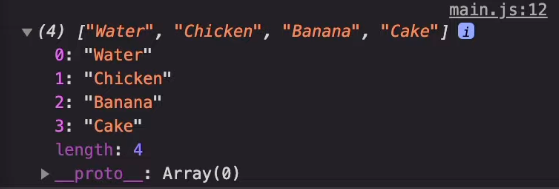
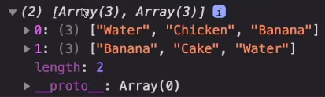
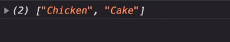
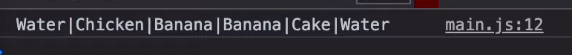

# lodash

{: .highlight } 
> - `lodash` 라이브러리를 통해 번들 사이즈를 줄일 수 있다.
>   -  array, collection, date 등 데이터의 필수적인 `구조를 쉽게 다룰 수 있게끔 하는데에 사용`


<br />
<br />

---

## uniq() `중복된 요소 제거`



{: .highlight } 
> - 배열내 중복된 요소 제거

<br />

```js
const myList = [
  'Water',
  'Chicken',
  'Banana',
  'Banana',
  'Cake',
  'Water'
]

const myNewArray = _.uniq(myList);
```


<br />
<br />

---

## chunk() `배열 n개씩 묶기`



{: .highlight } 
> - 배열을 n개씩 묶을 수 있다.

<br />

```js
const myList = [
  'Water',
  'Chicken',
  'Banana',
  'Banana',
  'Cake',
  'Water'
]

const MyNewArray = _.chunk(myList,3);
```


<br />
<br />

---

## difference `배열과 비교해 차이점 출력`




{: .highlight } 
> - 원본 배열과 비교해 차이점이 있는 요소만 배열에 담아 반환

<br />


```js
const myList = [
  'Water',
  'Chicken',
  'Banana',
  'Banana',
  'Cake',
  'Water'
]

const newArray = _.difference(myList, ['Water','Banana']);
```


<br />
<br />

---


## join() `문자열로 합쳐주는 함수`



{: .highlight } 
> - 문자열로 합치는 함수

```js
const myList = [
  'Water',
  'Chicken',
  'Banana',
  'Banana',
  'Cake',
  'Water'
]

const newArray = _.join(myList, '|');
```


<br />
<br />

---


## without() `요소 하나만 제외하고 반환`


{: .highlight } 
> - 한 가지 요소만 제외한 후 배열을 반환

<br />

```js
const myList = [
  'Water',
  'Chicken',
  'Banana',
  'Banana',
  'Cake',
  'Water'
]

const myNewArray = _.without(myList, 'Banana');
```


<br />
<br />

---

## findIndex()

{: .highlight } 
> - `_.findindex(array,[predicate=.indentity],[thisArg])`
> - `배열 내에서 원하는 index를 쉽게 구할 수 있음`

<br />

```js
var myFriend = [
 {name:'kys',job:'developer',age:27},
 {name:'cys',job:'webtoons man',age:27},
 {name:'yhs',job:'florist',age:26},
];

// lodash 함수 사용
_.findIndex(myFriend, age: 27);
```


<br />
<br />

---

## flatten()

{: .highlight } 
> - `_.flatten(arraym[isDeep])`
> - 다차원 배열 내의 요소를 출력하는데 편리


<br />

```js
_.flatten([1, [2, 3, [4]]]);
// → [1, 2, 3, [4]]

// 배열안의 배열 값을 깊이와 상관없이 순서대로 나열합니다.
_.flatten([1, [2, 3, [4]]], true);
// → [1, 2, 3, 4]
```


<br />
<br />

---

## remove()

{: .highlight } 
> - `.remove(array, [predicate=.identity], [thisArg])`
> - 배열 내의 조건에 맞는 요소들을 제거한 후 반환


<br />

```js
var array=[1,2,3,4];

var evens=remove(array,function(n){
   return n%2==0;
});

console.log(array);
//-> [1,3]

console.log(evens);
//-> [2,4]
```


<br />
<br />

---

## every() `배열안 요소들의 값들 비교`

{: .highlight } 
> - `.every(collection, [predicate=.identity], [thisArg])`
> - 출력값 : `boolean`

<br />

```js
var myFriend = [
  { name: 'kys', active: false },
  { name: 'cys', active: false }
];

// 값을 비교할 수 있습니다.
_.every(myFriend, { name: 'kys', active: false });
// → true

// key와 value가 있는지 확인할 수 있습니다.
_.every(myFriend, 'active', false);
// → true

// key에 해당하는 value가 모두 true이면 true를 반환합니다.
_.every(myFriend, 'active');
// → false
```

<br />
<br />

---

## find() `조건을 만족하는 컬렉션에서 첫번째 요소 찾기`

{: .highlight } 
> - 조건을 만족하는 컬렉션에서 첫번째 요소 찾기
> - 형식 : `.find(collection, [predicate=.identity], [thisArg])`

<br />

```js
var myFriend=[
 {name:'kys',job:'developer',age:27},
 {name:'cys',job:'webtoons man',age:27},
]

// 콜백함수가 처음으로 참이되는 객체를 반환
_.find(myFriend, function(friend) {
  return friend.age < 28;
});
// → { name: 'kys',job:'developer' ,'age': 27}
```


<br />
<br />

---

## filter() `특정 조건을 만족하는 모든 요소를 추출하는 메소드`


{: .highlight } 
> - 특정 조건을 만족하는 모든 요소를 추출하는 메소드
> - 형식 : `.filter(collection, [predicate=.identity], [thisArg])`

<br />

```js
let myFriend=[
 {name:'kys',job:'developer',age:27},
 {name:'cys',job:'webtoons man',age:27},
 {name:'yhs',job:'florist',age:26},
 {name:'chj',job:'nonghyup man',age:27},
 {name:'ghh',job:'coffee man',age:27},
 {name:'ldh',job:'kangaroo',age:27},
]

// 입력한 object의 key와 value들을 모두 포함하는 객체들을 배열로 반환합니다.
_.filter(myFriend, { age: 26, job: 'florist' });
// → [{ name: 'yhs',job:'florist', age: 26}]

// 입력한 key값이 true인 객체들을 배열로 반환합니다.
_.filter(myFriend, friend=>friend.age==26);
// → [{ name: 'yhs',job:'florist', age: 26}]
```


<br />
<br />

---

## map() `key값을 입력할 경우 해당 key값을 간추려서 반환한다.`

{: .highlight } 
> - 형식 : `.map(collection, [iteratee=.identity], [thisArg])`
> - 출력 : key값을 입력할 경우 해당 key값만 간추려서 반환

<br />

> 예시

```js
//첫번째 예시
function timesTwo(n) {
  return n * 3;
}

_.map([1,2],timesTwo);
//->[3,6]

//두번째 예시
var myFriend=[
  {'name':'kys'},
  {'name':'cys'},
];

.map(myFriend,'name');
//->['kys','cys']
```

<br />
<br />

---

## includes() `값이 포함되는지 확인하는 함수`

{: .highlight } 
> - 형식 : `_.includes(collection, target, [fromIndex=0])`
> - 출력 : boolean

<br />

```js
// 첫번째 예시
// 배열에 값이 있는지 찾습니다.
_.includes([1, 2, 3], 1);
// → true

// 두번째 예시
// 일치하는 값이 있는지 찾습니다.
_.includes({ 'name': 'yhs', 'age': 26 }, 'yhs');
// → true

// 세번째 예시
// 일치하는 값이 문자열 안에 있는지 찾습니다.
_.includes('dontknow', 'ont');
// → true
```


<br />
<br />

---

## reduce() 

{: .highlight } 
> - 형식 : `형식: .reduce(collection, [iteratee=.identity], [accumulator], [thisArg])`

<br />

```js
//첫번째 인자에 대해 배열 내부의 값을 통해 콜백함수를 실행시킨 후 결과값을 반환합니다.

_.reduce([1, 2], function(total, n) {
  return total + n;
});
// → 3
```


<br />
<br />

---

## cloneDeep `배열안의 내용을 깊은 복사`

{: .highlight } 
> - 배열안의 내용을 깊은 복사하는 함수

<br />

```js
// 사용 예시
const objects = [{ "a" : 1 }, { "b" : 2 }];
// cloneDeep 함수 사용
const deep = _.cloneDeep(objects);
console.log(deep[0] === object[0]);
// => false 출력
```


<br />
<br />

---

## unionBy 

{: .highlight } 
> - 중복되는 값을 제거하는 함수
> - 사용 예시 : `_.unionBy(배열 변수1,배열 변수2, '고유한 속성 이름')`

<br />

```js
const fruit1 = [
  {
    fruitId : 1, color : "yellow" , name : "banana"
    fruitId : 2, color : "green" , name : "apple"
  }
]
const fruit2 = [
  {
    fruitId : 2, color : "green" , name : "apple"
    fruitId : 3, color : "red" , name : "strawberry"
  }
]
//fruitId 중복값 제거
const fruit3 = _.unionBy(fruit1,fruit2,'fruitId')
//    콘솔 출력
//    fruitId : 1, color : "yellow" , name : "banana"
//    fruitId : 2, color : "green" , name : "apple"
//    fruitId : 3, color : "red" , name : "strawberry"
```


<br />
<br />

---

## uniq() `배열 중복 제거`


{: .highlight } 
> - 배열 내 중복되는 내용 삭제

<br />

```js
_.uniq([2,1,2]);
// => [2,1];
```


<br />
<br />

---


<br />

> webpack file

```js
// webpack.config.js
const path = require("path");

// 빌드 시 dist 폴더에 main.js 파일 생성
module.exports = {
  // index.js 파일을 빌드
  entry: './src/index.js'
  // output 폴더 
  output: {
    filename: "main.js"
    path: path.resolve(__dirname, "dist");
  }
}
```

<br />
<br />

```js
// 필요한 모듈들만 가져왔기 때문에 빌드시 용량이 확 줄게 된다.
import each from "/loadsh/each";

const arr = [1,2,3,4,5];

each(arr, num => {
  console.log(num,"hello");
})
```