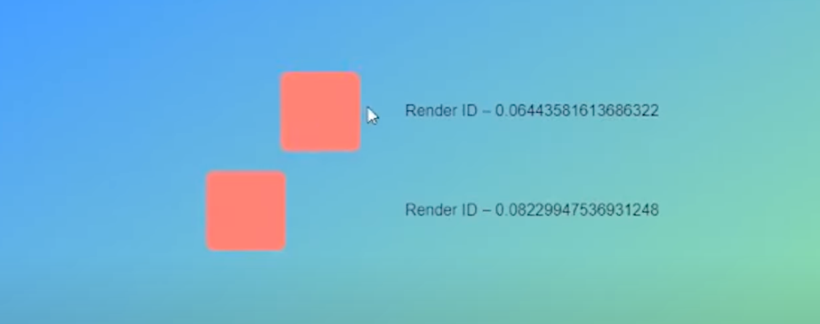
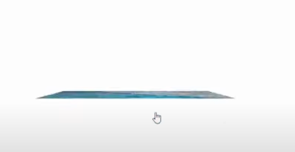

# ReactSpring



{: .highlight } 
> - `ReactSpring` : 리랜더링 없이 애니메이션을 구현할 수 있다.
> - 아래는 왼쪽 오른쪽으로 움직이는 애니메이션 기능 구현 코드이다.

<br />


```js
import {useSpring, useSpringRef, animated} from '@react-spring/web';

const Component = () => {
  //api를 호출하면서 사용
  const api = useSpringRef();
  const spring = useSpring({
    ref:api,
    from: { x:0 }
  })

 // 클릭했을때 오른쪽 이동 다시 누르면 왼쪽 이동
  const handleClick = () => {
    api.start({
      to: {
        x: spring.x.get() === 100 ? 0 : 100
      }
    })
  }

  return (
    <div>
      <animated.div
        onClick={handleClick}
        style={{
          width:80,
          height:80,
          background:"#000",
          ...spring,
        }}
      
      
      />
    </div>
  )
}
```

<br />
<br />
<br />


---

## 기본 사용법 (1) - 기본 이벤트

{: .highlight }
> - 이벤트 없이 바로 실행되는 애니메이션
> - animate.div : 애니메이션 줄 객체 선택 
> - useSpring : 애니메이션 등록

<br />

```js
function Animation (){
  //객체로 정의
  // 애니메이션 등록 0부터 100까지 이동
  const spring = useSpring({
    from : { x : 0 },
    to : { x : 100 }
  })

  return (
    <animation.div
      style={{
        background: "#000"
        height : 80
      }}
    ...spring
    />
  )
}
```


<br />
<br />
<br />


---

## 기본 사용법 (2) 이벤트 등록

{: .highlight }
> - useSpring - api 사용 (함수로 정의)


<br />


```js
function Animation (){
  // 이벤트 등록은 함수로 정의
  const [spring,api] = useSpring(() => {
    // 시작 위치
    from : { x : 0 },
  })

  //이벤트 등록 0에서 100으로 이동!!
  const handleClick = () =>{
    api.start({
      from: {
        x:0
      },
      to: {
        x:100
      }
    })
  }

  return (
    <animation.div
      onClick={handleClick}
      style={{
        background: "#000"
        height : 80
      }}
    ...spring
    />
  )
}
```

<br />
<br />
<br />


---

## 이미지가 뒤집히는 예제 코드



{: .highlight } 
> - react spring을 이용해서 카드뒤집히는 예제 만들기
> - `style`에 `useSpring`만든 속성을 넣어줘야함


<br />


```js
function App(){
  const [flipped, set] = useState(false);
  // 애니메이션 가져옴 (springs로 다 가져올 수 있음)
  const {transform , opacity} = useSpring({
    // flipped클릭했을 때 180도 회전
    // perspective 이미지과의 거리감
    transform: `perspective(600px) rotate(${flipped? 180 : 0})`
    // 투명도 조정
    // flipped클릭했을때 선명도 1
    opacity : flipped ? 1 : 0;
  })


  return (
    <div onClick={()=>{set((state => !state))}}>
      <animated.div
        style={{
          transform,
          opacity: opacity.to(value =>1-value)
        }}
      />
      <animated.div
      style={{
        transform,
        opacity
      }}
      />
    </div>
  )
}


```


<br />
<br />
<br />
<br />


{: .note }
> - `react-spring.dev/examples`에서 많은 예제를 볼 수 있다.