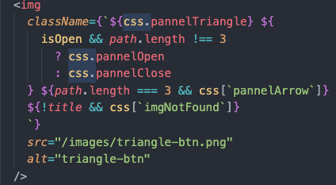
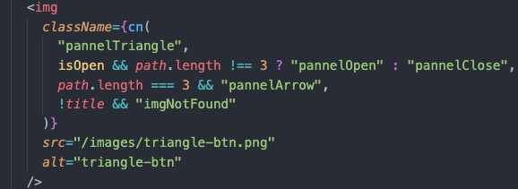

# classNames 모듈


{: .highlight } 
> - `classNames` : 리액트에서 조건부 스타일을 줄 때 편리하게 사용 가능

<br />

{: .new }
> - 설치 방법

```bash
$ npm install classnames --save
$ npm install --save @types/classnames
```


<br />

{: .new }
> - bind를 해주지 않으면 `css.`을 계속 붙여야한다. (`꼭 bind를 사용할 것`)
> - template literal를 마구 마구 쓰지 않아도 된다. 걍 나열만 하면 됨
> - cn(이름은 자유롭게 설정!)으로 한 번 감싸주고, string 표시와 쉼표로 이름을 구분하면 됨

```js
import classNames from "classnames/bind";
import css from "./SidePannels.module.scss";

function App(){

const cn = classNames.bind(css);

  return (
        <div
      onClick={() => setIsOpen(!isOpen)}
      className={cn(`path${path.length}`,path.length === 3 && `blueBg`
     )} />
    
  )
}
```


<br />
<br />
<br />

---


## 간단 사용 예시 (1)


{: .new }
> - 간단 사용 예시

<br />

- 
- 


<br />
<br />
<br />

---

## 간단 사용 예시 (2)

{: .new }
> - true , false에 따라 class 추가하는 방법

<br />

```js
// 'box-info mg-10'
className={classnames('box-info', 'mg-10')} 
// 'box-info mg-10'
className={classnames(['box-info', 'mg-10'])}
// 'box-info'
className={classnames('box-info', {mg-10 : false})} 
// 'box-info mg-10'
className={classnames('box-info', {mg-10 : 'abc'})} // 'box-info mg-10'
```


<br />
<br />
<br />

---

## 간단 사용 예시 (3)

{: .new }
> - 클릭의 유무에 따라 클래스 적용과 해제 예시

<br />

```js

const Sample = () => {
    const [isSelect, setSelect] = useState(false);
    // 클릭했을때만 is-selected 클래스 추가
    // 클릭 해제 했을때 is-selected 클래스 삭제
    return (
        <button
            className={classNames('tabList', { 'is-selected': isSelect })}
            onClick={onClickSelect}>
      	</button>
      );
}
```


<br />
<br />
<br />

---

## 간단 사용 예시 (4)

{: .new }
> - class 묶어주기

<br />

```js
function App(){
  const someProp = false
  const wrapperClasses = classNames('wrapper','class-1', {
    'conditional-class': someProp === true
  })
  
  return (
    <div className={wrapperClasses}>
    </div>
  )
}
```