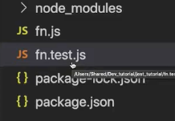
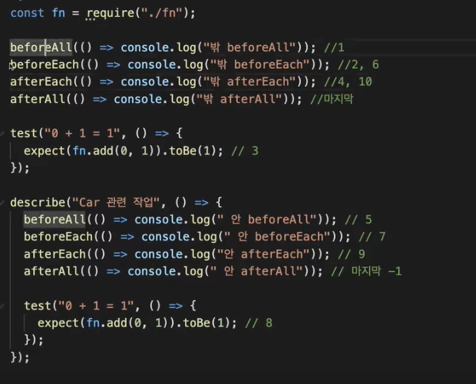
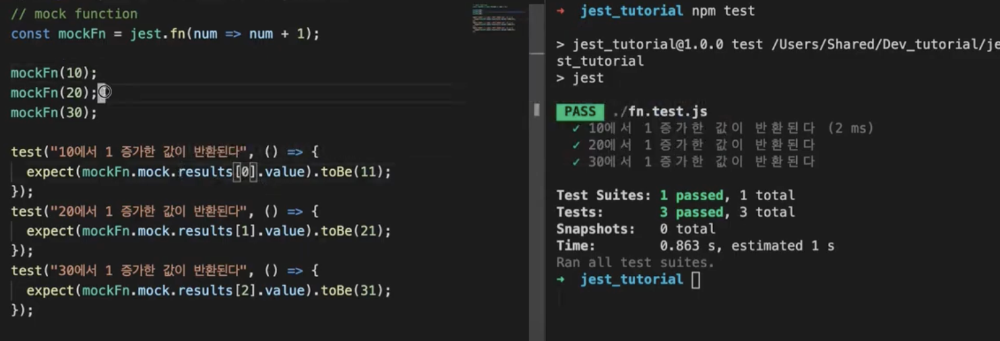
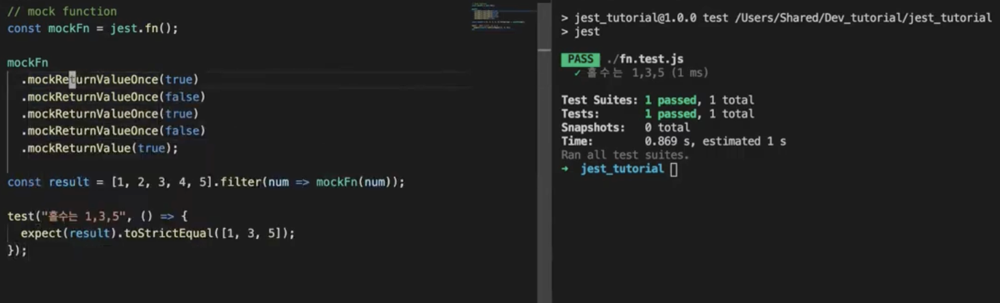
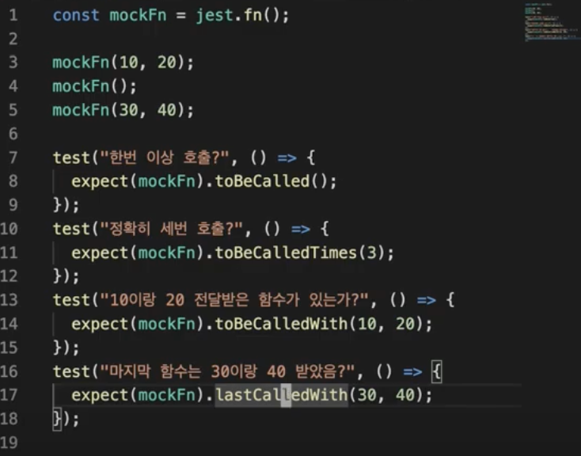
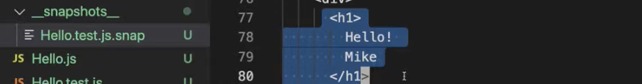
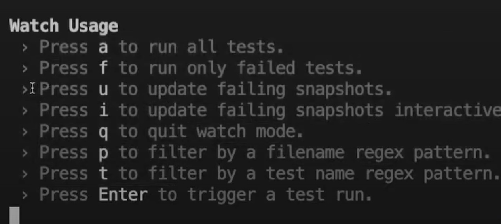

# Jest 


## Jest로 테스트 하는 방법

<br />

{: .note-title } 
Jest 설치 (1)

```bash
$ npm install jest --save-dev
```

{: .note }
package.json 파일 수정 -> script:"jest" (2)

```.json
{
    "name":"jest ...",
    "version": "1.0.0",
    "main": "index.js",
    "script": {
        "test":"jest"
    }
    ...
}
```

{: .note }
테스트할 파일 .test.js로 생성 (3)


{: .note }
> - 테스트 코드 작성 (4)
>   - `expect` : 검증할 값 삽입
>   - `toBe` : 기대되는 값 삽입

```js
//fn.js 일반 파일
const fn = {
    add:(num1,num2) => num1 + num2,
}
module.export = fn;


//fn.test.js 테스트 파일
//테스트할 함수를 불러온다
const fn = require('./fn');

// 1번째 테스트
test("1은 1이야.", ()=>{
    expect(1).toBe(1);
})

// 2번째 테스트
test("2더하기 3은 5야.", ()=>{
    expect(fn.add(2,3)).toBe(5);
})

//3번째 테스트
test("3더하기 3은 5가 아니다.", ()=>{
    expect(fn.add(2,3)).not.toBe(5);
})
```

{: .note }
`npm test`로 테스트를 실행한다.

<br />
<br />
<br />

---

## toEqual, toStrictEqual

{: .note }
> - `동일한지 확인하는 함수`
>   - 객체의 내용이 같더라도 서로 다른 메모리에 있는 객체이기 때문에 toBe를 쓰면 false가 나온다
>
> - `toBe`
>   - obj가 같은 객체를 가르키고 있는지 확인한다.
>
> - `toEqual`
>   - 객체의 내용이 같은지 확인 할때 사용
>
> - `toStrictEqual`
>   - 객체의 내용이 같은지 확인 할때 사용(`좀 더 엄격하게`)
> 

<br />

```js
// 일반 함수
//fn.js
const fn = {
    makeUser : (name , age) => ({name , age});
}

module.exports = fn;

// 일반 함수 테스트 함수
// fn.test.js
const fn = require("./fn");

test("이름과 나이를 객체로 리턴", () => {
    expect(fn.makeUser("Kim", 30).toEqual({
        name : "kim"
        age : 30
    }))
})

test("이름과 나이를 객체로 리턴", () => {
    expect(fn.makeUser("Kim", 30).toStrictEqual({
        name : "kim"
        age : 30
    }))
})
```

<br />
<br />

---

## toBeNull ,toBeUndefined ,toBeDefined

{: .note }
> - `toBeNull`
>   - Null이면 true
>
> - `toBeUndefined`
>   - Undefined이면 true
>
> - `toBeDefined`
>   - 정의가 되어 있으면 true

<br />

> 간단 예시


```js
const fn = require("./fn");

//null 일 때 Pass
test("null일 때 Pass",() =>{
    expect(null).toBeNull();
})
```

<br />
<br />

---

## toBeTruthy , toBeTruthy

{: .note }
> - `toBeTruthy`
>   - 값이 true면 pass  
>
> - `toBeTruthy`
>   - 값이 false면 pass

<br />

```js
const fn = require("./fn");

// true이면 Pass
test("단어를 합친거는 true",() =>{
    expect(fn.add("hellow","world")).toBeTruthy();
})
```

<br />
<br />

---

## toBeGreaterThan , toBeGreaterThanOrEqual , toBeLessThan , toBeLessThanOrEqual


{: .note }
> - `사용자의 입력글자 및 업로드 파일 크기 제한할 때 사용한다. `
>
> - toBeGreaterThan : 초과
> - toBeGreaterThanOrEqual : 이상
> - toBeLessThan : 작다
> - toBeLessThanOrEqual : 이하

<br />

> 사용 예제 

```js
const fn = require("./fn")

// 
test("id는 10자 이하이어야 한다.", ()=>{
    const id = "abcdefg"
    expect(id.length).toBeGreaterThan(10);
})
```


<br />
<br />

---

## toMatch , toContain(정규 표현식)

{: .note }
> - `정규표현식에 사용 `
>   - `i`를 뒤에 붙이면 대소문자 구별을 하지 않는다.
>
> - `toMatch` : 정규표현식 사용
>
> - `toContain` : 배열에 특정 요소가 포함되는지?
> 

<br />


> 예제 

```js
const fn = require("./fn")

// 글자에 a가 포함되는지 확인
test("hello world에 a가 포함되는지?", ()=>{
    expect("hello world").toMatch(/a/i);
})

// 배열에 특정 요소가 포함되는지?
test("hello world에 a가 포함되는지?", ()=>{
    const List = ["tom" , "Jane" , "Kai"];
    const user = "Mike"
    expect(List).toContain(user);
})

```


<br />
<br />

---

## toThrow (특정 에러가 발생하는지 체크)

{: .note }
> - `특정 에러가 발생하는지 체크`
> 

<br />

> 예제 


```js
const fn = require("./fn")

//"oo"이런 에러를 뱉어내면 Pass
test("에러가 나는지?", ()=>{
    expect(() => fn.throwErr().toThrow("oo"));
})
```


<br />
<br />
<br />

# `비동기 함수에서의 테스트 함수`

{: .new } 
> - 비동기에서의 test 함수
>   - 비동기를 기다리지 않고 끝에 도달하면 바로 Pass 한다
> - `done`를 이용해서 비동기 함수 테스트를 할 수 있다.
>   - 비동기가 끝난 후 `done()`를 실행하면 된다
> - `Promise 반환 시`
>   - `resolves` : 비동기 함수가 Promise를 반환하고 이 `Promise가 해결되면, resolves를 사용하여 해당 Promise의 결과 값을 검사`
>   - `rejects` : 비동기 함수가 Promise를 반환하고 ` 이 Promise가 거부될 때 해당 거부 상태를 검사`

<br />

> 예제 

```js
// fn.js
// 일반 함수
const fn = {
    getName: callback => {
        const name = "Mike";
        setTimeout(()=>{
            callback(name);
        }, 3000);
    }
}
module.exports = fn;

//fn.test.js
// 테스트 함수
test("3초후에 받아온 이름은 Mike", (done)=>{
    function callback(name) {
        expect(name).toBe("Mike");
        //done함수를 이용해서 비동기함수 테스트를 진행 할 수 있다.
        try{
            expect(name).toBe("Mike");
            done();
        }catch{
            done();    
        }
    }
    fn.getName(callback);
})
```

<br />


{: .important-title }
`꼭 return를 적어줘야 한다` (안하면 다 Pass)


> 예제 (promise 반환될때 상황)

```js
// fn.js
// 일반 파일
const fn = {
    getAge: () => {
        const age = 30;
        return new Promise((res,rej) => {
            setTimeout(()=>{
                res(age);
            },3000);
        })
    }
}
module.exports = fn;


//fn.test.js
// 테스트 파일
const fn = require("./fn")

//비동기를 기다린 후 30과 값이 같다면 Pass
test("3초 후에 받아온 나이가 30", ()=>{
    return expect(fn.getAge()).resolves.toBe(30);
})

// async await으로도 테스트 가능
test("3초 후에 받아온 나이가 30", async ()=>{
    const age = await fn.getAge();
    expect(age).toBe(30);
})
```


<br />
<br />
<br />

# 테스트 전후 작업

{: .note-title }
> - 테스트 전후에 변수 초기화
>   - `beforeEach` : 각각의 테스트 전에 실행되는 함수
>   - `afterEach` : 각각의 테스트 이후에 실행되는 함수
>   - `beforeAll` : 현재 파일 처음 시작할 때 실행
>   - `afterAll` : 현재 파일 맨 마지막에 실행되는 함수


- 
  - 실행되는 순서
  - `description` `테스트 함수`들을 `묶어` 줄 수 있다.


<br />

> 예제 코드 (1)

```js
//fn.js 일반 파일
const fn = {
    add:(num1,num2) => num1 + num2,
}


// fn.test.js
// 테스트 파일
const fn = require("./fn")

let num = 0;
// 매 테스트 마다 num 값 0으로 초기화
beforeEach(() => {
    num = 0;
})

test("0 더하기 1 = 1", () => {
    num = fn.add(num,1);
    expect(num).toBe(1);
})

test("0 더하기 1 = 1", () => {
    num = fn.add(num,1);
    expect(num).toBe(1);
})
```

<br />

---

## DB연결 및 연결 해제

{: .note-title }
> - 테스트 시작 시 db연결 
> - 테스트 완료 시 연결 해제 

<br />

```js
// 일반 함수
// fn.js
const fn = {
    //db연결 함수
    connectUserDB : () => {
        return new Promise(res =>{
            setTimeout(()=>{
                res({
                    name : "Mike",
                    age : 30,
                    gender : "male"
                })
            },500)
        })
    },
    //db 연결 해제 함수
    connectUserDB : () => {
        return new Promise(res =>{
            setTimeout(()=>{
                res()
            },500)
        })
    }
}


// 테스트 함수
// fn.test.js
const fn = require("./fn")

let user;
// 맨 최초에 db연결
beforeAll(async()=>{
    user = await fn.connectUserDB();
})
//맨 마지막에 db 연결 해제
afterAll(()=>{
    return fn.connectUserDB();
})

//test 함수
test("이름은  mike", () => {
    expect(user.name).toBe("Mike");
})
```

<br />
<br />

---

## only (파일 중 한가지 함수 테스트만 진행하고 싶을 때)

{: .note-title }
> - `test.only` 를 사용하면 현재 파일 중이 `only키워드가 있는것만 테스트를 진행`한다.
> - `test.skip` 를 사용하면 현재 파일 테스트할 때 `skip`키워드가 있으면 테스트를 진행하지 않는다.


> 예시 코드

```js
const fn = require("./fn");

let num = 0;

test.("0더하기 1은 1", () => {
    expect(fn.add(num,1).toBe(1))
})
test.("0더하기 2은 2", () => {
    expect(fn.add(num,2).toBe(2))
})
test.("0더하기 3은 3", () => {
    expect.only(fn.add(num,3).toBe(3))
})
```


<br />
<br />

---

## mock function (테스트 하기 위해 흉내만 낸 함수) (1)

{: .note-title }
> - `mock function` 이란 함수 흉내만 함수
>   - mock함수의 `calls` 키워드로 함수가 몇번 호출됐는지 , 어떤 프로퍼티를 전달 했는지 알 수 있다. (`mock.calls`)
>   - result : 리턴된 값을 가지고 있다. (`mock.result`)
<br />

> mock 함수 사용법 (1)

```js
// mock 함수 이용

const mockFn = jest.fn()

mock();
mock(1);

// mock함수를 이용해서 몇번 호출됐는지 프로퍼티로 무슨 값이 전달됐는지 알 수 있디
test("dd", () => {
    // [ [] , [1] ]
    console.log(mackfn.mock.calls);
    expect("dd").toBe("dd")
})
```

> mock 함수 사용법 (2)

```js
const mockFn = jest.fn();

function forEachAdd1(arr){
    arr.forEach(num => {
        mockFn(num + 1)
    })
}
// mock함수에 [ [11] , [21] , [31] ]
forEachAdd1([10,20,30])

//테스트 코드 mock함수 호출은 총 3번 이루어짐
test("함수 호출은 3번", () => {
    expect(mockFn.mock.calls.length).toBe(3)
})

// 파라미터로 전달된 값
test("전달된 값은 11,21,31", () => {
    expect(mockFn.mock.calls[0][0]).toBe(11);
    expect(mockFn.mock.calls[1][0]).toBe(21);
    expect(mockFn.mock.calls[2][0]).toBe(31);
})
```


<br />
<br />

---

## mock function (테스트 하기 위해 흉내만 낸 함수) (2)


{: .note-title }
> - mockFn 함수에는 안에 따로 함수를 삽입할 수 있다.
>   - result


<br />

> 예시 코드 `result`



> mock 호출마다 다른 값을 뱉어내게 할 수 있다.



<br />
<br />

---

## mock function (테스트 하기 위해 흉내만 낸 함수) (3)

{: .note-title }
> - mockFn 함수에는 안에 따로 함수를 삽입할 수 있다.
>   - `mockResolveValue`를 이용해서 비동기 함수를 흉내 낼 수 있다

> 비동기 함수 처럼 보이게 하는 예시 코드 

```js
// mock function
const mockFn = jest.fn();

// 비동기 테스트 하는 코드
test("비동기에서 받아온 값은 Mike", () => {
    mock().then(res => {
        expect(res.name).toBe("Mike");
    })
})
```

<br />
<br />

---

## mock function (테스트 하기 위해 흉내만 낸 함수) (4)

{: .important-title } 
데이터 베이스에 실제로 값을 삽입하는 함수를 테스트 하는 방법 `mocking 모듈로 만들고 테스트`

<br />

```js
// 테스트 할 함수 불러오기
const fn =require("./fn")
//실제로 데이터 베이스에 값이 추가되면 안되니 mocking 모듈로 변환(불러온 파일)
jest.mock("./fn")
// 실제 createUser 함수는 호출되지 않고  {name: "Mike"}를 반환하는 mock함수가 실행된다.
fn.createUser.mockReturnValue({name: "Mike"});

test("유저를 만든다.", () => {
    const user = fn.createUser("Mike");
    expect(user.name).toBe("Mike");
})
```

<br />

> mock 함수의 유용한 함수 모음

- 

<br />
<br />
<br />

---

## 리액트에서 Jest 사용하기


{: .note }
> - `render()` : 컴포넌트를 불러와 props를 전닳 할 수 있다.
> - `screen.getByText` : 이용해 특정 텍스트가 포함되어 있는지 확인
> - `toBeInTheDocument` : document안에 있는지 확인 하는 함수


<br />

> 리액트 + Jest 테스트 코드 작성

```js
const user = {
    name : "Mike",
    age : 30
}

test("Hello글자가 포함되는가?", () => {
    // 컴포넌트 불러옴
    render(<Hello user={user} />);
    // 아래 글자가 포함되는지 check
    const helloEl = screen.getByText(/Hello/i);
    // document안에 특정 글자가 있는지 확인
    expect(helloEl).toBeInTheDocument();
})
```

<br />
<br />

## react test snapshot 이용하기




{: .note }
> - `snapshotTest란` 성공하는 테스트를 찍어두고 다른 케이스들과 비교해서 테스트 하는 방식이다.
>   - `랜더링 된 화면과 snapShot으로 찍어둔 화면이 다르면 테스트 실패`
>   - `snapShot으로 찍어둔 화면이랑 완전히 동일해야 테스트 통과한다.`

<br />

> 스냅샷 찍는 법

```js
const user1 = {
    name: "Mike",
    age: 20
}
const user2 = {
    age: 20
}

// 첫번째 스냅샷 생성
test("snapShot 1" , () => {
    const el = render(<Hello user={user1} />)
    expect(el).toMatchSnapshot();
})
// 두번째 스냅샷 생성
test("snapShot 2" , () => {
    const el = render(<Hello user={user2} />)
    expect(el).toMatchSnapshot();
})
```

<br />
<br />

## React 시간에 따라 변경되는 컴포넌트

{: .note }
> 시간에 따라 변경되는 컴포넌트는 `mock함수`를 이용해 snapShot테스트를 진행 할 수 있다.

<br />

> 컴포넌트 코드

```js
export default function Time(){
    const now = Date.now();
    const sec = new Date(now).getSeconds();
    return <p>{sec}초</>
}
```

> 테스트 코드

```js
test("초 표시", () => {
    //Date.now를 mock함수로 Date.now는 항상 123456이 값만 return 한다.
    Date.now = jest.fn(() => 123456);
    const el = render(<Timer />)
    expect(el).toMatchSnapshot();
})
```

{: .important-title } 
Date.now는 JavaScript에서 현재 시간을 밀리초 단위로 반환하는 내장 함수, 이 코드에서는 jest.fn()을 사용하여 `Date.now 함수를 모의 함수로 대체`했습니다. 이렇게 하면 `Date.now()가 호출될 때` 기본적으로는 실제 시간을 반환하지만, 대신에 () => 123456 함수가 실행되어 `항상 123456을 반환`하도록 만들었습니다.