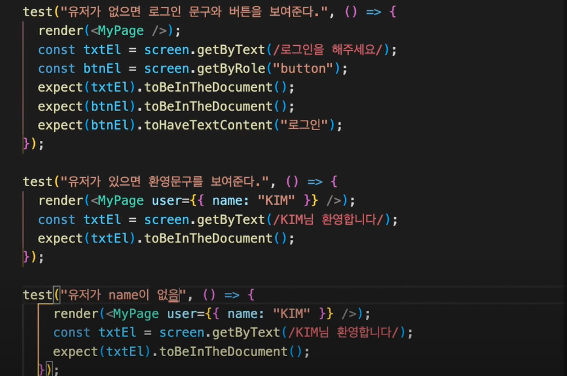
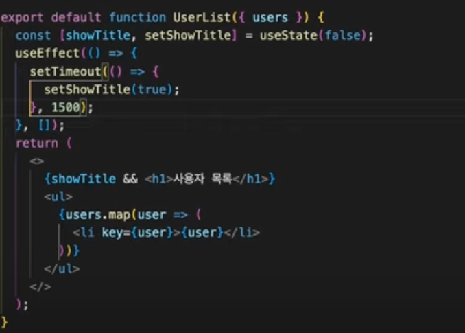
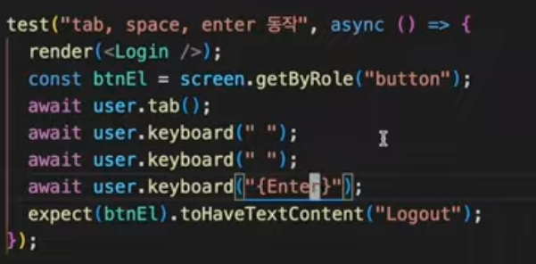

# React Test 

## React 테스트

<br />

{: .note-title } 
> - React Test Library 
>   - react 설치시 자동으로 시작된다.
>   - 컴포넌트 레벨을 테스트 할 때 사용한다.
> - `render` : 컴포넌트를 받아서 virtual dom를 생성해준다.
> - `screen` : 안에 특정 메소드를 이용해서 요소에 접근할 수 있다.

<br />

> 기본 예제 사용 예시 (1) (특정 문자가 컴포넌트 안에 있는지)

```jsx
test("render links",()=>{
    // 컴포넌트를 생성
    render(<App />);
    // 요소에 접근해서 지 글자가 있는지?
    const linkElement = screen.getByText(/learn react/i);
    // 현재 document 안에 이 글자가 있는지?
    expect(linkElement).toBeInTheDocument();
})

```

> 기본 예제 사용 예시 (2) 



<br />
<br />

---

## Custom matchers

{: .note-title } 
> - `screen.getByRole` : HTML요소를 변수에 담는 문법
> - `toBeEmptyDOMElement` : dom이 비어있는 경우
> - `toHaveClass` : class를 가지는지
> - `toBeChecked` : 체크되었는지 
> - `toBeDisabled` : 비활성화 되었는지
> - `toBeIntheDocument` : 해당 요소가 DOM에 있는지
> - `toHaveStyle` : 해당 스타일을 가지고 있는지


<br />

> html 코드

```jsx
<button disabled={age < 19}>
{age < 19 ? (
    <h1 style="color:red"> 성인만 가입 가능</h1> : 
        <h1 style="color : white">성인</h1>)}
</button>
```

> 테스트 코드 작성

```js
test("19세 이하만 클릭 가능, 색상은 빨간색", ()=>{
    render(<JoinButton age={10} />)
    // 버튼 요소를 가져옴
    const btnEl = screen.getByRole("button")
    const txtEl = screen.getByRole("heading")
    //해당 요소가 dom에 존재하는지
    expect(btnEl).toBeIntheDocument();
    expect(txtEl).toBeIntheDocument();
    // 아래스타일을 btn이 가지고 있는지
    expect(btnEl).toHaveStyle({
        color: "red"
    })
})
```

<br />
<br />

---

## getBy ~Queries (요소 찾기)

{: .note-title } 
> - `getByText` : 텍스트로 찾는 것
> - `getByRole` : html이 가진 role로 찾는 것
>   - `h1 ~ h6` : heading
>   - `buttton` : button
>   - `a` : link
>   - `checkbox` : checkbox
>   - `radio` : radio
>   - `select` : combobox
>   - `textbox` : input , textarea , ...
> - `getByLabelText` : 라벨을 찾아서 라벨에 연결된 textbox가 있는지 체크
> - `getByTestId` : data-testid값으로 요소 찾기


<br />

> 제목이 있는지 체크하는 코드 (1)

```jsx
function MyPage(){
    return(
        <h1>title</h1>
    )
}
```

```js
test("제목이 있는지 체크하는 코드" , () =>{
    render(<MyPage />);
    // level : 1은 h1를 의미한다
    // ㅣevel : 2은 h2를 의미한다.
    const titleEl = screen.getByRole("heading",{
        level:1
    });
    expect(titleEl).toBeInTheDocument();
})
```

<br />

> `getByLabelText` 사용 예제 (2)

```js
function MyPage(){
    return (
        <div>
            <label htmlFor="pro"> 자기소개 </label>
            <input type="text" id="pro" />
        </div>
    )
}
```


```js
test("input요소가 있다.", () => {
    render(<MyPage />)
    // 라벨을 찾아서 라벨에 연결된 textbox가 있는지 체크
    const inputEl = screen.getByLabelText("자기소개");
    //  const inputEl = screen.getByLabelText("자기소개",{
    //  selector : "textarea"
    //  });
    expect(inputEl).toBeInTheDocument();
})
```

<br />

> `my-div` 사용 예제 (3)

```js
function MyPage(){
    return (
        <div data-testid="myapp" />
    )
}
```

```js
test("myapp div가 있는지 체크" , () =>{
    render(<MyPage />);
    const titleEl = screen.getByTestId("myapp");
    expect(titleEl).toBeInTheDocument();
})
```

<br />
<br />

---

## Dom 특정 모든 요소 불러오기

{: .new } 
> - `getBy` , `getAllBy` : 일치하는 요소가 없으면 error 발생
>   - `없는요소를 확인하는 방법으로는 적절하지 않다.`
> - `queryBy` , `queryAllBy` : 일치하는 요소가 없으면 0 or null 발생
>   - `없는 요소를 찾는데 적절하다`
> - `li` : listitem 접근
> - `ul` : list 접근

<br />

```jsx
function List ({users}){
    // 배열의 요소 만큼 li를 생성한다.
    // 빈 배열이면 li없음
    return (
        {users.map(user => (
            <li key={user}>{user}</li>
        ))}
    )
}
```

```js
describe("User test", () => {
    const users = ["Tom", "jane", "Mike"];

    test("ui 있다", ()=>{
        render(<List user={users} />)
        const EL = screen.getByRole("list");
        expect(EL).toBeInTheDocument();
    })

    test("li 3개 ??", ()=>{
        render(<List user={users} />)
        const EL = screen.getAllByRole("listitem");
        expect(EL).toHaveLength(3);
    })

})
```

{: .important-title }
> - promise 반환 비동기적으로 나중에 나타나는 값 찾기




<br />
<br />

---

## 유저 이벤트 테스트

{: .note } 
> - `click / keyup / keydown` 같은 이벤트 테스트
> - 유저 이벤트는 promise를 반환하기 때문에 `async / await`를 사용한다.
> - `toHaveTextContent` : 특정 문자를 가지고 있는지


<br />

> 사용예시 (1)

```js
function Login(){
    
    const [isLogin ,setIsLogin] = useState(false);

    function onClickHandler(){
        setIsLogin(!isLogin);
    }

    return (
        <button onClick={onClickHandler}> {isLogin ? "Logout" : "Login"} </button>
    )
}
```


```js
import userEvent from "테스트 라이브러리"

// 이벤트 라이브러리를 가지고 옴
const user = userEvent.setup();

test("한번 클릭하면 logout", async () => {
    render(<Login />);
    const El = screen.getByRole("button");
    //가져온 버튼에 click이벤트를 실행한다.
    await user.click(El)
    //El 요소에 특정 문자를 가지고 있는지 test
    expect(El).toHaveTextContent("Logout")
})
```

<br />

{: .important-title } 
tab키 , space키 , enter 키를 눌렀을때 실행되는 테스트 코드 작성하기



<br />
<br />

## mockAPI 

{: .new }
msw : 네트워크에서 요청을 가로채 mock를 만들어준다.

<br />

> 설치 (1)

```
$ npm install msw --save-dev
```

> src/mocks/server.js 파일 생성 (2)

```js
import {setupServer} from "msw/node";
import {handlers} from "./handlers";

export const server = setupServer(...handlers);
```

> src/mocks/handlers.js 파일 생성 (3)

```js
import rest from "msw"

// api를 가로채서 mock데이터를 전달해준다.
// 여기에 가로챌 api를 전부 추가하면 된다.
export const handlers = [
    rest.get("api url 주소", (req, res , ctx) => {
        // 호출을 가로채서 mock데이터를 클라이언트에 전달
        return res(
            // mock 상태 코드
            ctx.status(200);
            // mock 함수가 전달 할 값
            ctx.json([
                {id:1},
                {id:2},
                {id:3}
            ])

        );
    })
]

```


> root 폴더에 setupTests.js 파일 추가  파일 생성 (4)
> 네트워크 호출을 가로채 mock 데이터를 가져오는 형식


```js
import '@test-library/jest-dom';

import {server} from "./mocks/server.js"

//모든 연결전에 만든 서버 연결
before(()=> server.listen());

//각각 테스트 끝나면 핸들러 리셋한다.
after(()=> server.resetHandlers())

//테스트 끝나면 서버를 닫는다.
afterAll(()=> server.close())
```