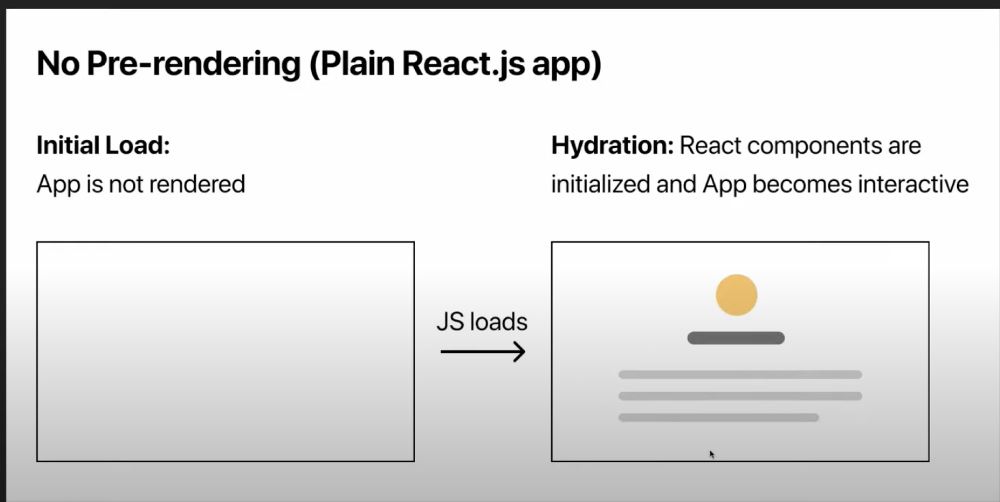
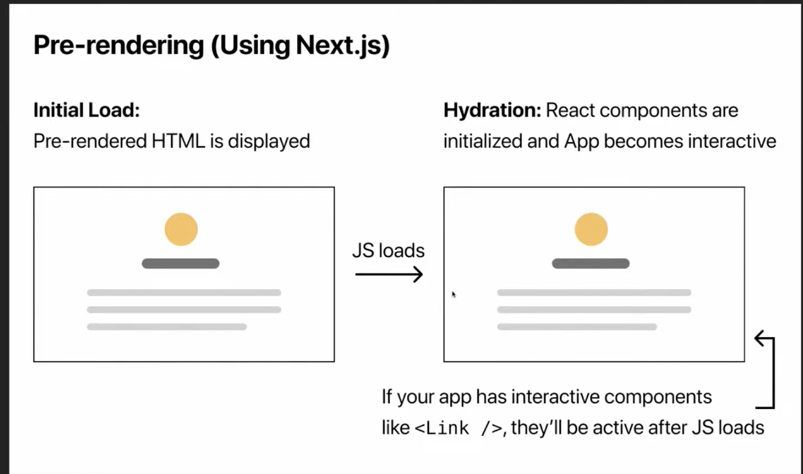
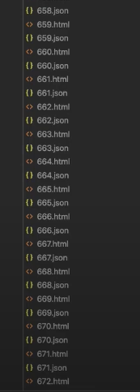

| 정적 생성        | 서버 사이드          | 
|:-------------|:------------------|
| getStaticProps | getServerSideProps | 
| getStaticPaths | -   | 


# getStaticProps , getStaticPaths

{: .new } 
> - Pre-rendering
>   - Nextjs 기본적으로 모든 페이지를 pre-render한다
>   - `각 html파일을 사전에 만든다는 의미`
>   - 퍼포먼스와 SEO 향상

<br />

## pre-rendering 됐을때와 안됐을때의 비교




{: .note }
> - `pre-redering`이 아닐 때  
>   - 빈화면에서 js가 load된 이후에 웹페이지를 그린다.
>
> - `pre-redering`이 됐을 때 
>   - 사전에 만들어둔 html요소들이 나온다
>   - js load이후 `<Link />`같은 컴포넌트들이 작동을 시작한다.
>
> - `Hydration` : 정적인 파일에 생기를


<br />

{: .note }
> - `정적 셍성`
>   - 같은 html를 미리 만들어서 사용자에게 재공
>   - 마케팅 페이지 , 블로그 게시물 , 제품목록 , 도움말
>   - 빌드 시점에 html 파일 자체를 만든다.
>
> - `서버 사이드 랜더링`
>   - 사용자가 요청하면 만들어서 보여줌
>   - 항상 최신 상태 유지 , 관리자 페이지 , 분석 차트


<br />

> getStaticProps 예시 (1) 제품 페이지


```jsx
// 정적 생성 서버에서 미리 만들어둠
export async function getStaticProps(){
    const apiUrl = process.env.apiUrl;
    const res = await Axios.get(apiUrl);
    const data = res.data;

    return {
        props:{
            list : data,
            name: process.env.name
        }
    }
}


export default function Home ({list}){
    return (
        <div />
    )
}
```


<br />
<br />


---

# getStaticPaths




{: .new } 
> - D`ynamic 라우터와 정적 생성 방식 사용`
>   - 특정 페이지에 대해 미리 정적 파일로 만들어 둘 수 있다.
>
> - `fallback : true`이면
>   - `path에 없는 파일들은 background에서 html,css를 정적 파일로 만들어준다.`
>   - 첫번째 접속 시 초반에 빈 화면이 보인다.
>   - 두번째부터는 빠르게 볼 수 있다.
>
> - Link를 사용하면 스크롤 하는 것으로도 detail 페이지를 미리 정적 파일로 만들어둔다.
>   - `viewport` 내에 있는 파일들은 preload된다.

<br />

```jsx
// 사용 예시
export async function getStaticPaths(){
    return (
        //static하게 3개의 값을 전달
        path:[
            {params: {id : '740'}},
            {params: {id : '736'}},
            {params: {id : '735'}},
        ]
        //fallback이 false면 없는 페이지에 대해 대응을 하지 않는다.
        //fallback이 true면 없는 페이지를 백그라운드에서 만들어줌
        fallback: false
    )
}
```

<br />
<br />

# getStaticPaths Loading 페이지 생성

{: .important-title }
> - `getStaticPaths` path에 등록되지 않는 것은 초기 로딩 시 초반에 빈화면이 나타난다 
>   - `useRouter()`의 `isFallback`를 이용해 로딩화면을 그릴 수 있다.
>   - 로딩 중 : true
>   - 로딩 완료 : false


<br />


```jsx
//정적 파일이 생성되지 않았다면 router.isFallback를 이용해서 초기 로딩 창 띄움
export async function getStaticPaths(){
    return (
        //static하게 3개의 값을 전달
        const res = await Axios.get("...");
        const data = res.data;
        path: data.slice(0,8).map(item => ({
            params: {id : item.id.toString()}
        }))
        //fallback이 false면 없는 페이지에 대해 대응을 하지 않는다.
        //fallback이 true면 없는 페이지를 백그라운드에서 만들어줌
        fallback: true
    )
}
export async function getStaticProps(){
    const apiUrl = process.env.apiUrl;
    const res = await Axios.get(apiUrl);
    const data = res.data;

    return {
        props:{
            item : data,
            name: process.env.name
        }
    }
}
export Home({item }){
    const router = useRouter();
    if(router.isFallback){
        return(
            <div>
                로딩 중...
            </div>
        )
    }
}
```