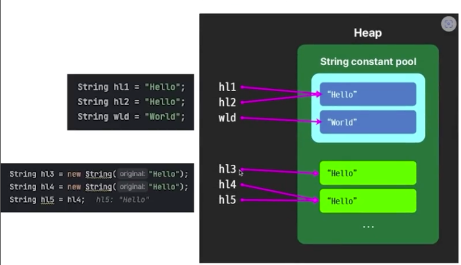
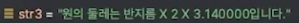
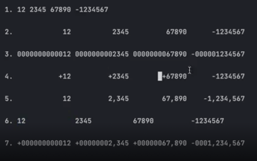
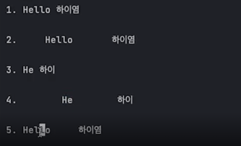
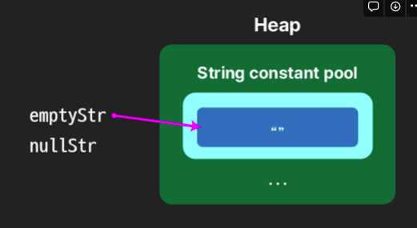
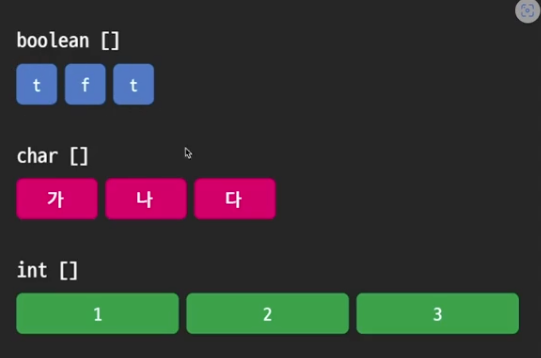
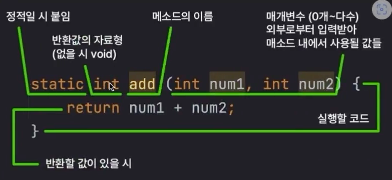

## java에 기본 메인 틀

<br />

```java
// final : 한번만 값을 넣을 수 있는 주머니
public class Main{
    public static void main(string[] args){
        system.out.println("프린트 해라");
    }
}
```

<br />
<br />
<br />


---

# 기본 문자열 자료형 , 관련된 함수



<br />

{: .highlight }
> - 인스턴스로 만든 문자열들끼리 비교할 때 `equals`를 사용한다
> - 문자열을 비교할 때 `equals`를 사용한다.

```java
String h1 = new String("hi");
String h2 = new String("hi");

boolean h3 = h1.equal1s(h2) // true
```

<br />
<br />
<br />


---

# 문자열의 메소스 (상)

{: .highlight }
> - `trim()` : 문자열 앞 뒤 공백 없앰
> - `chatAt(n)` : 문자열 n번째 글자를 가져오는 것
> - `indexOf("A")` : A가 몇번째에 처음 나오는지
> - `lastIndexof("B")` : B가 마지막으로 나온곳이 몇번째 인덱스 인지? , 포함안되면 `-1`
> - `equalsIngoreCase` : 대소문자 상관없이 문자열 구별
> - `contain("A")` : A문자열이 포함되는지?
> - `startWith("A")` : A문자열로 시작하는지?

<br />
<br />
<br />


---

# 문자열의 메소스 (상)

{: .highlight }
> - `concat` : 문자열 합치기 (`+`사용하는게 서능이 더 좋음)
> - `repeat(n)` : n번 반복
> - `substring(n,n+2)` : n ~ (n+2) 까지의 글자를 잘라서옴
> - `replace("a" , "b")` : a문자열을 b문자열로 변환

<br />
<br />
<br />


---

## java formatting



<br />

|    %b       | 불리언 | 
| %d |  10진 정수  | 
| %F |  실수  | 
| %c |  문자  | 
| %s |  문자열  | 
| %n |  포멧 문자열 내 바꿈  | 

```java
String circle = "원";
int two = 2;
double PI = 3.14;
"%s의 둘레는 반지름 X %d X %f입니다.".formatted(circle, two, PI);


//  ⭐️ 시스템의 printf 메소드 : String.format과 같은 형식으로 출력
//  줄바꿈을 하지 않으므로 직접 넣어줘야 함
System.out.printf("%s의 둘레는 반지름 X %d X %f입니다.%n", circle, two, PI);
```

<br />
<br />


---

## java formatting (2)



<br />

{: .highlight }
> - 정수형 다양하게 포맷팅 하기

```java
//  💡 정수 다양하게 포매팅하기
    String[] intFormats = {
        "%d",        // 1. 기본
        "%13d",      // 2. n 자리수 확보, 오른쪽 정렬
        "%013d",     // 3. 빈 자리수 0으로 채움
        "%+13d",     // 4. 양수는 앞에 + 붙임
        "%,13d",     // 5. 쉼표 사용
        "%-13d",     // 6. 자리수 확보, 왼쪽 정렬
        "%+,013d"    // 7.
    };
```

<br />
<br />


---


## java formatting (2)



<br />

{: .highlight }
> - 문자형 다양하게 포맷팅 하기

<br />
<br />


---

## null 과 ""



<br />

{: .highlight }
> null 과 ""은 다른 값이며, 코드 상에서 null과 ""을 구분해줘야한다.

```java
//  💡 문자열을 외부로부터 받아올 경우 등
//nullStr값이 있으면 값 사용 없으면 default 출력
String nullStr = null;

String defaultStr = (nullstr != null && !nullStr.isEmpty())
                    ? nullStr : "default"
```

<br />
<br />


---


## 배열



{: .highlight }
> - 특정 타입의 데이터를 묶음으로 다루기 위해 사용
> -  개수의 변경이 불가능함
> - 배열의 자료형마다 크기가 다름

<br />
<br />

```java
// 배열을 만드는 1번째 방법
//  💡 사용할 자료형 뒤에 []를 붙여 선언
char[] yutnori = {'도', '개', '걸', '윷', '모'};
// 5
int length = yutnori.length;


// 배열을 만드는 2번째 방법
boolean[] boolAry = new boolean[3];
int[] intAry = new int[3];
double[] dblAry = new double[3];
```

```java
char[] dirAry3;
//  선언만 먼저 한 상태에서는 new 자료형[]를 앞에 적어줘야함
dirAry3 = new char[] {'동', '서', '남', '북'};
```

<br />
<br />


---


## 이중 배열

{: .highlight }
> - 배열에는 메모지 주소가 저장된다.

<br />


```java
//  이중 배열
boolean[][] dblBoolAry = new boolean[3][3];

int[][] dblIntAry = new int[][] {
        //  ⭐️ 요소 배열의 크기가 다를 수 있음
        {1, 2, 3},
        {4, 5},
        {6, 7, 8, 9},
};
```

<br />
<br />


---


## final 배열 

{: .highlight }
> - 상수 배열은 다른 배열은 할당 할 수 없다.
>   - 하지만, n번째 인덱스 값을 변경시키는 것은 가능

```java
//  상수 배열의 경우
final int[] NUMBERS = {1, 2, 3, 4, 5};

//  ⚠️ 다른 배열을 할당하는 것은 불가
NUMBERS = new int[] {2, 3, 4, 5, 6};

//  ⭐️ 배열의 요소를 바꾸는 것은 가능
NUMBERS[0] = 11;
```

<br />
<br />


---

## 자바의 메소드



{: .highlight }
> - 모두 매인 메서드에서 실행됨

<br />


```java
public class Main{
    public static void main(string[] args){
        double xx = 3, yy= 4;
        addSubtMultDiv(xx,yy);

        //배열 메소드 호출
        double avg getAverage(new int[] {3,5,4,13,7})
    }

    // 메소드 정의 아무것도 반환하지 않음
    static void addSubtMultDiv (double a, double b) {
    //메소드 정의
        system.out.println("메서드 호출")
    }

    // int 반환
    static int addSubtMultDiv (double a, double b) {
    //메소드 정의
        return 5
    }

    //배열의 배소드
    static int[] getAverage (int[] nums){
    //nums int로된 배열값을 파라미터로 받음
    // 배열길이가 2인 배열을 리턴
        return new int[] {max, min};
    }
}
```


<br />
<br />


---

## 자바의 배열 

{: .highlight }
> - `매개변수의 갯수가 정해지지 않은 메소드`
>   - 💡 `... 연산자` : 해당 위치 뒤로 오는 연산자들을 배열로 묶음!!

<br />

```java

// 첫번째 예제
// 문자열 넣기
double avg = getAverage(3, 91, 14, 27, 4);

//배열을 넣으면 알아서 펼쳐져 넣어짐
int[] numbers = {3, 91, 14, 27, 4};
double avgOfArr = getAverage(numbers);


//  💡 ... 연산자 : 해당 위치 뒤로 오는 연산자들을 배열로 묶음!!
//  int[] (배열 자체를 받음)과는 다름!
static double getAverage(int... nums) {
        double result = 0.0;
        for (int num : nums) {
            result += num;
        }
        return result / nums.length;
    }
```

```java
// 두번째 예제
String class3Desc = descClass(3, "목아진", "짱구", "철수", "훈이");
String[] kids = {"짱구", "철수", "훈이"};
String class3DescByArr = descClass(3, "목아진", kids);


// 메소드
static String descClass (int classNo, String teacher, String... kids) {
    return "%d반의 담임은 %s 선생님, 원생들은 %s 입니다."
            .formatted(classNo, teacher, String.join(", ", kids));
}
```

<br />
<br />
<br />

---

## 다양한 메소드 (오버로딩)

{: .highlight }
> - `같은 메소드 / 다른 매개변수`
> - 다른 자료형의 값들로 같은 성질 작업 할 때

<br />

> 예시

```java
// 오버로딩 예시
static int add(int a, int b) { return a + b; }
static int add(int a, int b, int c) { return a + b + c; }
static double add(double a, double b) { return a + b; }
```

<br />
<br />

## 자바의 forEach 구문

{: .highlight }
> - `for (let num : nums)`

<br />

```java
int[] nums = {1, 2, 3, 4, 5};

for (int num : nums) {
    System.out.println(num);
}
//1
//2
//3
//4
//5
```