# Java 객체 지향 


<br />
<br />


```java
// 배열 생성
Integer[] integerAry = {1,2,3,4,5};
```


---

## 접근제어자

- 공개 범위 : `private < default < protected < public`

| 접근제어자        |  공개 범위     | 
|:-------------|:------------------|
| private           | 같은 클래스만! | 
| default | 같은 패키지만!  | 
| protected      | 같은 패키지! , 다른 패키지여도 상속받으면 o | 
| public | 같은 패키지O , 다른 패키지O  | 


<br />

## 제어자

| 접근제어자        |  공개 범위     | 
|:-------------|:------------------|
| static           | 모든 인스턴스에서 공통으로 사용 , 인스턴스 생성안하고 사용가능 , `인스턴스를 생성안하고 사용가능` 이기때문에 인스턴스 필드, 메서드를 사용xxx, 클래스 선언 후 바로 사용 가능| 
| final           | 이게 붙으면 절대 확장,변경 불가능 , 상속도 안됨| 
| abstract,interface(자격증 같은거)         | 선언만 하고 / implement에서 구체적인걸 구현 함 | 


## Java의 객체 지향

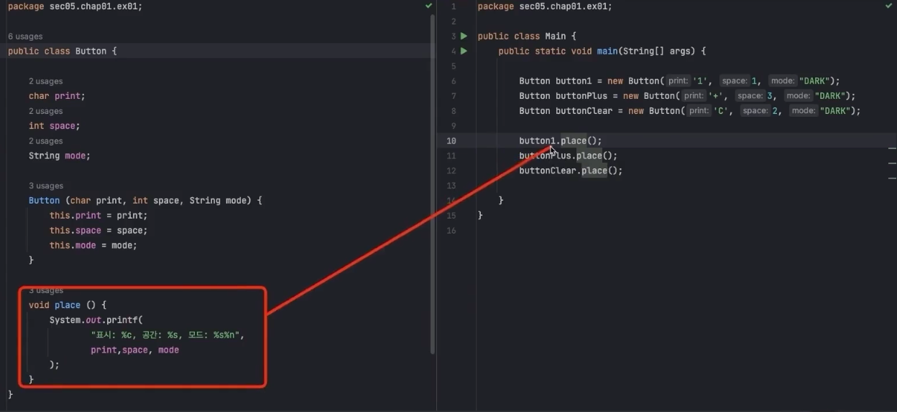

<br />

{: .highlight } 
> - 프로그램의 시작은 메인 메소드
> - `class로 지정한 것은 자료형이 된다.`
>   - 인스턴스 : 속성과 기능들의 묶음
> - class는 `객체`나 `인스턴스`라고 쓰인다.

<br />
<br />
<br />

---

## 생성자와 메소드

- 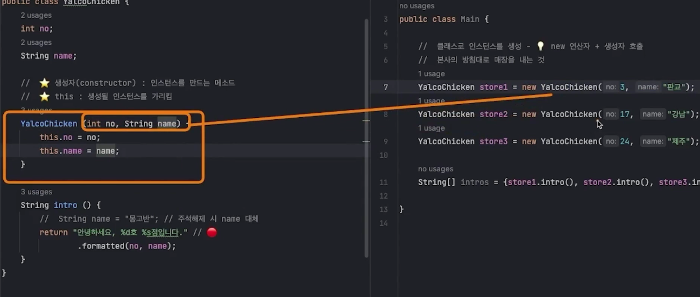
- 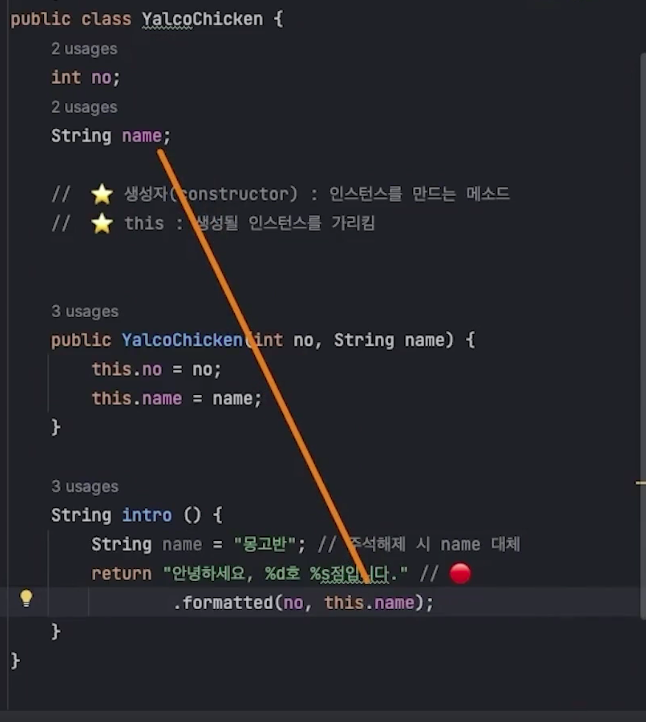

{: .highlight } 
> - class : 본사 
> - 인스턴스 : 프랜차이즈
> - `new` :  연산자와 함께 사용되어 인스턴스를 반환
>   - `생성자` : 인스턴스를 만들때 무슨 인자를 받을 지 정해주는 것 (인자가 없어도 컴파일 시 만들어짐)
>   - `Command + n` : constroct를 만들어주는 단축키
> - `this` : 생성될 인스턴스를 가르킴
> - `object`는 모든 클래스의 조상이다
>   - toString , equal 등등의 object의 메소드는 override해서 개조할 수 있다.

<br />

> 본사 코드

```java
// 본사 코드
public class YalcoChicken {
    int no;
    String name;

    //  ⭐ 생성자(constructor) : 인스턴스를 만드는 메소드
	//  ⭐ this : 생성될 인스턴스를 가리킴
    //  클래스와 이름이 같음 / 반환값은 없음 / 인스턴스를 만들때 무슨 값을 넣어줘야하는 건지 정의
    YalcoChicken (int no, String name) {
        this.no = no;
        this.name = name;
    }

    String intro () {
		//  String name = "몽고반"; // 주석해제 시 name 대체
        return "안녕하세요, %d호 %s점입니다.".formatted(no, name);
    }
}
```

> 프랜차이즈 코드

```java
//  클래스로 인스턴스를 생성 - 💡 new 연산자 + 생성자 호출
//  본사의 방침대로 매장을 내는 것
YalcoChicken store1 = new YalcoChicken(3, "판교");
YalcoChicken store2 = new YalcoChicken(17, "강남");
YalcoChicken store3 = new YalcoChicken(24, "제주");
```

<br />
<br />
<br />

---

## 생성자와 메소드 (2)

{: .highlight } 
> - 인스턴스를 만드는 방법을 두개 선언 가능 : 생성자 두개 생성

<br />

```java
// 인스턴스를 2개인자 , 3개인자로 만들 수 있음
public class ChickenMenu {
    String name;
    int price;
    // 기본 값
    String cook = "fry";

    //인스턴스를 2개의 매게변수로도 만들 수 있음
    ChickenMenu (String name, int price) {
        this.name = name;
        this.price = price;
    }
    //인스턴스를 3개의 매게변수로도 만들 수 있음
    ChickenMenu (String name, int price, String cook) {
        this.name = name;
        this.price = price;
        this.cook = cook;
    }
}
```

```java
// 다른 인스턴스를 생성자에 넣어서 받을 수 있음
public class YalcoChicken {
    int no;
    String name;
    ChickenMenu[] menus;

    YalcoChicken (int no, String name, ChickenMenu[] menus) {
        this.no = no;
        this.name = name;
        this.menus = menus;
    }

    //orderMenu 함수는 ChickenMenu자료형을 반환한다.
    ChickenMenu orderMenu (String name) {
        return menu;
    }
}
```

```java
//메인 메서드에서 인스턴스 생성
//ChickenMenu 인스턴스 생성
ChickenMenu[] menus = {
            new ChickenMenu("후라이드", 10000),
            new ChickenMenu("양념치킨", 12000),
            new ChickenMenu("화덕구이", 15000, "bake")
};
        
//YalcoChicken 인스턴스 생성
YalcoChicken store1 = new YalcoChicken(3, "판교", menus);

//생성된 YalcoChicken의 ChickenMenu를 반환하는 함수 사용
ChickenMenu order1 = store1.orderMenu("양념치킨");
```

<br />
<br />
<br />

---

## 정적 필드와 메소드


{: .highlight } 
> - `static` : 본사의 기능 
>   - 인스턴스마다 따로 갖고 있을 필요가 없는 것들
> - 정적 메소드에서는 인스턴스 프로퍼티 사용 불가능 
>   - `static은 static끼리만 소통 가능`
> - 인스턴스에서는 본사의 내용 사용 가능 


<br />

> static 필드는 인스턴스를 만들지않고 바로 사용가능 (`본사의 기능이기 때문에`)

```java
//  💡 클래스 필드와 메소드는 인스턴스를 생성하지 않고 사용
String ycBrand = YalcoChicken.brand;
String ycContact = YalcoChicken.contact();
```

<br />
<br />

{: .note } 
> - `static`메소드를 이용해서 index하나씩 늘리기
>   - `static`메소드는 클래스 안에서 만 사용되서 인스턴스를 계속 만들어도 클래스 내의 값을 계속 유지 된다.


```java
//Chicken
public class YalcoChicken {
    //본사의 내용 YalcoChicken안에서만 사용
    static int lastNo = 0; // ⭐️

    int no;
    String name;

    YalcoChicken(String name) {
        // 클래스 변수를 활용하여 생성마다 새 번호 부여 (또는 위처럼)
        no = ++lastNo;
        this.name = name;
    }
}
```

```java
//메인 메서드
//{1,판교}
YalcoChicken store1 = new YalcoChicken("판교");
//{2,강남}
YalcoChicken store2 = new YalcoChicken("강남");
//{3,제주}
YalcoChicken store3 = new YalcoChicken("제주");
```

<br />

{: .note } 
> - static 사용 예제 (2)

```java
//Button 클래스
public class Button {
    //클래스 고유 static
    static String mode = "LIGHT";
    static void switchMode () {
        mode = mode.equals("LIGHT") ? "DARK" : "LIGHT";
    }

    char print;
    int space = 1;
    //생성자
    Button (char print, int space) {
        this.print = print;
        this.space = space;
    }
}
```

```java
//main 메서드
Button button1 = new Button('1', 1);
Button buttonPlus = new Button('+', 3);
Button buttonClear = new Button('C', 2);

Button[] buttons = {button1, buttonPlus, buttonClear};

for (Button button : buttons) { button.place(); }
```

<br />
<br />
<br />

---

## 접근 제어자

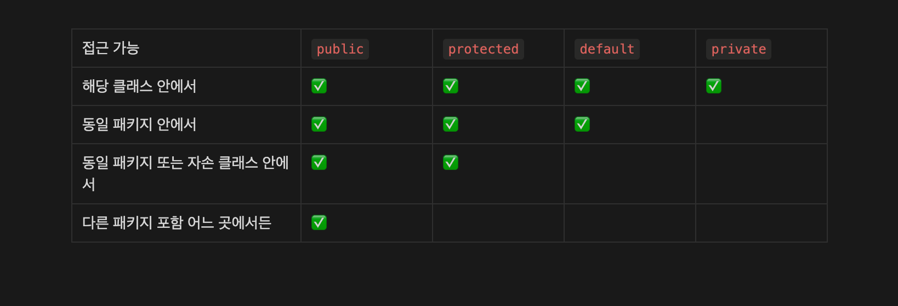

{: .highlight } 
> - `private` : 해당 클래스 제외하고 다른 클래스에서 접근이 불가능하게 한 것
> - `pubilc` : 다른 패키지에서 사용 가능
> - 클래스를 만든사람의 의도대로 프로그램을 작동시키기 위함

<br />

```java
public class SmartPhone {
    //다른 패키지 (다른 폴더에서) 접근 불가능 (같은 패키지는 접근 가능)
    String powerButton = "OnOff";
    //다른 패키지 (다른 폴더에서) 접근 가능!! (같은 패키지는 접근 가능)
    public String sdCardSlot = "SD Card";
    //다른 패키지 (다른 폴더에서) 접근 불가능 (같은 패키기도 접근 불가능 / 해당 클래스만 접근 가능)
    private String cpu = "Yalcom";
}
```

<br />

> 다른 예시

```java
public class Button {
    //바로 접근 불가능
    private static String mode = "LIGHT";
    //옳바른 값을 넣으면 mode값을 변경
    public static void switchMode () {
        mode = mode.equals("LIGHT") ? "DARK" : "LIGHT";
    }

    //바로 변경 불가능
    private char print;
    private int space = 1;

    // 자료형 잘 넣는지 확인 후 인스턴스 필드 값 변경
    public Button (char print, int space) {
        this.print = print;
        this.space = space;
    }

    //필드 값변경
    public void setSpace (int space) {
        if (space < 1 || space > 4) return;
        this.space = space;
    }
}
```

<br />
<br />
<br />

---


## protected 접근자

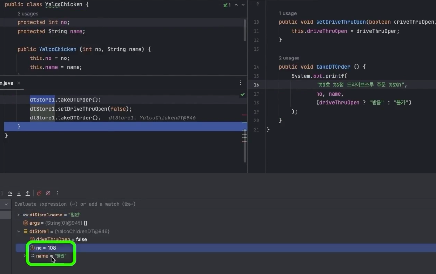

{: .highlight } 
> - 자손 클래스에서 사용가능하게 하는 접근자
>   - 선언만 하면 바로 사용 가능

<br />

```java
// Chicken class
public class Chicken {
    protected int no = 3;
    protected String name = "하이";
}

// 상속 받은 클래스 

public class ChickenDT extends Chicken {
    //부모의 상수를 그냥 사용 가능
    //3 , 하이 출력
    public void takeDTOrder(){
        System.out.println(no , name);
    }
}
```


<br />
<br />
<br />

---

## Getter / Setter


{: .highlight } 
> - getter 를 통해 필드 값 가져옴
> - setter 를 통해 필드 값 변경
> - `command + n
`
<br />

```java
private String name;
private int price;

public String getName() {
    return name;
}

public void setName(String name) {
    if (name.isBlank()) return;
    this.name = name;
}

public int getPrice() {
    return (int) (price * (1 - discount));
}

public void setPrice(int price) {
    int max = (int) (this.price * increaseLimit);
    this.price = price < max ? price : max;
}
```

<br />
<br />
<br />

---

## 상속

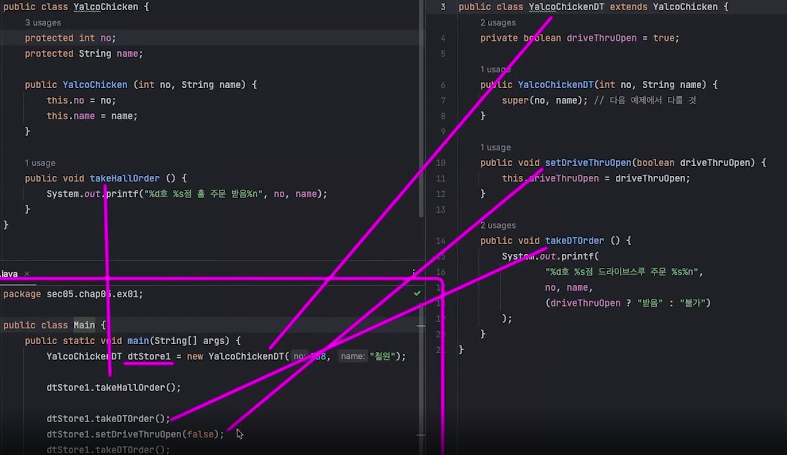

{: .highlight } 
> - `extends` 연산자 사용
> - 부모의 `필드 메소드` , 상속 받음
>   - `protected` : 자손 클래스에서 사용가능하게 하는 것

<br />
<br />
<br />

---

## 메소드 오버라이딩 (상속)

- 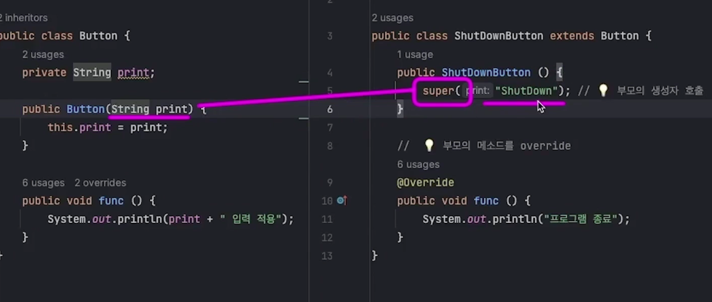
  - 생성자에서 호출하면 부모의 생성자를 호출
- 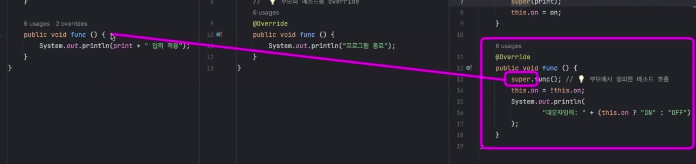
  - 부모의 func 매소드 호출

{: .highlight } 
> - 부모가 가진 같은 이름의 메소드와는 다른 방식으로 정의하는 것
> - 오버라이딩 할 때는 `@override`를 메소드 위에 붙여준다. (어노테이션) `command + n`
> - `super` : 부모의 생성자에게 인자를 전달하는 역할 (`상속 받은 클래스 생성자에서 선언 시`)
>   - `super가 생성자 말고 다른 곳에서 사용되면 부모자체를 가리키게 된다.`
>   - `상속 받을 때 빈 생성자라도 생성해야함`

<br />
<br />


```java
public class Button {
    private String print;

    public Button(String print) {
        this.print = print;
    }

    public void func () {
        System.out.println(print + " 입력 적용");
    }
}
```

```java
public class ShutDownButton extends Button {
    public ShutDownButton (String print) {
        super(print); // 💡 부모의 생성자 호출
    }

	// 💡 부모의 메소드를 override
    // 부모의 메소드를 재정의할 때는 @override를 붙여준다.
	@Override
    public void func () {
        System.out.println("프로그램 종료");
    }
}
```


<br />
<br />
<br />

---

## 다형성

{: .highlight } 
> - `상속 받은 클래스는 부모 클래스에 속한다.`
>   - `자식 클래스의 인스턴스는 부모 클래스 자료형에 속한다.`
>   - ⭐️ 이처럼 특정 자료형의 자리에 여러 종류가 들어올 수 있는 것 - 다형성
>   - `instanceof`연산자로 부모로 부터 상속받은 인스턴스인지 확인 가능

<br />


```java
//  💡 가능 - 자식 클래스는 부모 클래스에 속함
Button button1 = new Button("Enter");
Button button2 = new ShutDownButton();
Button button3 = new ToggleButton("CapsLock", true);

//  💡 가능 - 자식 클래스는 부모 클래스에 속함
Button[] buttons = {
    new Button("Space"),
    new ToggleButton("NumLock", false),
    new ShutDownButton()
};


for (Button button : buttons) {
	//  ⭐️ 모든 Button들은 func 메소드를 가지므로
    button.func();
}
```

<br />

{: .important-title }
> - 다형성 다른 예제 (2)
> - YalcoChickenDT 클래스는 `takeDTOrder`라는 고유의 메소드를 가짐
> - 여러 자료형을 조상으로 묶어서 사용할 때 예제 !!
> - instanceof로 YalcoChickenDT인스턴스인지 확인 후 `store`변수를 `(YalcoChickenDT)`자료형으로 강제 형변환 후 `takeDTOrder`메서드 사용
 

```java
YalcoChicken ycStores[] = {
    new YalcoChicken(3, "판교"),
    new YalcoChicken(17, "강남"),
    new YalcoChickenDT(108, "철원"),
};

for (YalcoChicken store : ycStores) {
    if (store instanceof YalcoChickenDT) {
        //  ⭐️ 자식 클래스의 기능을 사용하려면 명시적 타입 변환
        ((YalcoChickenDT) store).takeDTOrder();
    } else store.takeHallOrder();
}
```

<br />
<br />
<br />

---

## final연산자

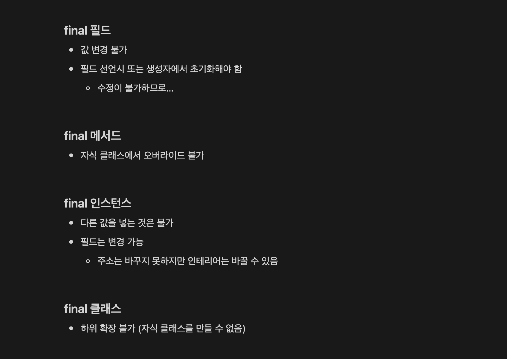

{: .new } 
> - final연산자는 수정이 불가능하다.
>   - `final`붙은 연산자는 수정 불가능
>   - `final`붙은 메소드는 오버라이딩 불가능
>   - `final`붙은 클래스는 상속주는 것 불가능

<br />

```java
public class YalcoChicken {
    protected static final String CREED = "우리의 튀김옷은 얄팍하다.";

    // 생성자에서 값을 무조건 넣어줘야함 (안 넣으면 에러)
    // final값은 변경할 수 없음
    private final int no;
    public String name;

    //  ⭐️ 필수 - no가 final이고 초기화되지 않았으므로
    public YalcoChicken(int no, String name) {
        this.no = no;
        this.name = name;
    }

    public void changeFinalFields () {
        // ⚠️ 불가
        this.no++;
    }

    //상속받은 자식 클래스에서 오버라이딩을 할 수 없다.
    //이 메서드는 무조건 이렇게 사용해야함
    public final void fryChicken () {
        System.out.println("염지, 반죽입히기, 튀김");
    }
}
```

<br />

{: .new } 
> - 클래스 앞 final 예제

```java
public final class YalcoChickenDT extends YalcoChicken {
		public YalcoChickenDT(int no, String name) {
        super(no, name);
    }
}

// final이 붙은 class 상속이 불가능!!!
public class YalcoChckenHighWayDT extends YalcoChickenDT {
    // final이 붙은 class 상속이 불가능!!!
}
```

<br />

{: .new } 
> - 인스턴스 앞 final 예제
>   - final로 변수 선언 후 다른 값 삽입은 불가능
>   - 요소 변경은 가능

```java
final YalcoChicken store1 = new YalcoChicken(3, "판교");

//  ⚠️ 불가 (Error!!)
store1 = new YalcoChicken(17, "강남");
//  💡 요소 변경은 가능
store1.name = "선릉";
```

<br />
<br />
<br />

---

## 추상 클래스


- 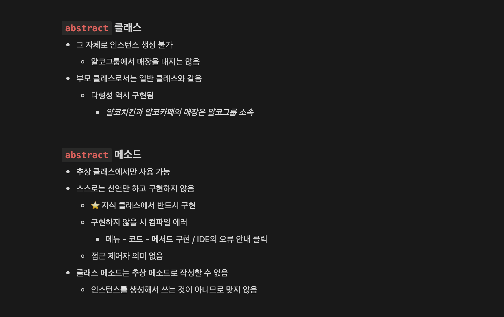
- 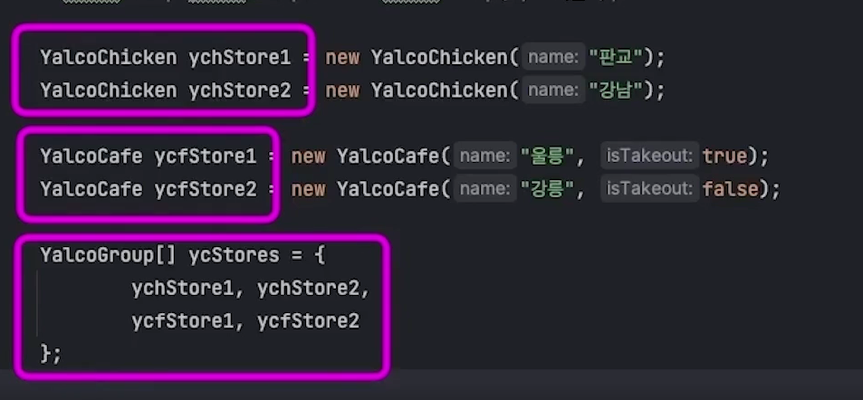

{: .new } 
> - 추상 클래스 : 스스로 인스턴스를 만들 수 없음
>   - 인스턴스를 만들기에는 너무 추상적 
>   - `다른 클래스끼리 묶어주는 역할`
> - 필드는 `protected`로 선언되어 있음 
>   - 자식들이 물려 받아야하기 때문에
> - 추상클래스에서 메서드에`abstract`를 붙인 건 반드시 자식 메소드에서 오버라이드 해야함
>   - `abstract` : 자식 메서드가 구현하라고 만든 메서드 


<br />

> 추상 클래스 생성

```java
// 인스턴스만들지 못하고 자식 클래스 마다에서 재정의 해줘야함
public abstract class FormElement {
    // 자식에서 사용해야하니 protected
    protected int space;

    // 생성자
    public FormElement(int space) {
        this.space = space;
    }

    // 상속받을 클래스에서 정의할 메소드
    abstract void func ();
}
```

> 추상 클래스 상속 받기 1 ( button )

```java
public class Button extends FormElement {
    private String print;

    // 자식 클래스 생성자
    public Button(int space, String print) {
        //부모 생성자 전달
        super(space);
        this.print = print;
    }

    //abstract 메소드 정의
    @Override
    void func() {
        System.out.println(print + "입력 적용");
    }
}
```


> 추상 클래스 상속 받기 2 ( butSwitchton )

```java
public class Switch extends FormElement {
    private boolean on;

    // 자식 클래스 생성자
    public Switch(int space, boolean on) {
        super(space);
        this.on = on;
    }

    //abstract 메소드 정의
    @Override
    void func() {
        on = !on;
        System.out.println((on ? "ON" : "OFF") + "으로 전환");
    }
}
```

<br />

> Main 메서드에서 사용

```java
Button button1 = new Button(2, "Enter");
Switch switch1 = new Switch(3, true);
DropDown dropDown1 = new DropDown(5, new String[] {
        "이름 오름차순", "이름 내림차순",
        "크기 오름차순", "크기 내림차순",
        "날짜 오름차순", "날짜 내림차순"
});


        //  💡 다형성 적용 확인
        clickFormElement(button1);
        clickFormElement(switch1);
        clickFormElement(switch1);
        clickFormElement(switch1);
        clickFormElement(dropDown1);


//FormElement 자료형만 사용 가능
public static void clickFormElement (FormElement fe) {
        fe.func();
}
```


<br />
<br />
<br />

---

## 인터페이스 

- 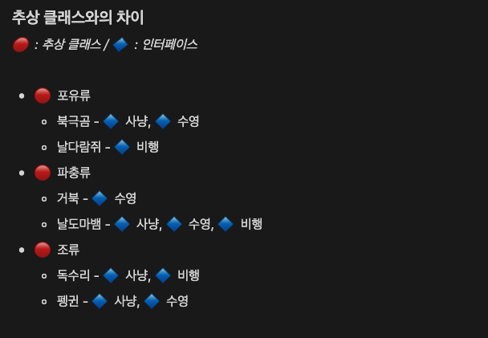

- 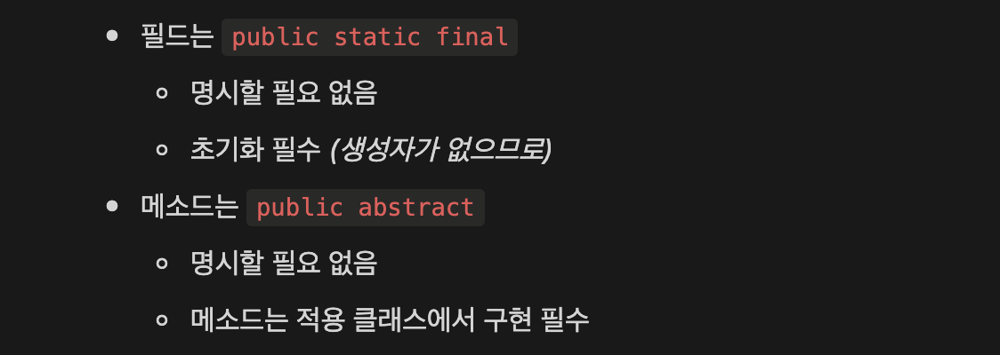
  - `인터페이스 특징 설명`
  - `인터페이스는 자격증 같은 것`

|  | 추상 클래스 | 인터페이스 |
| --- | --- | --- |
| 기본 개념 | 물려 받는 것 (혈통/가문/계열) | 장착하는 것 (학위/자격증) |
| 다중 적용 | 불가 (모회사는 하나 뿐) | 가능 (학위는 여럿 딸 수 있음) |
| 상속관계에 의한 제한 | 있음 | 없음 |
| 생성자 | 가짐 | 가지지 않음 |
| 메소드 | 구상, 추상 모두 가능 | 추상 메소드 (abstract 안 붙여도 됨), default 구상 메소드, 클래스 메소드 |
| 필드 | 모두 가능 | 상수만 가능 (final 명시 불필요) |
| 적용 연산자 | extends | implements |

{: .new } 
> - `추상 클래스` : 계열에 관한 것
> - `인터 페이스` : 자격증 같은 것
>   - 인터페이스의 모든 변수는 자동으로 `final`이다.
>   - 추상 메서드가 들어감 () 구현 클래스에서 추상 클래스를 꼭 구현해야함

<br />

```java
// 인터페이스 예제
// 헌터자격증을 가지면 당연히 헌팅을 할 수 있음
public interface Hunter {
    // 자동으로 final이 붙음
    String position = "포식자"; // ⭐️ final - 초기화하지 않을 시 오류
    // 추상 메서드로 구현 클래스에서 꼭 다시 정의해야함!!
    void hunt ();
}

//인터페이즈 정의 2
public interface Flyer {
    // 모든 변수는 final
    String aka = "날짐승"; // ⭐️ final - 초기화하지 않을 시 오류
    // 추상 클래스로 구현 클래스에서 재정의해야함
    void fly ();
}
```

<br />

> 구현 클래스

```java
public class GlidingLizard implements Hunter, Flyer {
    // 인터페이스에 추상 메서드를 (재정의 안하면 오류)
    @Override
    public void fly() {
        System.out.println("날개막으로 활강");
    }
    
    // 인터페이스에 추상 메서드를 (재정의 안하면 오류)
    @Override
    public void hunt() {
        System.out.println(position + ": 벌레 사냥");
    }
}


public class Eagle extends Bird implements Hunter {
    // 인터페이스에 추상 메서드를 (재정의 안하면 오류)
    @Override
    public void fly() {
        System.out.println("날개로 비행");
    }

    @Override
    // 인터페이스에 추상 메서드를 (재정의 안하면 오류)
    public void hunt() {
        System.out.println(position + ": 토끼 사냥");
    }
}
```

<br />

> 메인 클래스

```java
public class Main {
    public static void main(String[] args){
        
        // 각각 자료형 선언
        GlidingLizard glidingLizard = new GlidingLizard();
        Eagle eagle = new Eagle();

        // 다형성 hunter를 각각 구현하고 있기 때문에 hunter자료형이 될 수 있음
        Hunter[] hunters = {
            glidingLizard , eagle
        }

        // 각각이 헌터니까 hunt메소드를 가지고 있다.
        //  💡 인터페이스 역시 다형성에 의해 자료형으로 작용 가능
        for (Hunter hunter : hunters) {
            hunter.hunt();
        }
    }
}

```


<br />
<br />
<br />

---

## 인터페이스의 고유 메소드 등록 방법

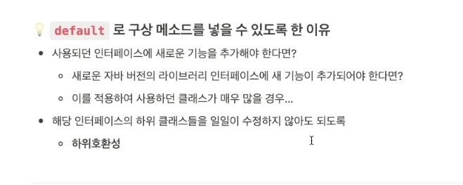

{: .new } 
> - `default` : 구상 메소드의 이름으로 사용됨
>   - `인터페이스 구현체에 상속 되는 메서드`

<br />

```java
// FoodSafety 인터페이스 구현
public interface FoodSafety {

    //  인터페이스 고유 메소드
    static void announcement () {
        System.out.println("식품안전 관련 공지");
    }

	//  ⭐️
    //  인터페이스 구현체에 상속 되는 메서드
    default void regularInspection () {
        System.out.println("정기 체크");
    }

    void cleanKitchen ();
    void employeeEducation ();
}
```

<br />

```java
// 메인 메서드
FoodSafety.announcement();

YalcoChicken store1 = new YalcoChicken();

store1.regularInspection();
store1.cleanKitchen();
store1.employeeEducation();
```

<br />
<br />
<br />

---

## 싱글턴

{: .new } 
> - 프로그램 상에서 특정 인스턴스가 `하나만 존재 해야할 때`
>   - `프로그램상 여러곳에서 공유되는 설정`
> - 공유시킬 인스턴스를 하나만 가지도록 하는 것 : 싱글턴

<br />

> 싱글턴 만들기

```java
//  ⭐️ 이 클래스를 싱글턴으로 만들기
public class Setting {

    // 클래스(정적) 필드
    // - 프로그램에서 메모리에 하나만 존재
    private static Setting setting;

    //  ⭐️ 생성자를 private으로!
    // - 외부에서 생성자로 생성하지 못하도록!!
    private Setting () {}

    //  💡 공유되는 인스턴스를 받아가는 public 클래스 메소드
    public static Setting getInstance() {
        //  ⭐️ 아직 인스턴스가 만들어지지 않았다면 생성
        //  - 프로그램에서 처음 호출시 실행됨
        if (setting == null) {
            // 프로그램에서 단 한번만 호출됨
            setting = new Setting();
        }
        return setting;
    }
}


// 필드 / 메서드 (위는 싱글턴 만들기 공유되는 인스턴스 생성법)
private int volume = 5;

public int getVolume() {
    return volume;
}
public void incVolume() { volume++; }
```

<br />

> 싱글턴 호출

```java
public class Tab {
    //  ⭐️ 공유되는 유일한 인스턴스를 받아옴
    private Setting setting = Setting.getInstance();

    public Setting getSetting() {
        return setting;
    }
}
```

<br />

> 메인 메서드

```java
//인스턴스 생성
// setting를 생성하고 가져옴
Tab tab1 = new Tab();
// 위에서 만든 setting을 가져옴
Tab tab2 = new Tab();
// 위위에서 만든 setting을 가져옴
Tab tab3 = new Tab();

// 인스턴스내 변수를 변경해도 같은 인스턴스를 공유하기 때문에 모든 인스턴스에서의 변수가 변경된다.!!!
tab1.getSetting().incVolume();
tab1.getSetting().incVolume();

System.out.println(tab1.getSetting().getVolume()); // 7
System.out.println(tab2.getSetting().getVolume()); // 7
System.out.println(tab3.getSetting().getVolume()); // 7
```

<br />
<br />