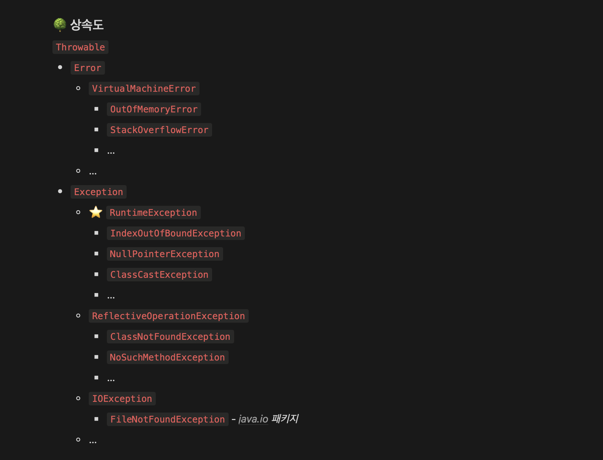

# 자바 에러 핸들링

<br />

## 자바 에러 핸들링



{: .highlight } 
> - 에러나 예외가 발생하면 프로그램이 종료됨
>   - 예외처리 했을 땐 종료되지 않음
> - `try ~ catch 문` : 예외가 발생할 수 있는 부분에 대비하여 프로그램 종료를 막음
> - ` e.printStackTrace();` : 디버깅 시 유리

<br />

```java
try {
    System.out.println(ints[3]);
} catch (Exception e) {
    String errMsg = e.getMessage();
    e.printStackTrace(); // 🔴
}

//null에 lenth메소드를 사용했을 때
try {
    System.out.println(((String) null).length());
} catch (Exception e) {
    String errMsg = e.getMessage();
    e.printStackTrace(); // 🔴
}
```

<br />
<br />

## finally문

{: .highlight } 
> - 예외상황 여부 상관없이 반드시 실행할 코드
>   - `데이터 베이스 연결을 열어 작업한 뒤 닫아줄 때 사용`

<br />

> 예시

```java
public class Ex02 {
    public static void main(String[] args){
    
    }

    //withFinally1
	public static void withFinally1 (boolean makeException) {
    try {
        if (makeException) System.out.println("".charAt(0));
        System.out.println("🎉 예외 없이 정상실행됨");
        } catch (Exception e) {
       System.out.println("🛑 예외 발생");
        } finally {
        System.out.println("🏁 무조건 실행");
       }
    }
}

```

<br />
<br />
<br />

---

## 예외 정의하고 발생시키기

{: .highlight } 
> - `throw` : 컴퓨터가 문제라고 인식못하는 상황에서 인위적으로 예외 발생

<br />

> 예시 코드

```java
public class Main {
    public static void main(String[] args){

        //  💡 메시지를 특정하여 던지기
        throw new RuntimeException("뭔가 잘못됐어요!");        

        //  💡 원인이 되는 다른 예외들을 명시하여 던지기
        //  💡 오류 메세지와 예외 에러처리를 넣어줄 수 있다.
        throw new RuntimeException("얘네 때문임",
               new IOException(
                       new NullPointerException()
               )
        );
    }
}
```

<br />

> 사용예시 13월, 14월 존재 하지않는 월을 넣을때 예외 처리


```java
public class Main {
    public static void main(String[] args){
        


    }

	public static void registerDutyMonth (String name, int month) {
        if (month < 1 || month > 12) {
            //1~12월 아닌 다른 달을 넣었을때 index에러 리턴
            throw new IndexOutOfBoundsException(
                    "우리 %s씨는 1년에 몇 달이 있는지 아직 못 배웠나봐?"
                            .formatted(name)
        );
    }
    System.out.printf("%s씨 %d월 담당으로 배정되셨어요.%n", name, month);
	}
}
```


<br />
<br />
<br />

---

# 사용자 정의 예외 만들기

{: .highlight } 
> - 예외의 타입으로 어떤 예외를 만들지 전달
>   - 예외에 추가적 기능을 담을 때

<br />

```java
public class WrongMonthException extends RuntimeException {
    //month로 잘못된 달을 받도록 함
    public WrongMonthException(int month){
        //RuntimeException의 클래스 생성자에게 문자열 전달
        super(
            ('에러가 발생했습니다.')
        )
    }
}
```

> main메소드에서 예외처리 발생

```java
public class Ex03 {
    public static void main(String[] args){
		try {
            registerDutyMonth("김돌준", 13);
        } catch (WrongMonthException we) {
            we.printStackTrace();
        } catch (Exception e) {
            e.printStackTrace();
        }
    }

    // 위에서 호출한 메소드
	public static void registerDutyMonth (String name, int month) {
    if (month < 1 || month > 12) {
        // 위에서 만든 커스텀 에러 던지기!
        throw new WrongMonthException(month);
    }
        System.out.printf("%s씨 %d월 담당으로 배정되셨어요.%n", name, month);
    }
}
```