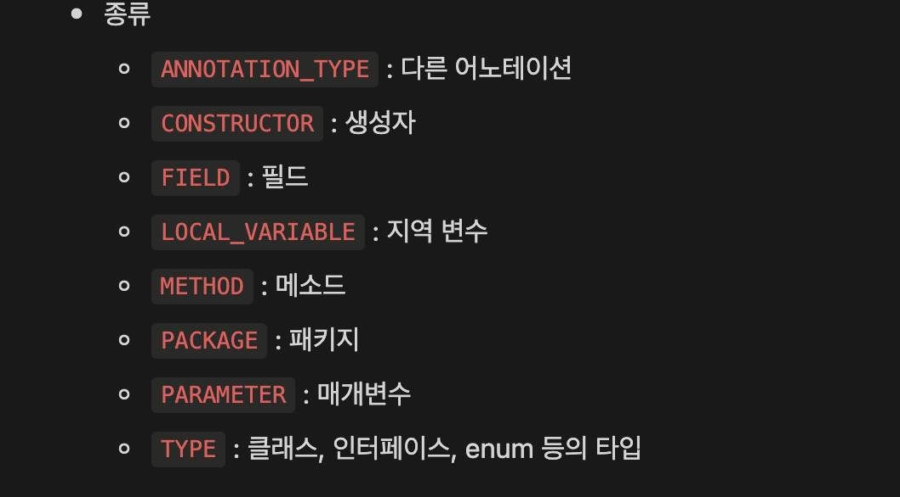
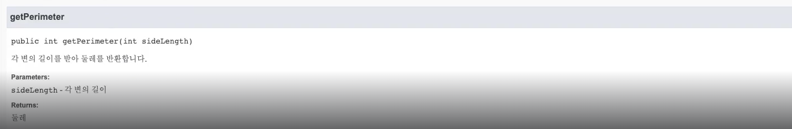

# 리플렉션

<br />

## 자바 어노테이션

| 어노테이션 | 설명 |
| --- | --- |
| @Deprecated | 더 이상 사용되지 않음 |
| @Override | 오버라이드되는 메소드
( 컴파일러가 검사 ) |
| @FunctionalInterface | 함수형 인터페이스임 |
| @SuppressWarnings | 컴파일러의 경고 무시 |

{: .new } 
> - 사용자 정의 어노테이션 만들기
>   - 클래스, 메소드에 붙일 수 있다.

<br />

```java
//커스텀 인터페이스 만들기
//어노테이션 이름 CustomAnnt
public @interface CustomAnnt {

}
```

<br />
<br />
<br />

---

## @Retention

{: .new } 
> - 어노테이션 유지되는 범위
>   - `정책 종류`
>       - `SOURCE` : 소스 파일에만 적용
>       - `CLASS` : 클래스 파일까지 사용됨
>       - `RUNTIME` : 실행시에 사용가능

<br />

```java
@Retention(RetentionPolicy.SOURCE)
public @interface RetSource { }

@Retention(RetentionPolicy.CLASS)
public @interface RetClass { }

@Retention(RetentionPolicy.RUNTIME)
public @interface RetRuntime { }
```

> main 메소드

```java
public class MyClass {
    //컴파일 이후에 사라짐
    @RetSource
    int a;
    //클래스 이후에 사라짐
    @RetClass
    int b;
    //계속 살아남음
    @RetRuntime
    int c;

}

```

<br />
<br />
<br />

---

## @Target



{: .new } 
> - 어노테이션이 적용될 수 있는 대상 지정
>   - 어느 타입에 붙을 수 있을지 지정

<br />

```java
// 어노테이션 클래스
// @Target 어디에 붙을 수 있는지 정의 
// 다른 어노테이션에 붙을 수 있음
@Target(ElementType.ANNOTATION_TYPE)
public @interface TargAnnot { }

// 어노테이션 클래스
// 생성자에 붙을 수 있음
@Target(ElementType.CONSTRUCTOR)
public @interface TargConstr {
}

//어노테이션 클래스
// 필드,메소드,지역변수에 붙을 수 있음
@Target({
        ElementType.FIELD,
        ElementType.METHOD,
        ElementType.LOCAL_VARIABLE
})
public @interface TargMulti { }
```

> 메인 메소드 어노테이션 사용

```java
public class MyClass {
    
    // 생성자에 사용
    @TargConstr
    public MyClass() { }

    //메소드에 사용
	@TargConstr
    public MyClass() { }
}
```

<br />
<br />
<br />

---

## @Repeatable

{: .new } 
> - 동일 요소에 여러번 사용 가능

<br />

```java
// 어노테이션 생성 {RepeatT}
@Repeatable(Repeats.class)
@Retention(RetentionPolicy.RUNTIME)
public @interface RepeatT {
    //  💡 다음 강에서 배움
    int a();
    int b();
}
```

> 메인 메소드 사용

```java
public class Main {
    public static void main(String[] args){
        

        @RepeatT(a = 1, b = 2)
        @RepeatT(a = 3, b = 4)
        @RepeatT(a = 5, b = 6)
        boolean repeat; 
    }
}
```

<br />
<br />
<br />

---

# 어노테이션 만들기

<br />


```java
//어노테이션 만들기
//@Count 어노테이션
@Retention(RetentionPolicy.RUNTIME)
public @interface Count {
    int value() default 1; // 💡 기본값 설정
}


//두번째 어노테이션
//@PersonName 어노테이션
@Retention(RetentionPolicy.RUNTIME)
public @interface PersonName {
    String first();
    String last();
}
```

> main 메소드

```java
//메인 메소드
public class Main {
    //커스텀 어노테이션 사용
    @Count(value = 3)
    private int apple;

    //커스텀 어노테이션 사용
    @Count(value )
    private int applea;

    //💡 값이 여럿일 시. 순서 무관
    //커스텀 어노테이션 사용
    @PersonName(last = "홍", first = "길동")
    private Object seller;

    public static void main(String[] args){

    }
}
```

<br />
<br />
<br />

---

# java-doc



{: .new } 
> - JDK에 포함된 도구
> - Java로 작성된 소스 코드의 문서화에 사용됨
>   - `@param` : 파라미터
>   - `@return` : 리턴값

<br />

> 예시

```java
/**
 * 각 변의 길이가 동일한
 * 다각형을 나타내는 클래스입니다.
 */
public class RegularPolygon {
    /**
     * 각 변의 길이를 받아 둘레를 반환합니다.
     *
     * @param sideLength 각 변의 길이
     * @return 둘레
     */
    public int getPerimeter (int sideLength) {
        return sideLength * sides;
    }
}

//javadoc -d docs
```