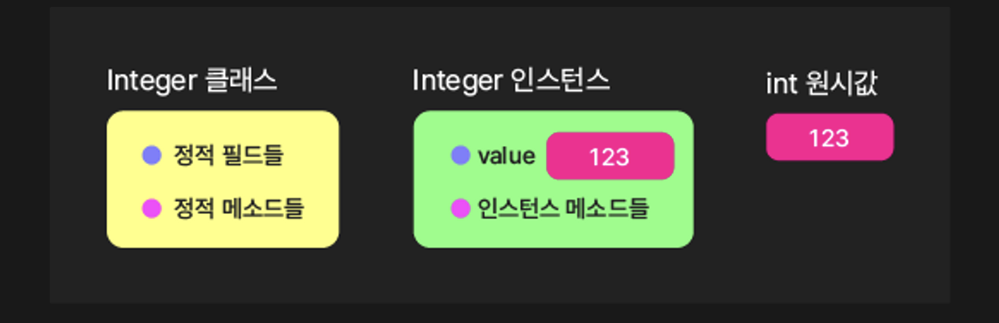
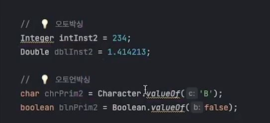
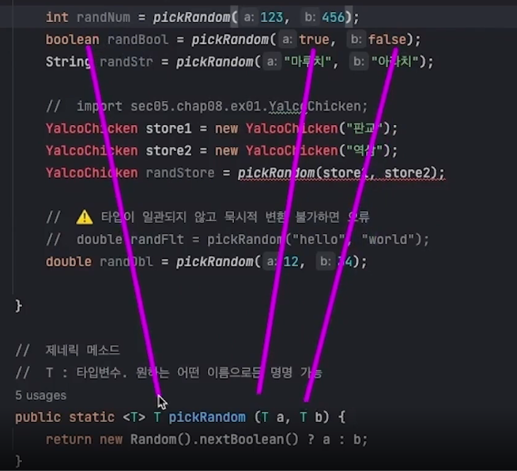
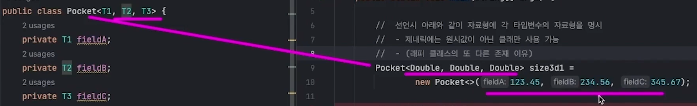
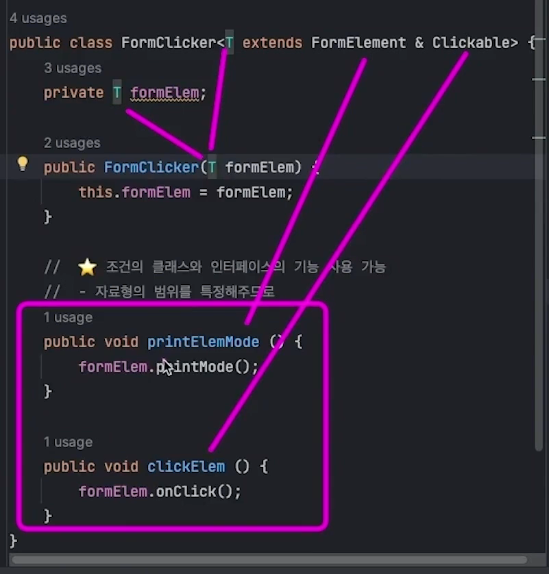

# 자바 Wrapper 클래스 



{: .highlight } 
> - 래퍼 클래스 : 인스턴스와 서로 변환 가능
> - 원시값 존재 이유는 더 높은 성능에 있다.
>   - 대신 순수 객체지향언어가 아니게 됨

| 원시 자료형 | 래퍼 자료 |
| --- | --- |
| byte | Byte |
| short | Short |
| int | Integer |
| long | Long |
| float | Float |
| double | Double |
| char | Character |
| boolean | Boolean |

<br />


> 원시값 , 래퍼클래스 만들기

```java
//  원시 자료형 만들기
int int1 = 123;
double dbl1 = 3.14;
char chr1 = 'A';
boolean bln1 = true;


//  💡 래퍼 클래스 만들기
// 123 -> 박스를 입어서 래퍼 클래스가됨
// 3.14 -> 박스를 입어서 래퍼 클래스가 됨...
Integer int3 = Integer.valueOf(123);
Double dbl3 = Double.valueOf(3.14);
Character chr3 = Character.valueOf('A');
Boolean bln3 = Boolean.valueOf(true);
```

<br />
<br />
<br />

---

## 박싱과 언박싱



{: .highlight } 
> - 박싱 : 원시값 -> 래퍼 클래스가 되는 것
> - 언박싱 : 래퍼클래스 -> 원시값이 되는 것
>   - `프로그래밍할 때 원시값인지 래퍼클래스값인지 신경 안써도 됨`

<br />

```java
// 자바에서는 박싱 / 언박싱을 자동으로 해줌
static int add(Integer a, Integer b) { return a + b; }
```

<br />
<br />

---

## 래퍼클래스의 유용한 메소드

{: .highlight } 
> - `Integer.valueOf` : 인스턴스 반환
> - `Integer.parseInt` : 원시값 반환
> - `Character.isLetter(c)` : 문자인가
> - `Character.isUpperCase(c)` : 대문자 판별
> - `Character.isLowerCase(c)` : 소문자 판별
> - `Character.isSpaceChar(c)` : 스페이스 판별


<br />
<br />
<br />

---

# 제네릭



{: .highlight } 
> - 자료형을 필요에 따라 동적으로 정할 수 있음
> - 메소드 or 클래스에서 사용

<br />

> 제네릭의 예제

```java
int randNum = pickRandom(123, 456);
String randStr = pickRandom("마루치", "아라치");
//  제네릭 메소드
//  T : 타입변수. 원하는 어떤 이름으로든 명명 가능
public static <T> T pickRandom (T a, T b) {
    return Math.random() > 0.5 ? a : b;
}
```


<br />
<br />
<br />

---

## 제네릭 클래스



{: .highlight } 
> - 제네릭 타입을 가진 클래스 
>   - 인자 각각 다른 타입을 가짐 (T1, T2, T3)
> - 인스턴스 생성 시 타입을 명시해준다.

<br />

> 제네릭 클래스 생성

```java
//  원하는 자료형들로 세 개의 필드를 갖는 클래스
public class Pocket<T1, T2, T3> {
    private T1 fieldA;
    private T2 fieldB;
    private T3 fieldC;

    // 샘성자 함수
    public Pocket(T1 fieldA, T2 fieldB, T3 fieldC) {
        this.fieldA = fieldA;
        this.fieldB = fieldB;
        this.fieldC = fieldC;
    }

    public T1 getFieldA() {
        return fieldA;
    }

    public T2 getFieldB() {
        return fieldB;
    }

    public T3 getFieldC() {
        return fieldC;
    }
}
```

> 클래스 사용 (인스턴스 생성)

```java
// 앞에 제네릭 타입 선언
Pocket<Double, Double, Double> size3d1 = new Pocket<>(123.45, 234.56, 345.67);

//  타입추론도 가능은 함
var size3d2 = new Pocket<>(123.45, 234.56, 345.67);

//인스턴스 사용
double width = size3d1.getFieldA();

// 인스턴스 생성
Pocket<String, Integer, Boolean> person = new Pocket<>("홍길동", 20, false);

//  제네릭 클래스는 배열 생성시 new로 초기화 필수
Pocket<String, Integer, Boolean>[] people = new Pocket[] {
                new Pocket<>("홍길동", 20, false),
                new Pocket<>("전우치", 30, true),
                new Pocket<>("임꺽정", 27, true),
        };
```


<br />
<br />
<br />

---

## T는 Number를 상속 받은 클래스만 가능

{: .highlight } 
> - int / double / ...만 가능

<br />

> Number 상속한 것만 가능 (클래스)

```java
//  💡 T는 Number를 상속한 클래스이어야 한다는 조건
public static <T extends Number> double add2Num(T a, T b) {
    return a.doubleValue() + b.doubleValue();
}
```

> 인스턴스 생성

```java
var sum1 = add2Num(12, 34.56);
```


<br />
<br />
<br />

---

## 제네릭 실용 예제



{: .highlight } 
> - 
> - 

<br />

> FormElement (추상 클래스)

```java
public abstract class FormElement {
    //두개의 변수를 가짐
    public enum MODE { LIGHT, DARK }

    //FormElement에서만 사용되는 필드
    private static MODE mode = MODE.LIGHT;

    //인스턴스 메소드
    public void printMode () {
        System.out.println(mode);
    }
    //다른 인스턴스에서 구현해야됨
    abstract void func ();
}
```

> 인터 페이스 자격증 (Clickable.java)

```java
public interface Clickable {
    void onClick();
}
```

> 버튼 상속 , 구현 Button.java

```java
public class Button extends FormElement implements Clickable {
    @Override
    public void onClick() { func(); }

    @Override
    void func() { System.out.println("버튼 클릭");}
}
```

> Switch.java

```java
public class Switch extends FormElement implements Clickable {
    private boolean isOn;

    public Switch(boolean isOn) {
        this.isOn = isOn;
    }

    @Override
    public void onClick() { func(); }

    @Override
    void func() {
        isOn = !isOn;
        System.out.printf("%s(으)로 전환%n", isOn ? "ON" : "OFF");
    }
}
```

> FormClicker.java

```java
// FormElement와 / Clickable를 상속 받은 타입만 T으로 받을 수 있다.
public class FormClicker<T extends FormElement & Clickable> {
    private T formElem;

    public FormClicker(T formElem) {
        this.formElem = formElem;
    }

    //  - 자료형의 범위를 특정해주므로
    public void printElemMode () {
        //FormElement의 인터페이스 메소드
        formElem.printMode();
    }

    public void clickElem () {
        //Clickable의 인터 페이스 메소드
        formElem.onClick();
    }
}
```

> main.java

```java
FormClicker<Button> fc1 = new FormClicker<>(new Button());
FormClicker<Switch> fc2 = new FormClicker<>(new Switch(true));

fc1.printElemMode();
fc2.clickElem();

//  ⚠️ 조건에 부합하지 않는 클래스 사용 불가
FormClicker<TextInput> fc3 = new FormClicker<>(new TextInput());
FormClicker<HyperLink> fc4 = new FormClicker<>(new HyperLink());
```