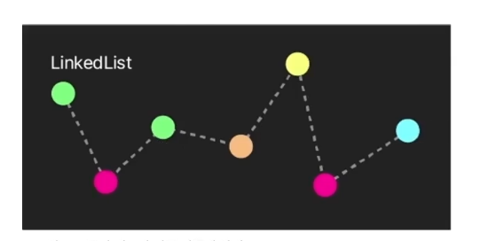

# 자바 프레임워크

<br />

## 자바의 리스트 (List)

{: .highlight } 
> - 자바의 리스트
>   - 래퍼 객체를 제네릭으로 전달
>   - 자료의 크기가 동적으로 변함 (크기가 몇인지 안 지정해도 됨)
> - `.size` : 크기가 몇인지
> - `.isEmpty` : 비어 있는지
> - `.contains` : 포함하는지
> - `clear` : 다 지워줌
>   - 장점 : 각 요소의 접근이 빠름
>   - 단점 : 요소 추가 제거 시 성능 부하

<br />

> 예시 (1)

```java
public class ABC {
    public static void main(String[] args){
        //래퍼 객체 Integer
        ArrayList<Integer> ints1 = new ArrayList<>();
        ArrayList<String> strings = new ArrayList<>();
        ArrayList<Knight> knights = new ArrayList<>();

        //인스턴스에 값 추가
        ints1.add(11);
        ints1.add(22);
        ints1.add(33);

		//  for-each 문 사용 가능
        for (int i : ints1) {
            System.out.println(i);
        }
    }
}
```

<br />

> arrayList 생성과 동시에 값넣기

```java
//  ⭐️ 간략한 생성 및 초기화 방법들
ArrayList<Integer> ints2A = new ArrayList<>( Arrays.asList(1, 2, 3, 4, 5)); 

ArrayList<Integer> ints2B = new ArrayList<>( List.of(1, 2, 3, 4, 5) ); 
```

<br />
<br />
<br />

# 자바의 LinkedList



{: .highlight }
> - ArrayList와 정반대
>   - 장점 : 요소의 추가와 제거가 빠름
>   - 단점 : 요소 접근이 느림
>   - `요소들의 추가/제거가 잦은 곳에 적합`
> - `.size` : 크기가 몇인지
> - `.isEmpty` : 비어 있는지
> - `.contains` : 포함하는지
> - `clear` : 다 지워줌
> - ArrayList와 같은 이름으로 메소드 제공

<br />

```java
public class ABC {
    public static void main(String[] args){
        //래퍼 객체 Integer
        LinkedList<Integer> ints1 = new LinkedList<>();
        LinkedList<String> strings = new LinkedList<>();
        LinkedList<Knight> knights = new LinkedList<>();

        //인스턴스에 값 추가
        ints1.add(11);
        ints1.add(22);
        ints1.add(33);

		//  for-each 문 사용 가능
        for (int i : ints1) {
            System.out.println(i);
        }
    }
}
```

<br />
<br />
<br />

---

## `실무에서의 코드`

{: .highlight }
> - `List` / `Set` / `Map`등의 인터페이스로 변수/인자/제네릭 등의 자료형을 지정
> - 상세 구현이 어떤 알고리즘으로 되어 있는지 굳이 드러내지 않음
>   - 필요에 따라 다른 종류로 교체가 용이하다.
> - 💡 `실무에서는 컬렉션 자료형을 인터페이스로`

<br />

```java
List<Integer> intList = new ArrayList<>();
intList = new LinkedList<>();

Set<String> strSet = new HashSet<>();
strSet = new TreeSet<>();
        
Map<Integer, String> intStrMap = new HashMap<>();
intStrMap = new TreeMap<>();
```

<br />
<br />
<br />

---

# Set

{: .highlight }
> - 중복되지 않은 요소들의 집합

| 주요 클래스 | 장점 | 단점 |
| --- | --- | --- |
| HashSet | 성능이 빠르고 메모리 적게 사용 | 순서 관련 기능 없음 (보장하지 않음) |
| LinkedHashSet | 요소들을 입력 순서대로 정렬 (내부적으로 링크 사용) | HashSet보다는 성능 떨어짐 |
| TreeSet | 요소들을 특정 기준대로 정렬 (기본 오름차순) | 데이터 추가/삭제에 시간 더 소모 |

<br />

> hashSet 예제

```java
public class main {
    public static void main(String[] args){
		// 선언 자료형은 넓게 Set으로
        Set<Integer> intHSet1 = new HashSet<>();
        intHSet1.add(1);
        intHSet1.add(1);
        intHSet1.add(2);
        intHSet1.add(3);

        List<Integer> ints1 = new ArrayList(
                Arrays.asList(1, 1, 2, 2, 3, 3, 4, 5, 6, 7)
        );
        Set<Integer> intHSet2 = new HashSet<>(ints1);

		//  💡 for-each문 사용 가능
        for (var i :intHSet1) {
            System.out.println(i);
        }

		//  ⭐️ 아래와 같이 응용 가능
        //  - 중복을 제거한 ArrayList
        ints1.clear();
        ints1.addAll(intHSet2);
    }
}
```


<br />

> LinkedHashSet, TreeSet 예제

> LinkedHashSet (입력된 순서대로) /  TreeSet (오름차순) / HashSet(정렬)

```java
public class main {
    public static void main(String[] args){
		// LinkedHashSet , HashSet, TreeSet 3개 모두 Set에 속하는 것이기 때문
        Set<Integer> intHashSet = new HashSet<>();
        Set<Integer> intLinkedHashSet = new LinkedHashSet<>();
        Set<Integer> intTreeSet = new TreeSet<>();

        for (int i : new int[] { 3, 1, 8, 5, 4, 7, 2, 9, 6}) {
            intHashSet.add(i);
            intLinkedHashSet.add(i);
            intTreeSet.add(i);
        }
        for (var s : new Set[] {intHashSet, intLinkedHashSet, intTreeSet}) {
            System.out.println(s);
        }
        //  ⭐️ LinkedHashSet : 입력된 순서대로 / TreeSet : 오름차순
        //  ⚠️ HashSet이 정렬된 것처럼 보이지만 보장된 것이 아님
        //  - Hash 방식에 의한 특정 조건에서의 정렬일 뿐
    }
}
```

<br />
<br />
<br />

---

# Map


{: .highlight }
> - Key와 Value의 쌍
> - 키와 값의 자료형은 다양하게 가능
> - `get` : 키를 넣어 값에 접근
> - `set` : 키들의 Set인터페이스 반환
> - `containsKey` / `containsValue` : 키 / 값 포함되는 쌍 있는지 확인
> - `remove` : 주어진 키가 있다면 삭제
> - `clear` : 청소

<br />


```java
public class Main {
    public static void main(String[] args){
        
		Map<Integer, String> numNameHMap = new HashMap<>();
        numNameHMap.put(1, "홍길동");
        numNameHMap.put(2, "전우치");

        Map<String, Double> nameHeightHMap = new HashMap<>();
        nameHeightHMap.put("김철수", 176.8);
        nameHeightHMap.put("이장신", 187.4);

        //메소드
        numNameHMap.get(2);
        boolean contains1 = nameHeightHMap.containsKey("박숏달");
        
        //  keySet을 활용한 for-each
        for (var n : numNameHMap.keySet()) {
            System.out.println(numNameHMap.get(n));
        }
    }
}

```

<br />
<br />
<br />

---

## Comparable & Comparator 

{: .highlight }
> - `Comparable` : 기준이 있어서 알아서 정렬 가능
>   - 문자열 / 숫자열 / boolean이 해당됨
> - `Comparator` : 기준이 없어 제3자가 기준을 정해줘야 정렬 가능

<br />

> Comparable 사용 예시

```java
// Comparable 해당 되므로 알아서 정렬이 가능하다.
		Integer int1 = Integer.valueOf(1);
        Integer int2 = Integer.valueOf(2);
        Integer int3 = Integer.valueOf(3);

        //  대상보다 작을 때: 음수, 같거나 클 때: 양수
        int _1_comp_3 = int1.compareTo(3);
        int _2_comp_1 =  int2.compareTo(1);
        int _3_comp_3 =  int2.compareTo(1);
        int _t_comp_f = Boolean.valueOf(true).compareTo(Boolean.valueOf(false));
        int _abc_comp_def = "ABC".compareTo("DEF");
        int _def_comp_abc = "efgh".compareTo("abcd");
```

<br />

> Comparator 사용 예시

```java
// 반대로 정렬
public class IntDescComp implements Comparator<Integer> {
    @Override
    public int compare(Integer o1, Integer o2) {
        return o2 - o1;
    }
}
```

> Comparator 사용 예시 

```java
// 반대로 정렬됨
Arrays.sort(nums, new IntDescComp());
```

<br />
<br />


{: .new } 
> 익명 클래스로 Comparator더 간편하게 사용하기

```java
public class Main {
    public static void main(String[] args){
        //배열
        String[] atrs = {"Fox" , "Banana" , "Car" , "Apple"}


        //Comparator 사용 (첫번째 익명 클래스)
        Arrays.sort(strs, new Comparator<String>() {
            @Override
            public int compare(String o1, String o2) {
                return o1.length() - o2.length();
            }
        });

        //Comparator 사용 (두번째 익명 클래스)
        Arrays.sort(strs, new Comparator<String>() {
            @Override
            public int compare(String o1, String o2) {
                return (o1 % 2) - ( o2 % 2 ) 
            }
        });
    }
}

```

> 

```java
public class Person implements Comparable<Person> {
    private static int lastNo = 0;
    private int no;
    private String name;
    private int age;
    private double height;

    public Person(String name, int age, double height) {
        this.no = ++lastNo;
        this.name = name;
        this.age = age;
        this.height = height;
    }

    public int getNo() { return no; }
    public String getName() { return name; }
    public int getAge() { return age; }
    public double getHeight() { return height; }

    @Override
    public int compareTo(Person p) {
        return this.getName().compareTo(p.getName());
    }

    @Override
    public String toString() {
        return "Person{" +
                "no=" + no +
                ", name='" + name + '\'' +
                ", age=" + age +
                ", height=" + height +
                '}';
    }
}
```

<br />
<br />
<br />

---

# 이터레이터

{: .note }
> - `java.lang.Iterable` 인터페이스 구현 클래스에서 사용
> - 컬렉션을 순회하는데 사용
> - 순회 상태가 저장될 필요가 있을 때 유용
> - `next` : 자리를 옮기며 다음 요소 반환
> - `hasNext` : 순회가 끝났는지 여부 반환
> -  `intItor = intHSet.iterator();` : 순회 초기화
> - 인스턴스에 내가 몇번째 까지 진행했는지 나옴


<br />

```java
public class Main {
    public static void main(String[] args){
        //해쉬 set 자료형 생성
		Set<Integer> intHSet = new HashSet<>(Arrays.asList(1, 2, 3, 4, 5, 6, 7, 8, 9));


		// 💡 next : 자리를 옮기며 다음 요소 반환
        Integer int1 = intItor.next();
        Integer int2 = intItor.next();
        Integer int3 = intItor.next();

		//  💡 hasNext : 순회가 끝났는지 여부 반환
        boolean hasNext = intItor.hasNext();
    }
}
```