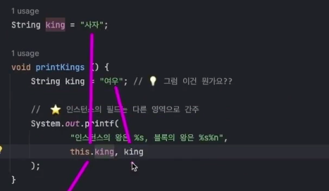
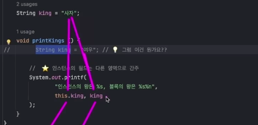
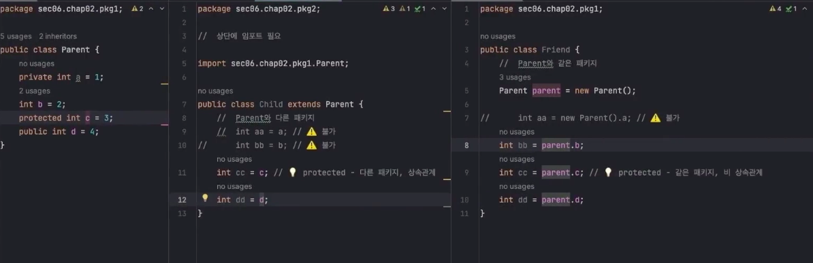
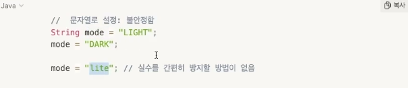
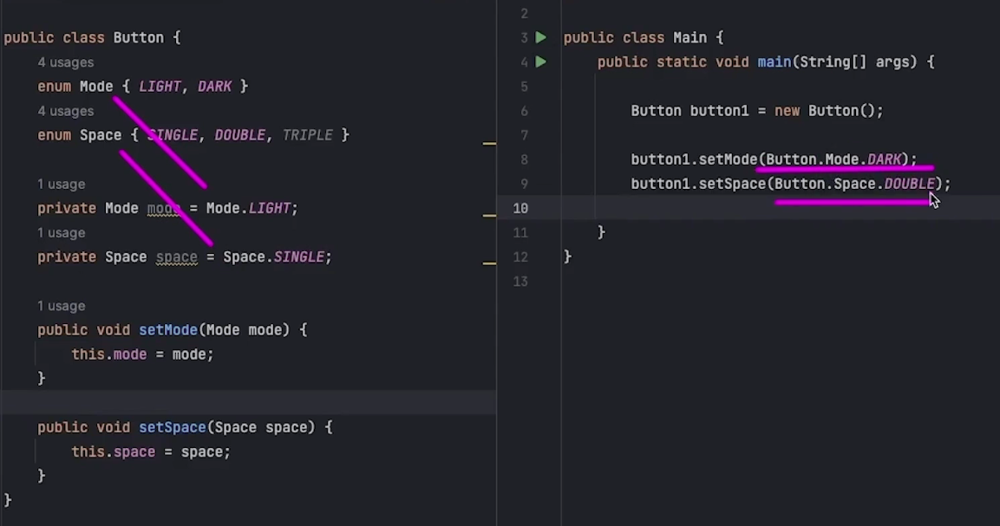
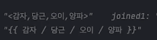
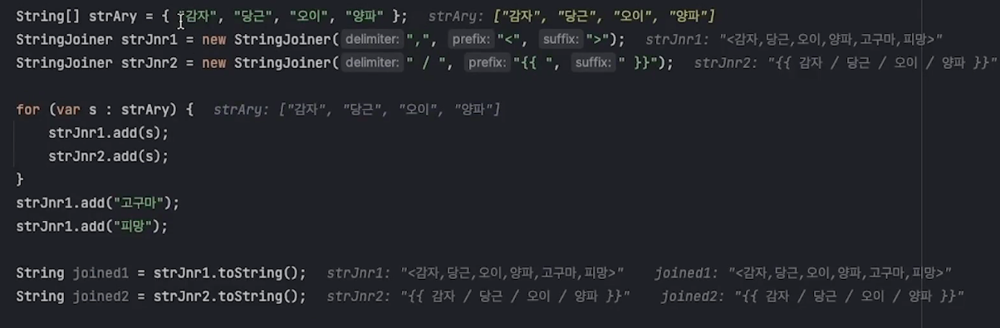
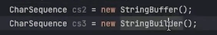
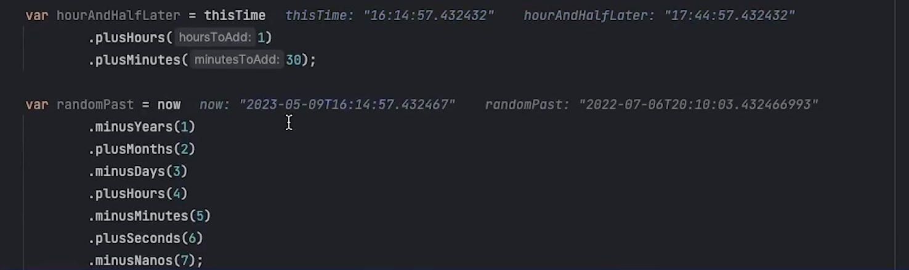

# 자바의 Class (2)


## 자바의 Class (2)

<br />

{: .highlight } 
> - 자바의 스코프에 대해서

- 
- 


<br />
<br />
<br />


---

## 패키지



{: .highlight } 
> - 패키지에 대해 (폴더 하나 하나를 뜻한다.)
> - 클래스명의 중복을 피하기 위해 사용
>   - `private` : 자식클래스에서 상속은 받지만 코드 사용은 불가 (같은 클래스에서만 사용)
>   - `default` : 자식이나 같은 패키지의 다른 클래스도 접근 가능 (`다른 패키지에서는 사용 불가능`)
>   - `protexted` : 자식이나 같은 패키지의 다른 클래스도 접근 가능
>   - `public` : 자식이나 같은 패키지의 다른 클래스도 접근 가능

<br />


{: .note } 
> - Parent Class

```java
public class Parent {
    private int a = 1;
    // 다른 패키지에서 import하더라도 사용 불가능
    int b = 2;
    protected int c = 3;
    public int d = 4;
}
```

{: .note } 
> - (같은 패키지)상속 받은 자식 Class
> - 상속을 받은게 아니기 때문에 인스턴스를 생성해서 사용해야함

```java
public class Child extends Parent {
    // * private변수는 사용 불가능 *
    // * 다른 변수는 바로 사용 가능 *
    int bb = b;
    int cc = c; // 💡 protected - 같은 패키지, 상속관계
    int dd = d;
}
```

{: .note } 
> - (같은 패키지 다른 클래스) Friend Class

```java
public class Friend {
    // 같은 패키지
    // 인스턴스 생성 후 사용
    Parent parent = new Parent();

    int bb = parent.b;
    int cc = parent.c;
    int dd = parent.d;
}
```


<br />
<br />
<br />

---


## 내부 클래스


{: .highlight } 
> - 멤버 인스턴스
> - 정적 내부 클래스
> - 메소드 안에 정의된 클래스
> - 익명 클래스

<br />
<br />

## 내부 클래스 중 멤버 인스턴스 클래스 (1)


{: .highlight } 
> - 외부 필드 , 클래스 접근 가능

```java
public class Outer {
    private String inst = "인스턴스";
    private static String sttc = "클래스";

    //  💡 1. 멤버 인스턴스 클래스
    class InnerInstMember {
        //  ⭐️ 외부 클래스의 필드와 클래스 접근 가능
        private String name = inst + " 필드로서의 클래스";
        private InnerSttcMember innerSttcMember = new InnerSttcMember();

        public void func () {
            System.out.println(name);
        }
    }

    //  💡 2. 정적(클래스) 내부 클래스
    //  ⭐️  내부 클래스에도 접근자 사용 가능. private으로 바꿔 볼 것
    public static class InnerSttcMember {

    }
}
```

<br />
<br />

## 내부 클래스 중 정적 내부 클래스 (2)


{: .highlight } 
> - 외부 클래스 필드만 접근 가능
> - static이 붙은 것만 접근 가능

```java
public class Outer {
    private String inst = "인스턴스";
    private static String sttc = "클래스";

    // 1. 멤버 인스턴스 클래스
    class InnerInstMember {
    }

    //  💡 2. 정적(클래스) 내부 클래스
    //  ⭐️  내부 클래스에도 접근자 사용 가능. private으로 바꿔 볼 것
    public static class InnerSttcMember {

    }
}
```

<br />
<br />

--- 

## 익명 클래스 

{: .highlight } 
> - 한번만 사용되고 버려질 클래스

<br />

> 부모 클래스 TalcoGroup.Class

```java
public abstract class TalcoGroup {
    protected static final String Creed = "hi"
    protected final int no;
    protected final int name;

    // 생성자
    public TalcoGroup(int no, String name){
        this.no = no;
        this.name = name;
    }
    //구체화할 클래스에서 함수 정의 (implement)
    public abstract void takeOrder ();
}
```

> 익명 클래스 Main.Class TalcoGroup와 같은 타입

```java
public class Main {
    public static void main(String[] args){
        TalcoGroup store1 = new TalcoGroup(1,"울산")
        // 익명 클래스
        TalcoGroup store33 = new TalcoGroup (2,"포항"){
            // abstract 함수 재 정의
            @override 
            public void takeOver(){
                ...
            }
        }

        //부모의 함수 사용 가능
        store33.intro()
    }
}
```

<br />
<br />
<br />

## 익명 클래스의 다른 예시 (2)

{: .highlight } 
> - 인터페이스는 자격증 같은 거
>   - 추상 클래스나 인터페이스는 둘다 override 사용 가능

<br />


> 인터페이스

```java
// 인터페이스 자격증 같은거 다시 재정의도 가능
public interface OnClickListener {
    void onClick ();
}
```

> class

```java
public class Button {
    String name;
    // 생성자
    public Button(String name) {
        this.name = name;
    }

	// !! 인터페이스를 상속한 클래스 자료형 / onClick함수를 가지고 있음
    private OnClickListener onClickListener;

    //onClickListener를 넣어서 onClick 함수 사용 가능
    public void setOnClickListener(OnClickListener onClickListener) {
        this.onClickListener = onClickListener;
    }

    public void func () {
        onClickListener.onClick();
    }
}
```

> 익명 클래스 사용 Main.java

```java
Button button1 = new Button("Enter");

//  ⭐️ IDE에서 회색으로 표시 : 이후 배울 람다로 대체
// 익명 클래스로 안에 함수를 오버라이드한 인스턴스 생성
button1.setOnClickListener(new OnClickListener() {
        @Override
        public void onClick() {
        System.out.println("줄바꿈");
        System.out.println("커서를 다음 줄에 위치");
    }
});

```

<br />
<br />
<br />

--- 

## 메인 메서드

{: .highlight } 
> - 메인메스드에 대해서
> - `public` : 어디서든 읽을 수 있다.
> - `static` : 인스턴스를 생성하지 않는 클래스 메서드
> - `void` : 반환값이 없음
> - `main` : 자바 코드가 실행되는 시작점

<br />

```java
public class Ex01 {
    // args : 자바 컴파일 시 문자를 넣어준 값이 들어감
    public static void main (string[] args){
        ...
    }
}
```


<br />
<br />
<br />

--- 

## 열거형 (enum) (1)



{: .highlight } 
> - 문자열로 설정하면 불안정 하다 (위 사진 참고)
>   - 이를 방지하기 위해 `enum`을 사용한다.
> - `enum`은 자료형 처럼 사용된다.
> - 엉뚱한 값이 안들어갈 수 있도록 해줌

<br />

{: .note } 
> - enum : 자료형 처럼 사용 가능 
> - ButtonMode.enum

```java
public enum ButtonMode {
    LIGHT, DARK
}
```

{: .note } 
> - Button.Class

```java
public class Button {
    // enum값을 가져와서 자료형 처럼 사용 가능
    private ButtonMode buttonMode = ButtonMode.LIGHT;
    private ButtonSpace buttonSpace = ButtonSpace.SINGLE;

    public void setButtonMode(ButtonMode buttonMode) {
        this.buttonMode = buttonMode;
    }
}


```

{: .note } 
> - Main.Class

```java
Button button1 = new Button();

button1.setMode(Button.Mode.DARK);
```

<br />
<br />
<br />

--- 

## 열거형 (enum) (2)



{: .highlight }
> - 열거형의 다른 사용 예시
> - 클래스안에 `enum`를 바로 명시 할 수도 있다.

<br />

{: .note } 
> - Button.class

```java
public class Button {
    //enum 바로 선언
    enum Mode { LIGHT, DARK }
    //space 바로 선언
    enum Space { SINGLE, DOUBLE, TRIPLE }

    private Mode mode = Mode.LIGHT;
    private Space space = Space.SINGLE;
    
    Button button1 = new Button();
}
```

{: .note } 
> - Main.class
> - 인스턴스 생성 후 enum 넣어주기

```java
	Button button1 = new Button();

    button1.setMode(Button.Mode.DARK);
```

<br />
<br />
<br />

---

## 레코드 16 버전 이상

{: .highlight }
> - json 같은거
> - Java 16버전 이상만 적용
> - class 자료형을 만들때 값이 변하지 않게 하고 , getter를 적용한 거
>   - `다른 클래스 상속불가`
>   - `getter가 기본적으로 만들어짐`
>   - `인스턴스 필드를 가질 수 없음`
>       - `매장만의 필드는 가질 수 없다.`
>       - 

<br />

> 원래 class문법

```java
//  기존처럼 클래스로 작성해야 했다면...
public class ChildClass {
    private final String name;
    private final int birthYear;
    private final Gender gender;

    public ChildClass(String name, int birthYear, Gender gender) {
        this.name = name;
        this.birthYear = birthYear;
        this.gender = gender;
    }

    public String getName() { return name; }
    public int getBirthYear() { return birthYear; }
    public Gender getGender() { return gender; }
}
```

> 레코드로 작성된 코드

```java
// ⭐️  레코드로 작성
public record Child(
        String name,
        int birthYear,
        Gender gender
) {}
```

> 레코드 사용 (Main.class)

```java
var children = new Child[] {
    new Child("김순이", 2021, Gender.FEMALE),
    new Child("이돌이", 2019, Gender.MALE),
};

for (var child : children) {
    System.out.printf(
        child.birthYear(),
        child.name()
    );
}
```


<br />
<br />
<br />

---

## record (2) 다른 예시

{: .highlight }
> - record의 다른 예시

<br />
<br />

> 인터페이스 정의 (자격증 같은거) `InfoPrinter 인터페이스`

```java
public interface InfoPrinter {
    void printInfo ();
}
```

> 다른 클래스 `Button 클래스`

```java
// 버튼 클래스
public class Button {

    //  ⭐️ 다른 클래스에 내부로 포함 가능
    //  인터페이스 구현 가능 (클래스 상속은 불가)
    public record ClickInfo(int x, int y) implements InfoPrinter {
 
        //  💡 클래스 필드를 가질 수 있음 (인스턴스 필드는 불가)
        static String desc = "버튼 클릭 정보";

        //  💡 인스턴스/클래스 메소드를 가질 수 있음
        @Override
        public void printInfo() {
            System.out.printf(
                    "(%d, %d)%n",
                     x, y
            );
        }
    }
    //recode 인스턴스 생성
    public ClickInfo func (int x, int y, ClickedBy clickedBy) {
        System.out.println("버튼 동작");
        return new ClickInfo(x, y);
    }
}
```

> Main.java

```java
// 인스턴스 생성
Button button = new Button();

//ClickInfo record타입 
Button.ClickInfo click1 = button.func(123, 456);
Button.ClickInfo click2 = button.func(492, 97);
```

<br />
<br />
<br />

---

# 다른 유용한 메서드들

## StringJoiner (1)

{: .highlight }
> - `StringBuffer`
>   - `첫번째 인자로 끈어주고`
>   - `두번째 인자를 맨앞에`
>   - `세번째 인자를 맨뒤에`

<br />




```java
StringJoiner strJnr1 = new StringJoiner(",", "<", ">");
StringJoiner strJnr2 = new StringJoiner(" / ", "{{ ", " }}");

for (var s : strAry) {
    strJnr1.add(s);
    strJnr2.add(s);
}

String joined1 = strJnr1.toString();
String joined2 = strJnr2.toString();
```

<br />
<br />

## StringBuffer / StringBuffer (2)



{: .highlight }
> - 문자열을 여러 차례 이어 붙일 때 사용
> - 문자 수정 관련 다양한 메소드를 가짐
>   - 효율적이고 성능상 유리
> - 단일 쓰레도 (`StringBuilder`) / 멀티 쓰레드 (StringBuffer)

<br />

```java
var strBldr1 = new StringBuffer("한놈");
strBldr1.append("두시기");

//  append 메소드는 해당 클래스의 인스턴스 반환
//  메소드 체이닝 가능
strBldr1
        .append("석삼")
        .append("너구리")
        .append("다섯놈");

var strBldr1Out = strBldr1.toString();
// strBldr1Out : 한놈두시기석삼너구리다섯놈
```


<br />
<br />

---

## 날짜와 관련된 라이브러리

{: .highlight }
> - 자바 8 부터는 java.time 패키지 클래스들 사용

<br />


{: .new }
> - 현재 날짜 / 시간 ...

```java
//  💡 현재 날짜 ex) 2023-05-09
LocalDate today = LocalDate.now();

//  💡 현재 시간 ex) 16:05:23.428527
LocalTime thisTime = LocalTime.now();

//  💡 현재 시간과 날짜 ex)2023.05.91T16.420577
LocalDateTime now = LocalDateTime.now();
```

<br />

{: .new }
> - 현재시간 , 날짜에 시간, 날짜 더하기 (메서드 체이닝 사용 가능)



<br />

{: .new }
> - 현재 컴퓨터에 적용된 시간 구하기

```java
//ZonedDateTime : 시간대 정보를 추가로 가짐
//이 컴퓨터가 어느 시간대의 시간을 따르는가
ZonedDateTime nowHere = ZonedDateTime.now();

//현재 시간대 구하기
var hereZone = nowHere.getZone().toString();

//특정 지역의 시간대
var newYorkNewYear = ZonedDateTime.of(
        2023, 1, 1,
        0, 0, 0, 0,
        ZoneId.of("America/New_York")
)
```

<br />
<br />

{: .new }
> - 원하는 형식으로 포맷팅 하기

```java
		//  ⭐️ 시간 표기형식 지정하기
        //  - DateTimeFormatter 클래스의 ofPattern 메소드 사용
        DateTimeFormatter formatter1 =
                DateTimeFormatter.ofPattern("yyyy-MM-dd");

        DateTimeFormatter formatter2 =
                DateTimeFormatter.ofPattern("yyyy/MM/dd HH:mm:ss");

        DateTimeFormatter formatter3 =
                DateTimeFormatter.ofPattern("yy.MM.dd");

        DateTimeFormatter formatter4 =
                DateTimeFormatter.ofPattern("dd/MM/yyyy hh a");

        DateTimeFormatter formatter5 =
                DateTimeFormatter.ofPattern("yyyy년 MM월 dd일 HH시");

        //  DateTimeFormatter 클래스의 코드에서 각 형식 요소 확인

        for (var formatter : new DateTimeFormatter [] {
                formatter1,
                formatter2,
                formatter3,
                formatter4,
                formatter5,
        }) {
            //  💡 형식에 따라 시간을 문자열로
            System.out.println(now.format(formatter));
        }
```

<br />
<br />

{: .new }
> - 문자열에서 시간 인스턴스로 변형하기

```java
//변형 전 (1)
var christmas25str = "2025-12-25";
DateTimeFormatter formatterA = DateTimeFormatter.ofPattern("yyyy-MM-dd");
// 변형완료
var christmas25 = LocalDate.parse(christmas25str, formatterA);

//변형 전 (2)
var christmas25dinnerStr = "2025/12/25 18:00:00";
DateTimeFormatter formatterB = DateTimeFormatter.ofPattern("yyyy/MM/dd HH:mm:ss");
//변형완료
var christmas25dinner = LocalDateTime.parse(christmas25dinnerSt,formatterB);
```


<br />
<br />
<br />

--- 

## 시간 차이를 구하는 두가지 방법

{: .new }
> - `Period`
> - `Duration`

<br />

```java
        //  💡 Period 클래스 : 두 날짜 사이의 간격을 다루는 클래스
        var childrensDay30 = LocalDate.of(2030, 5, 5);
        Period toChldDay30 = Period.between(today, childrensDay30);
        int[] toChldDay30inUnits = {
                toChldDay30.getYears(),
                toChldDay30.getMonths(),
                toChldDay30.getDays()
        }; // 연, 월, 일 부분 각각 표시


        //  💡 Period 클래스 : 두 날짜 사이의 간격을 다루는 클래스
        var childrensDay30 = LocalDate.of(2030, 5, 5);
        Period toChldDay30 = Period.between(today, childrensDay30);
        int[] toChldDay30inUnits = {
                toChldDay30.getYears(),
                toChldDay30.getMonths(),
                toChldDay30.getDays()
        }; // 연, 월, 일 부분 각각 표시
```