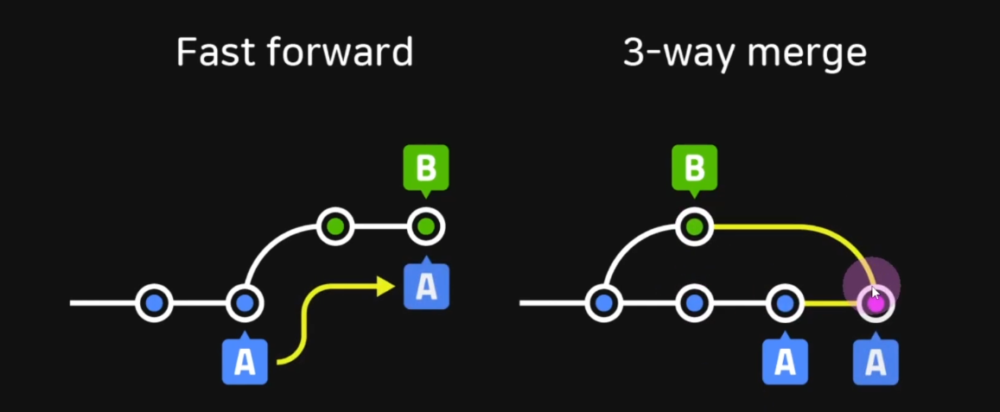
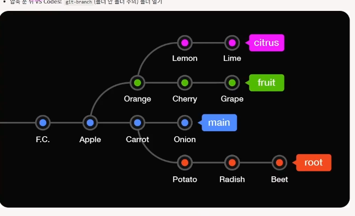
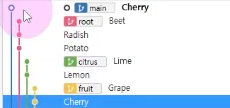
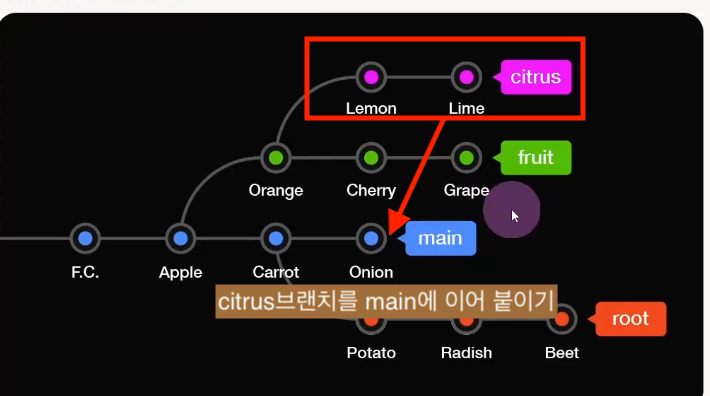
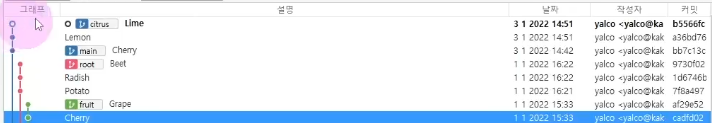
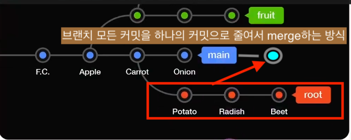
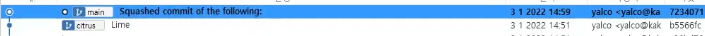

# Fastforward vs 3 way merge🎯💡🔥📌✅



{: .highlight } 
> - git이 merge를 하는 두가지 전략
> - A branch / B branch가 각각 존재 할 때
>   - `Fastforward` : A,B 브랜치가 있을때 두개가 A의 동콩 커밋 조상을 가질때 사용
>       - A브랜치를 B위치로 이동
>   - `3 way merge` : 일반적인 merge와 같다.


<br />

```bash
# Fastforward 방식으로 merge하기
git merge --no-ff 병합할 브랜치

# 3 way merge은 merge의 기본값이다.
git merge 병합할 브랜치
```


<br />
<br />
<br /> 

---

## 다른 브랜치에서 원하는 커밋만 가져오기 (cherry-pick)

- 
- 

{: .highlight } 
> `cherry-pick`
> - 특정 브랜치의 커밋만 복제해서 가져오는 명령어

<br />


```bash
# 특정 브랜치의 커밋만 복제해서 가져오기
git cherry-pick 11992cs15
```


<br />
<br />
<br /> 

---

# 다른 브랜치의 내용을 main브랜치에 이어 붙이기

- 
- 

{: .highlight } 
> - 다른 브랜치의 내용을 main브랜치에 이어 붙이기
>   - 갯수가 많지 않으면 하나씩 `cherry-pick`하는 방법도 있다.
> - 다른 브랜치에서 파생된 브랜치 옮겨붙이기
>   - `git rebase --onto (도착브랜치) (출발브랜치) (이동할 브랜치)`
>   - `git rebase --ontn`옵션 사용

<br />


```bash
# 다른 브랜치에서 파생된 브랜치 옮겨붙이기
git rebase --onto main fruit citrus

# 붙인 이후 main에 merge하기
git switch main
git merge citrus
```

<br />
<br />
<br /> 

---

# rebase merge 하기


{: .highlight } 
> - 하나씩 main 브랜치에 이어 붙이는 것

<br />

```bash
# rebase 사용
git rebase issue1

##병합된 branch는 삭제 한다.
git branch -d issue1
```


<br />
<br />
<br />

---

## merge 충돌 시 머지 이전 단계로 돌아가기

{: .highlight } 
> - `merge 충돌 해결` (모든 파일충돌을 해결 하고 커밋하는 방식이기 때문에 하나의 커밋으로 충돌 해결이 가능하다.)

```bash
# merge 시 너무 많은 충돌이 발생했을때 머지 취소하고 머지 실행 바로 직전으로 돌아가기
git merge --abort

# 충돌 해결 후 실행할 명령어
git add .
git commit -m "resolve conflict"
```

<br />
<br />
<br />

---

## rebase 충돌 시 충돌 해결하기

{: .highlight } 
> - `rebase 충돌 해결` (merge할 커밋들을 main branch에 하나씩 이어 붙이는 방식이기 때문에 충돌 나는 모든 커밋을 해결해야한다.)


```bash
# rebase 명령어 실행
git rebase main

# rebase 취소
git rebase --abort

## 충돌 해결 후  (다 rebase 될 때까지 반복 **)
git add .
git rebase --continue

# 마지막 merge
git merge main
```

<br />
<br />
<br />

---

## rebase vs no-rebase

{: .highlight } 
> - `pull`할 것이 있을 때 push를 할 때 사용할 수 있는 명령어 
>   - `git pull --no-rebase` : merge 방식
>   - `git pull --rebase` : rebase 방식 
>   - `pull받아올 때는 주로 rebase를 사용함`
<br />

> `git pull --no-rebase` (로컬과 원격의 분기를 하나로 merge하는 것)


> `git pull --rebase` (내 커밋을 원격의 main branch뒤에 이어서 붙여줌)


<br />
<br />
<br />

---

## squash 머지

- 
- 


{: .highlight } 
> - 브랜치 의 마디를 하나로 묶어 하나의 커밋으로 만든 후 main 브랜치에 병합
>   - `squash`머지
>   - `git merge --squash (대상 브랜치)`


<br />

```bash
# squash 머지 진행
# git add . 까지만 진행된 상태 (staging 상태)
git merge --squash root

# 커밋 컨벤션 
git commit -m "merge squash"
git push origin main
```


<br />
<br />
<br />

---

## git flow

| head1        | head two          | 
|:-------------|:------------------|
|   main | 출시/배포 | 
| develop |  출시/배포를 위한 개발 진행  |
| release |  출시/배포 전 테스트 진행  |
| feature | 기능 개발  |
| hotfix |  긴급한 버그 수정  |

{: .highlight } 
> - 협업을 위한 브랜치 전략

<br />

