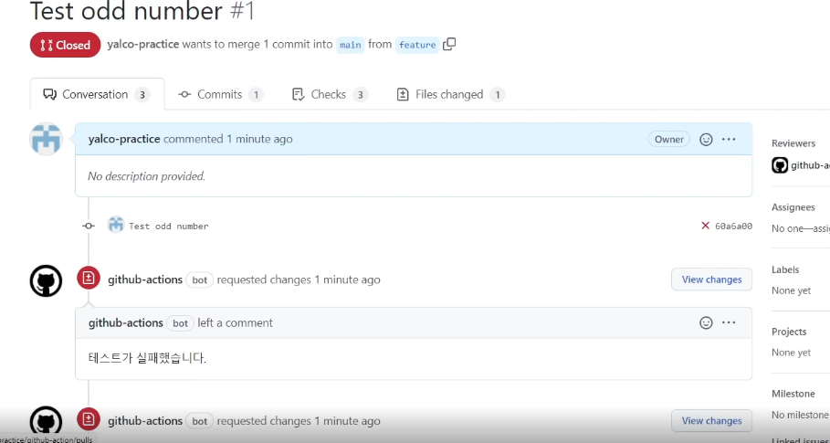

# Git action

## Git action 예제 (1)

> github에서 빌린 컴퓨터에서 `pwd`, `ls -al` 명령어를 실행하는 예제

> CI - CD

```yml
## ex) hellow
name: [action 이름]

## ex) push , [push , pull_request]
on: [event 이름]

##
jobs:
  build:
    ## ex) runs-on: ubuntu-latest , window , mac
    runs-on: [사용할 컴퓨터]
    # 실제로 행해지는 일은 step에 있다.
    steps:
      ## 스탭의 이름 : Runpwd
      - name: [스탭이름]
        run: pwd
      ## 스탭의 이름  : Run ls -al
      - name: [스탭이름]
        run: ls -al
```

- 

> 위 코드 github action에서 제공하는 컴퓨터에서 `pwd` , `ls -al` 명령어 실행

<br />
<br />

## Git acton 예제 (2)

> uses: ㅁㅁㅁ --> 다른 사람이 미리 만들어둔 `git action jobs`

> uses: actios/checkout@2 --> push 한 `코드를 github에서 빌려준 컴퓨터에 clone` 해주는 라이브러리 action

```yml
## ex) hellow
name: [action 이름]

## ex) push , [push , pull_request]
on: [event 이름]

##
jobs:
  build:
    ## ex) runs-on: ubuntu-latest , window , mac
    runs-on: [사용할 컴퓨터]
    # 실제로 행해지는 일은 step에 있다.
    steps:
      ## 다른 사람이 미리 만들어둔 git action
      - uses: actions/checkout@2
      ## 스탭의 이름 : Runpwd
      - name: [스탭이름]
        run: pwd
      ## 스탭의 이름  : Run ls -al
      - name: [스탭이름]
        run: ls -al
```

- 

> github에서 빌려준 컴퓨터 내에서 어디 폴더에 clone하고 잘 clone 됐는지 확인 가능

<br />
<br />

## Git acton / 환경변수 사용 예제 (3)

> ${{github.actor}} , ${{github.sha}} --> `github에서 미리 지정한 환경변수` , context

> ${{github.sha}} ==> commit id를 뜻하고 `github가 지정한 변수`

> runner를 구동할 때 필요할 만한 정보들을 ${{github.actor}} 이런형식으로 제공한다.

```yml
name: [action 이름]

on: [event 이름]

jobs:
  build:
    runs-on: [사용할 컴퓨터]
    # 실제로 행해지는 일은 step에 있다.
    steps:
      ## 스탭의 이름 : context
      - name: "context"
        ## env --> 환경변수를 주입할 때 사용한다.
        ## 변수에 환경변수를 주입힌다.
        env:
          변수: ${{github.sha}}
        # push한 commit 메세지 출력
        # 위 변수와 아래 변수 같음
        run: echo "Commit id $변수"
```

<br />
<br />

## Git acton / 환경변수 사용 예제 (4)

> github가 미리 지정한 환경 변수 모두 출력

```yml
name: Context testing
on: push

jobs:
  dump_contexts_to_log:
    runs-on: ubuntu-latest
    steps:
      - name: Dump GitHub context
        env:
          GITHUB_CONTEXT: ${{ toJson(github) }}
        run: echo "$GITHUB_CONTEXT"
      - name: Dump job context
        env:
          JOB_CONTEXT: ${{ toJson(job) }}
        run: echo "$JOB_CONTEXT"
      - name: Dump steps context
        env:
          STEPS_CONTEXT: ${{ toJson(steps) }}
        run: echo "$STEPS_CONTEXT"
      - name: Dump runner context
        env:
          RUNNER_CONTEXT: ${{ toJson(runner) }}
        run: echo "$RUNNER_CONTEXT"
      - name: Dump strategy context
        env:
          STRATEGY_CONTEXT: ${{ toJson(strategy) }}
        run: echo "$STRATEGY_CONTEXT"
      - name: Dump matrix context
        env:
          MATRIX_CONTEXT: ${{ toJson(matrix) }}
        run: echo "$MATRIX_CONTEXT"
```

<br />

## Git acton secret 생성(5)

- 

> git Secret 사용법

> `${{secret.추가한 시크릿 명}}`

```yml
name: CI

on: push

jobs:
  build:
    runs-on: ubuntu-latest

    step:
      - name: [스탭이름]
        env:
          # git secret에 저장한 값 변수에 삽입
          변수: ${{secrets.PASSWORD}}
          run echo <y password is $변수
```


<br />
<br />
<br />

---

# git action 예제(5)




{: .note } 
> - 테스트 진행하는 예제
>   - 테스트를 진행했을때 에러가 있으면 자동으로pr를 닫아주는 예제

<br />

```yml
# 테스트 진행하는 예제

name: Node.js CI

on:
  pull_request:
    branches: [ main ]

jobs:
  build:

    runs-on: ubuntu-latest

    strategy:
      matrix:
      ## 12 , 14 , 16 버전에서 테스트 실행
        node-version: [12.x, 14.x, 16.x]

    steps:
    # 사용하는 패키지
    - uses: actions/checkout@v2
    # 사용자가 직접 붙인 이름 (1)
    - name: Execute text
      run: npm test
    # 사용자가 직접 붙인 이름 (2)
    # 아래코드는  pr를 보냈을때 test가 실패하면 pr을 자동으로 close해주는 예제이다.
    - name: if fail
      uses: actions/github-script@0.2.0a
      with:
        github-token: ${{github.token}}
        script: |
          const ref = "${{github.ref}}"
          const pull_number = Number(ref.split("/")[2])
          await github.pulls.createReview({
            ...context.repo,
            pull_number,
            body:"테스트가 실패했습니다.",
            event: "REQUEST_CHANGES"
          })
          await github.pulls.update({
            ...context.repo,
            pull_number,
            state: "closed"
          })
      if: failure()                 
    

```