# git 기본🎯💡🔥📌✅

<br />

## git 버전 관리 하기

{: .highlight } 
> - branch 변경

```bash
$ git switch master
```

<br />
<br />

{: .highlight } 
> - 병합하기
>   - 현재 branch에 master branch병합

```bash
$ git merge master
```

<br />
<br />

{: .highlight } 
> - 충돌 메세지 이해하기

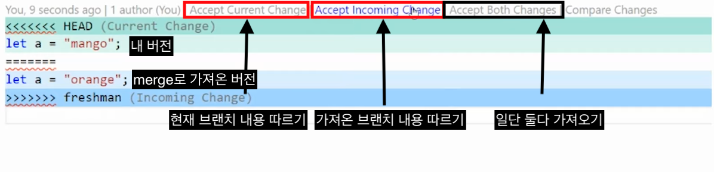

```bash
# 이후에 commit 까지 해야 충돌이 해결된 것
# 커밋까지 해야 해결된 것
$ git add .
$ git commit -m "merge conflict resolve"

## 여기서 해결된 것은 다른 branch들에서 pull받으면 그냥 승복함
```


<br />
<br />

{: .highlight } 
> - 로컬 저장소에서 branch를 만들고 원격 저장소에 올리는 방법

```bash
# 로컬 저장소에 브랜치 생성
$ git checkout -b jjehyun
# 원격 저장소에 브랜치 푸쉬
$ git push --set-upstream origin jjehyun
```


<br />
<br />

{: .highlight } 
> - github > Projects > Board
> - 프로젝트 상황을 보여줌


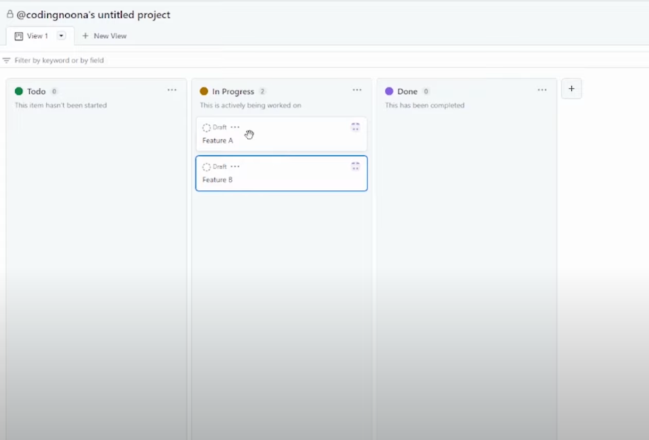


<br />
<br />

{: .highlight } 
> - github > issues 
> - 이슈를 생성 후 생성한 이슈에서 branch를 생성할 수 있다.
> - 오른쪽 Development > `Create a branch`를 클릭한다.

- 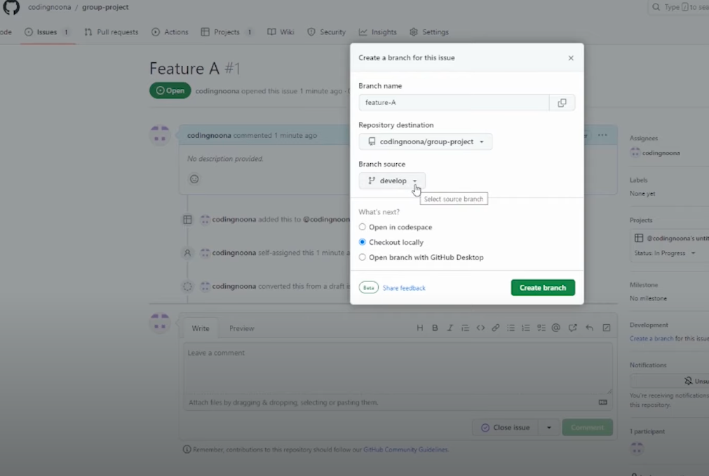
- 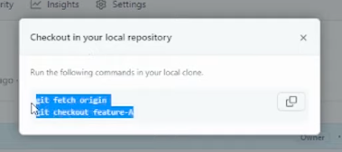

```bash
$ git fetch origin
$ git checkout feature-A
```

<br />
<br />

{: .highlight } 
> - pull-request 생성하기
> - 코드 리뷰 반영하기
> - github > Pull request > `Create pull request`

- 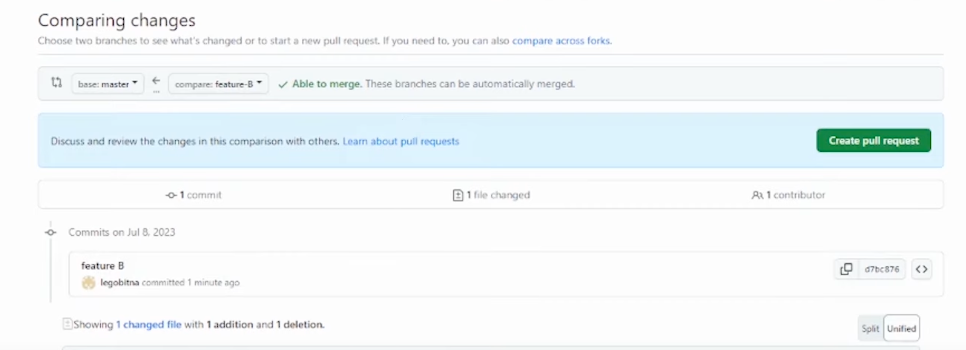
- 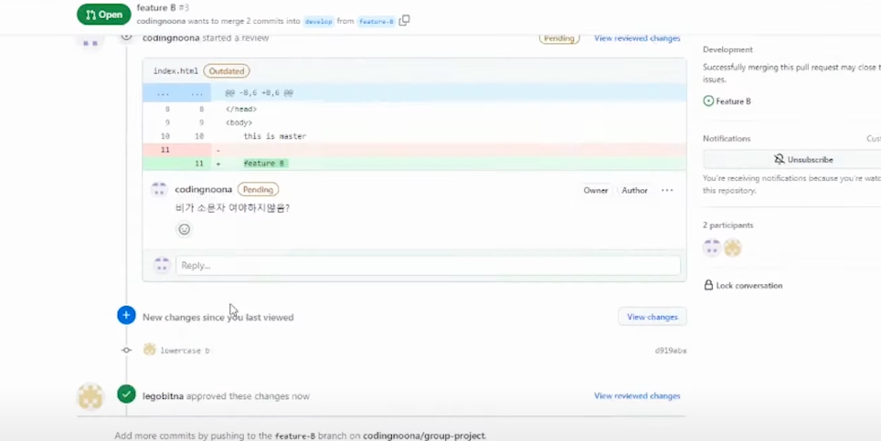

```bash
# 코드 리뷰 반영 하는 방법
# pr 보낸 상태에서 코드 리뷰받고 다시 pr를 수정하는 방법
# 그냥 pr 보낸 branch의 소스 코드를 원격 저장소에 다시 올리면 됨

$ git add .
$ git commit -m "코드 리뷰 반영"
$ git push origin jjehyun
```

<br />
<br />

{: .highlight } 
> - pr 충돌 해결하기
>   - 일단 로컬 저장소에서 merge작업을 진행해야함

- 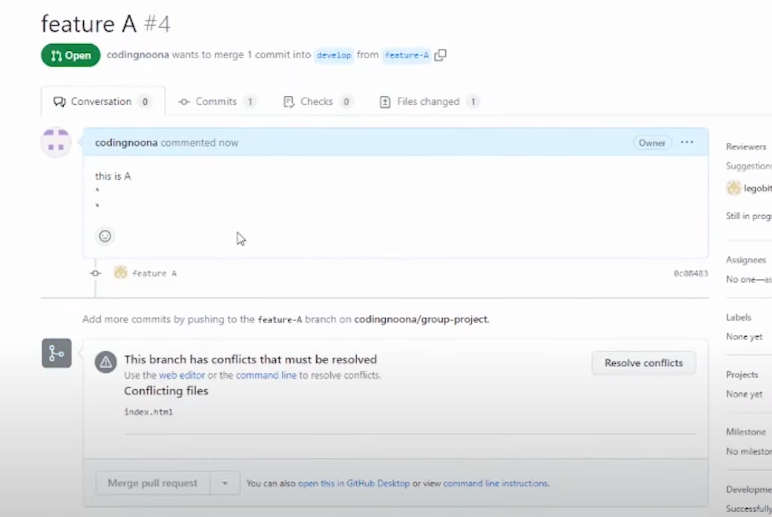
- 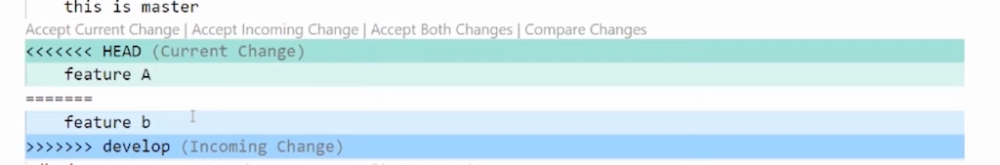
- 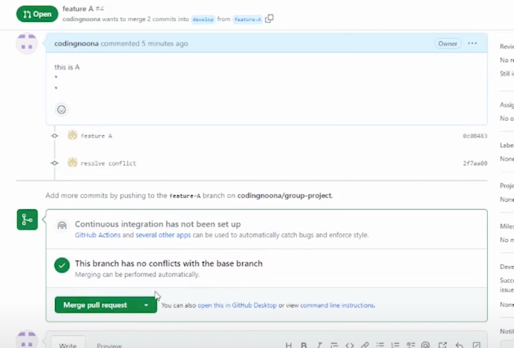

<br />

```bash
$ git checkout develop
# develop브랜치 내용을 가져옴
$ git pull origin develop
# 이전 branch로 돌아감
$ git checkout -
## 문제가 생기지 않게 로컬에서 merge작업을 진행
$ git merge develop 

## 어떤 코드가 맞는 지 팀원 상의 후에 선택하기!
# 충돌을 해결하고 원격 저장소에 올리기
$ git add .
$ git commit -m "resolve conflict"
$ git push
```

<br />
<br />

{: .highlight } 
> - 과거로 돌아가기 reset vs revert
> - `reset` : 과거로 돌아갈 해쉬 입력
> - `revert` : 취소할 커밋을 선택! 커밋을 반대로 실행하는 명령어
>   - revert 커밋메세지1 : `커밋메세지1의 변동 사항을 모두 취소하고 커밋을 하나 추가한다.`

<br />

```bash
# 과거로 돌아가기 원격저장소에서 작업 중일때 원격저장소에 올린거는 reset하면 안됨
git reset --hard 0bf487

# revert 커밋 중 취소할 하나의 커밋을 선택
git revert 0fe425

# revert 후에 자동 커밋 안되게 하기
git revert --no-commit 354ef2
```

<br />

{: .note } 
> - `revert` : 이해하기

- 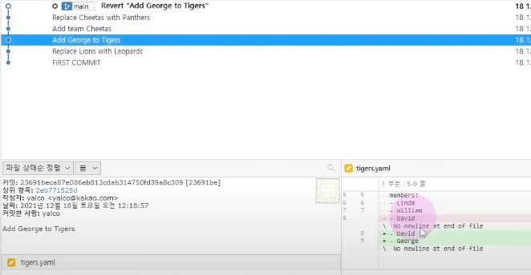
- 


<br />
<br />

{: .highlight } 
> - 브랜치 이동하기
> - 브랜치 관련 명령어

```bash
# branch 이동
git switch production

# branch 생성과 함께 이동하기
git switch -c production
```

<br />
<br />

{: .highlight } 
> - branch 병합하기 
> - `rebase` : main branch에 변경 사항을 하나하나 이어 붙인 것 (`rebase후 merge를 해야함`)
>   - `merge할때는 사용XXXX, pull 받을 때 주로 사용함`
>   - 히스토리를 깜끔하게 만드는 것이 중요하다면 `Rebase`
>   - `이미 팀원들간 공유된 커밋들에 대해서는 사용XX`
> - `merge` : 두개의 브랜치를 합치는 것
>   - 브랜치의 사용 내역을 남겨둘 필요가 있다면 `merge`

<br />


{: .important-title }
> - `merge` : 브랜치 두개를 합친 것


{: .important-title }
> - `rebase` : main에 병합할걸 이어 붙인것

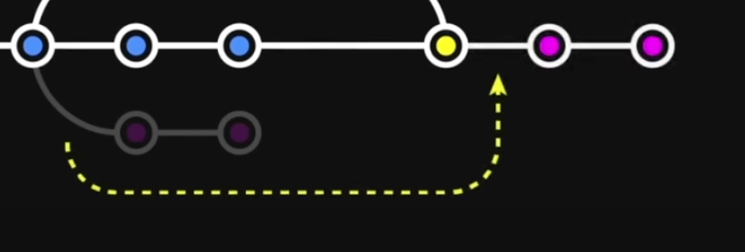

```bash
# merge 사용법
git merge main

# rebase 사용
git rebase main

##병합된 branch는 삭제 한다.
git branch -d add-coach
```

<br />
<br />
<br />

{: .highlight } 
> - `merge 충돌 해결` (모든 파일충돌을 해결 하고 커밋하는 방식이기 때문에 하나의 커밋으로 충돌 해결이 가능하다.)

```bash
# merge 시 너무 많은 충돌이 발생했을때 머지 취소하고 머지 실행 바로 직전으로 돌아가기
git merge --abort

# 충돌 해결 후 실행할 명령어
git add .
git commit -m "resolve conflict"
```

<br />
<br />
<br />

{: .highlight } 
> - `rebase 충돌 해결` (merge할 커밋들을 main branch에 하나씩 이어 붙이는 방식이기 때문에 충돌 나는 모든 커밋을 해결해야한다.)


```bash
# rebase 명령어 실행
git rebase main

# rebase 취소
git rebase --abort

## 충돌 해결 후  (다 rebase 될 때까지 반복 **)
git add .
git rebase --continue

# 마지막 merge
git merge main
```

<br />
<br />
<br />

{: .highlight } 
> - `pull`할 것이 있을 때 push를 할 때 사용할 수 있는 명령어 
>   - `git pull --no-rebase` : merge 방식
>   - `git pull --rebase` : rebase 방식 
>   - `pull받아올 때는 주로 rebase를 사용함`
<br />

> `git pull --no-rebase` (로컬과 원격의 분기를 하나로 merge하는 것)

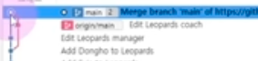

> `git pull --rebase` (내 커밋을 원격의 main branch뒤에 이어서 붙여줌)


<br />
<br />
<br />

{: .highlight } 
> - 원격 branch 다루기

```bash
# 원격 저장소에 jjehyun branch 생성
git swich jjehyun
git push -u origin jjehyun


# 원격 저장소, 로컬 저장소 모든 git branch 목록 확인하기
git branch -a

# git fetch를 통해 원격 저장소와 로컬 저장소 동기화 하기
git fetch
```


<br />
<br />
<br />

{: .highlight } 
> - 새로 생긴 원격의 다른 브랜치(jjehyun) pull받기

```bash
# git fetch를 통해 원격 저장소와 로컬 저장소 동기화 하기
git fetch

# 아래 명령어로 로컬에 같은 이름의 브랜치를 생성하고 연결해서 swich
# 이후에도 로컬의 jjehyun branch와 원격의 jjehyun 브랜치를 연결하겠다.
git switch -t origin/jjehyun

## 원격의 브랜치 삭제하기
git push origin --delete jjehyun
```


<br />
<br />
<br />

---

# 깃의 3가지 공간

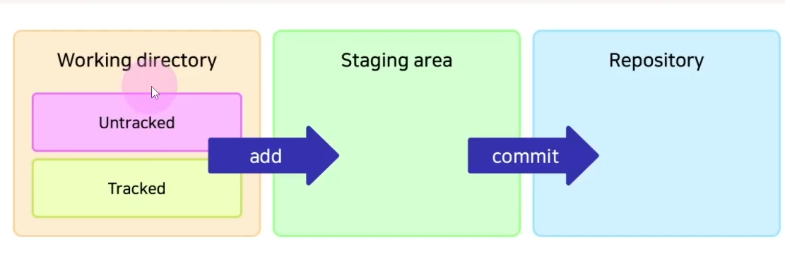

{: .highlight } 
> - Working directory : 로컬 상태
> - Staging area : 푸쉬하기 이전 상태
> - repository : 깃 원격 레파지토리
>   - `git rm` : 파일명 
>       - 파일 삭제한 내용이 git Staging area에 자동 등록 됨
>   - `git mv` : 파일명
>       - 파일 명이 바뀐 것을 git Staging area에 자동 등록 됨

<br />
<br />
<br />

--- 

## 깃 스테이지에 올린 후 특정 파일만 제외하는 명령어

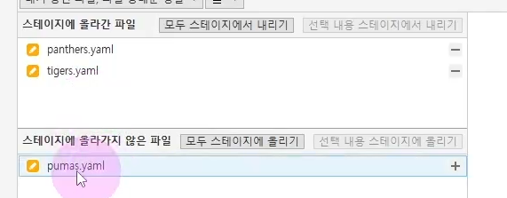

{: .highlight } 
> - `git restore --staged 파일명`
> - `git restore 파일명`
>   - git add . 후 특정 파일만 스테이지에서 빼고 싶을 때 사용하는 명령어

<br />
<br />
<br />

--- 

## git reset의 3가지 방법


{: .highlight } 
> - `git reset --hard` : working directory까지 날림
>   - `내가 고친 파일 내역 까지 모두 날림`
> - `git reset --mixed` : working directory에는 남겨둠
>   - `내가 고친 파일 내역을 살리고 add 하기전으로 돌림`
> - `git reset --soft` : Staging area에 남겨둠
>   - `내가 고친 파일 내역 살리고 add한 이루로 돌림`


<br />
<br />
<br />

--- 

## Git의 Head

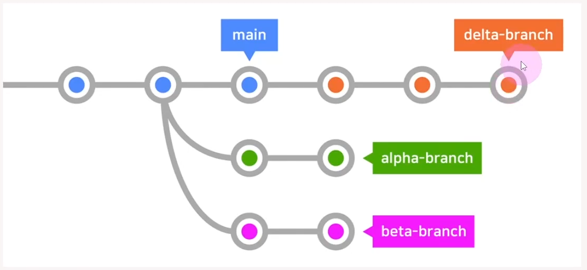

{: .highlight } 
> - `git HEAD는 현재 속한 브랜치의 가장 최신의 커밋`
>   - `git checkout`: 시간선은 그대로 둔 채 이전 커밋으로 돌아가기

<br />

```bash
# 한단계 전 커밋으로 돌아가기
git checkout Head^
# 두단계 전 커밋으로 돌아가기
git checkout Head^^
# 세단계 전 커밋으로 돌아가기
git checkout Head^^^
# 앞 커밋으로 이동 
git checkout - 
# 위 명령어로 파일의 변화를 관찰한 후 원래 브랜치로 돌아가기
git switch 원래브랜치
# 두단계 커밋으로 돌아간 뒤 리셋 적용
git reset --hard HEAD^^
```

<br />
<br />
<br />

--- 

## pull 과 fetch의 차이점


{: .highlight } 
> - `fetch` : 원격 저장소와 로컬 저장소 동기화 하기
>   - 원격 저장소의 최신 커밋을 로컬로 가져오기만 함
> - `pull` : 원격 저장소의 최신 커밋을 가져와 `merge` or `rebase` 진행

<br />

```bash
# git과 동기화
git fetch
# 원격의 main의 내용을 훌터보기만 함
git checkout origin/main
# 다시 로걸의 main으로 이동
git switch main


# 로컬과 원격의 내용 merge
git pull
```

<br />
<br />
<br />

--- 

## 원격 저장소에 있는 브랜치 가져오기

{: .highlight } 
> 원격 저장소에 있는 브랜치 가져오기

```bash
# 동기화
git fetch
# 브랜치 살펴보기
git branch -a
# 로컬에도 원격 브랜치 가져오기
git switch -t origin/브랜치명
```

<br />
<br />
<br />

--- 

## 커밋 컨벤션

- 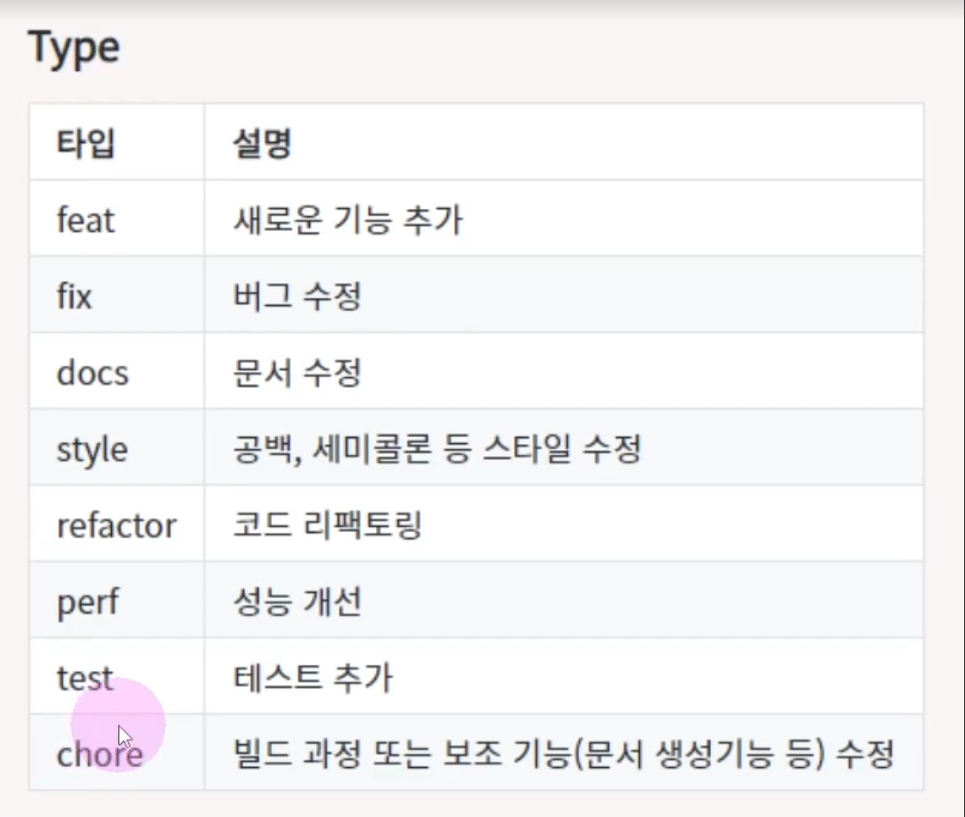
- 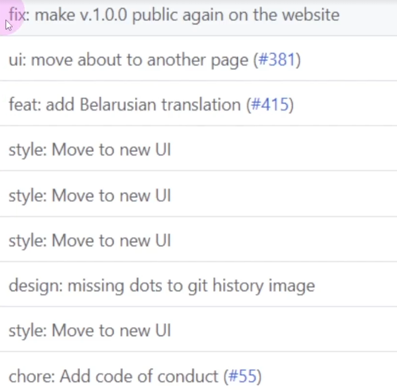

{: .highlight } 
> - 한 기능에 한가지 커밋만 넣기

<br />
<br />
<br />

--- 

## 커밋 수정하기

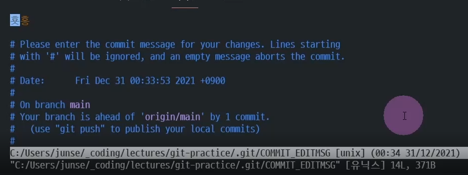

{: .highlight }
> - 전에 올린 커밋 메세지 수정하기
>   - `git commit --amend`
> - 지난 커밋에 하나의 수정 사항 추가하기
>   - `git add .` 파일 추가하기
>   - `git commit --amend` (파일 하나 추가하고 어전 커밋메세지를 변경하면서 변경사항 하나 더 추가)

<br />

```bash
## 커밋 메세지 수정하기
git commit --amend

## 이전 커밋에 하나의 변경사항 추가하기
git add .
git commit --amend -m "하나의 커밋 추가요!"
```

<br />
<br />
<br />

--- 

## 과거의 다양한 커밋을 삭제, 통합, 변경 방법

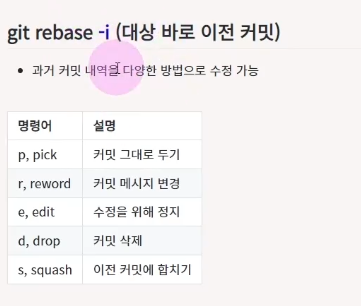

{: .highlight }
> - 과거 커밋 내역을 다양한 방법으로 수정 가능

<br />
<br />
<br />

--- 

## git에서 관리하지 않는 파일 삭제

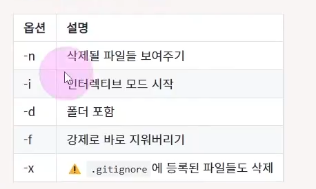

{: .highlight }
> - git에서 추적하지 않는 파일들 삭제

<br />

```bash
# 폴더를 포함해서 깃에서 추적하지 않는 파일 삭제 목록 
git clean -nd

# 하나씩 물어보면서 삭제하기
git clean -ni

# 깃 추척하지 않는 모든 파일 삭제 하기
git clean -df
```


<br />
<br />
<br />

--- 

## git에서 커밋되지 않는 변경사항 되돌리기


{: .highlight }
> - 파일 변경 사항 모두 없애기 `restore`

<br />

```bash
# 수정 사항 없애기
git restore "파일 명"
# 모든 수정 사항 없애기
git restore .
```


<br />
<br />
<br />

--- 

## git add 한 후 add 전으로 돌아가기

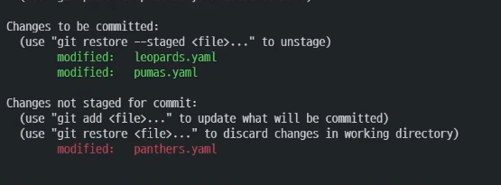

{: .highlight }
> - git add . 한 후 add 하기 전으로 돌아가는 방법
>   - `git restore --staged`
>   - git add한 후 working directory로 보내는 방법

<br />

```bash
# add 되돌리기
git restore --staged
```

<br />
<br />

--- 

## git 특정 파일만 특정 커밋으로 돌아가는 방법

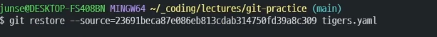

{: .highlight }
> - 특정 파일만 특정 커밋으로 돌아가기
>   - `git add / git commit 되지 않고 파일만 변경됨`
>   - git restore --soure="asdknasd02102" 파일 명

<br />

```bash
# 특정 시점으로 변경
git restore --source"23912bes113251f512" 파일명.yaml

# 특정 시점에서 다시 원상 복구
git restore .
```


<br />
<br />

--- 

## git 리셋 복구 하기

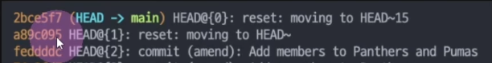

{: .highlight }
> - `reflog`를 이용해서 `reset 복구 하기`
>   - reset Head~15 한 바로 뒤의 시점을 리셋하면 리셋 전으로 돌아갈 수 있다.

<br />

```bash
# 최근 15개 리셋하기
git reset --hard HEAD~15

# 모든 커밋 목록 보기 (리셋 명령어도 볼 수 있음)
git reflog

# 15개 리셋을 하기 전 시점으로 리셋 실행
# 리셋 복구 완료
git reset --hard a89c095
```

