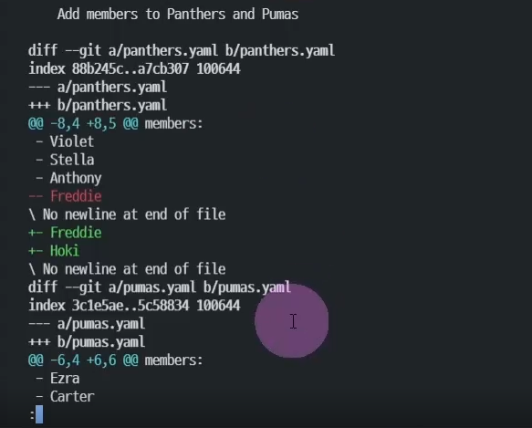
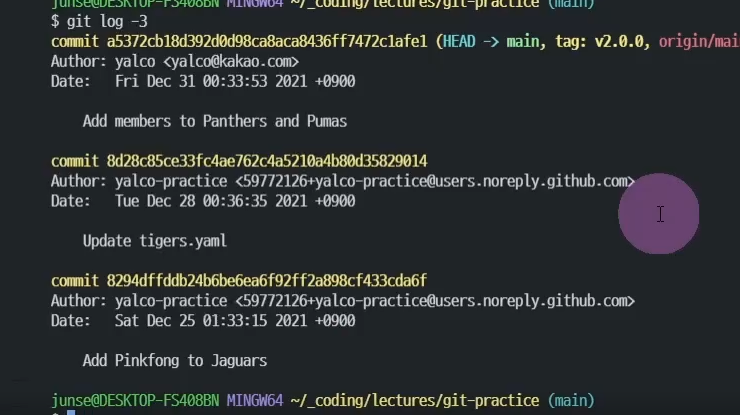
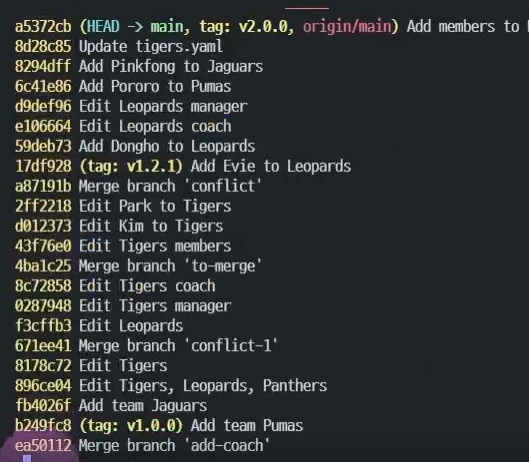
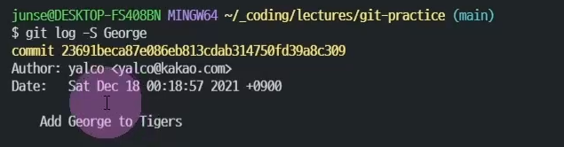
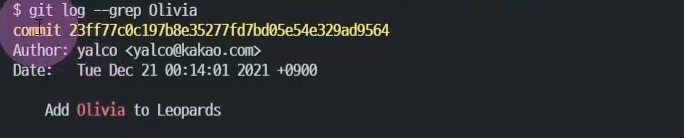
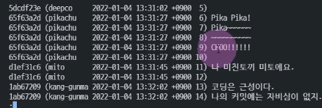
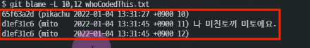

# git log debugging🎯💡🔥📌✅


<br />

## git 디버깅 하기

<br />

{: .highlight } 
> - 깃 변경내용과 함께 log 보기 
>   - `git log -p`



<br />
<br />

---

{: .highlight } 
> - 최근 n개의 커밋만 보기
>   - `git log (n)`




<br />
<br />

---

{: .highlight } 
> - git log내용 간략히 한줄로 보기
>   - `git log --oneline`



<br />
<br />

---

{: .highlight } 
> - 파일 변경 사항 중 `특정 단어`로 커밋 id 찾기
>   - `git log -S 특정 단어`



<br />
<br />

---

{: .highlight } 
> - 커밋 메제시 컨벤션으로 커밋 id 찾기
>   - `git log --grep "Docs"`



<br />
<br />

---

# git Diff 명령어 알아보기


{: .highlight } 
> - git diff : 워킹 디렉토리 변경 사항 확인
> - git stage : 스테이지의 변경 사항 확인
> - `git stage --name-only` : 스테이지에 올라가있는 변경된 파일만 확인
> - `git diff [커밋1] [커밋2]` : 커밋간의 차이점 확인하기
> - `git diff [브랜치1] [브랜치2]` : 브랜치간의 차이점 확인

<br />

```bash 
# 커밋간의 차이점 확인하기
git diff --name-only HEAD~1 HEAD~7
```

<br />
<br />

---

# git code 누가 작성했는지 알아보기 (blame)

- 
- 


{: .highlight } 
> - `git blame 파일.txt` : 누가 수정했는지 알아보는 명령어

<br />

```bash
# 특정 파일 특정 줄에 누가 어떤 수정을 했는지?
git blame -L 10,12 파일명.txt
```


<br />
<br />

---

# 오류가 난시점 찾아내기

{: .highlight } 
> - git bisect 명령어를 이용
>   - `이진 탐색 알고리즘으로 문제 발생 시점을 찾아냄`

<br />

```bash
# 이진 탐색 시작
git bisect start

# 오류를 확인하고 오류가 나면 good , 안나면 bad로 입력
git bisect bad

# 의심지점으로 이동 [커밋으로 이동]
git checkout [asd721]

# 원인을 찾을 때까지 git bisect good // git bisect bad 반복
```


