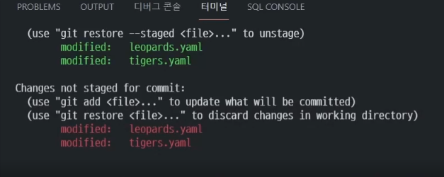
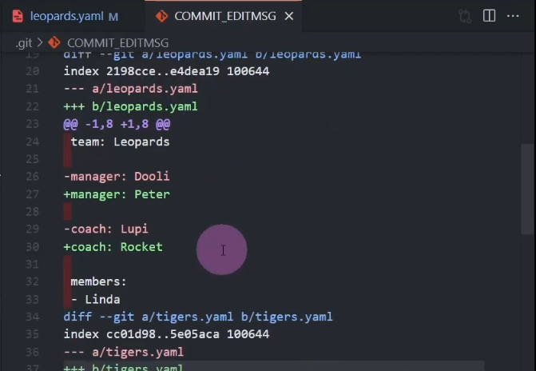
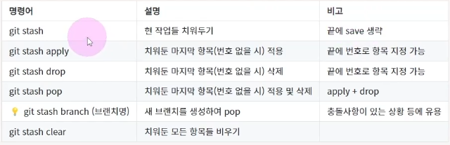
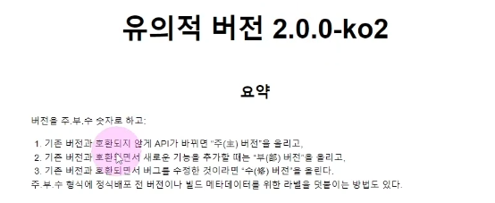

# 세심하게 커밋하기🎯💡🔥📌✅

- 
- 

<br />

{: .highlight } 
> - 한 파일 내에서도 부분부분 git add가 가능하다.
>   - 한 파일 내에서 `git add -p` 명령어 이용
>   - y,n를 통해 한 파일 내에서 변경사항 add. 구문과 add하지 않을 구문을 구별 할 수 있다.

<br />
<br />
<br />

---

## 현재 커밋에 변경사항 파악하기



{: .highlight } 
> - `git commit -v` 명령어 사용

<br />
<br />
<br />

---

## stash 사용 하기



{: .highlight } 
> - `git stash -p` : 원하는 것만 스테시 하기
> - `git stash -m` "스테이 첫번째" : 메세지와 함께 스테시 하기
> - `git stash` : " 스테시 진행"
> - `git stash` : "스테시 목록 확인"
> - `git stash pop` : 스태시 빼오기


<br />
<br />
<br />

---

## git Tag 사용하기




{: .highlight } 
> - Tag 사용 이유
>   - 특점 시점을 키워드로 저장하고 싶을 때
>   - 커밋에 버전 정보를 붙이고 싶을 때
> - ?.0.0 : 기존 버전과 api바뀌면서 호환되지 않을 때
> - 0.?.0 : 기존 버전과 호환되면서 새로운 기능 추가
> - 0.0.? : 기존 버전과 호환되면서 버그를 수정


<br />

| 태그 종류        | 설명          | 
|:-------------|:------------------|
| lightweight   | 특정 커밋을 가리키는 용도 | 
| `annotated(추천)` | 작성자 정보와 날짜,메세지,GPG 서명 포함 기능   | 

<br />


```bash
# 제일 최근 커밋에 tag 달기
git tag v2.0.0

# 태크 정보 확인하기
git tag

# 태그 삭제하기
git tag -d v2.0.0

# 태그에 설명 추가하가
git tag v2.0.0 -m "v2.0.0 태그에 설명 추가하기"

# 원하는 커밋에 태그 추가하기
git tag (태그명) (커밋 해시) -m "메세지"
git tag v1.0.0 b2949vc -m "1버전"
git tag v2.0.0 cs949vc -m "2버전"

# 1버전 만 보기 / 0버전만 보기
git tag -l "v1.*"
git tag -l "0.*"

## 원하는 버전으로 체크아웃
git checkout v1.0.0
## 원래대로 돌아가기
git swich main
```

<br />
<br />
<br />

---

## 원격의 태그 관리 하기

<br />

