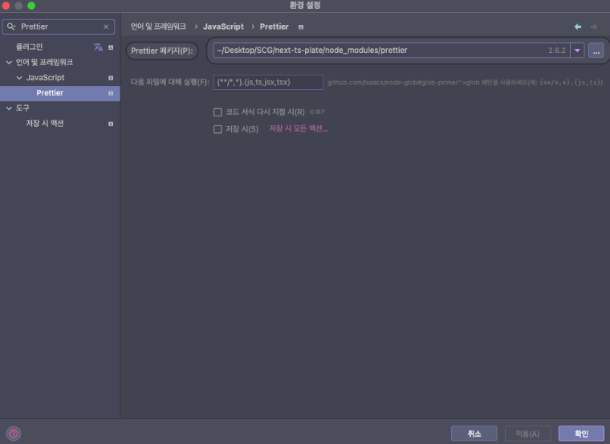
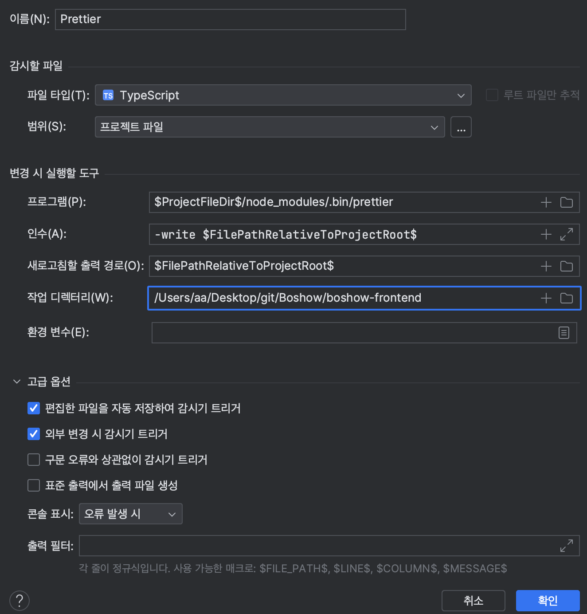
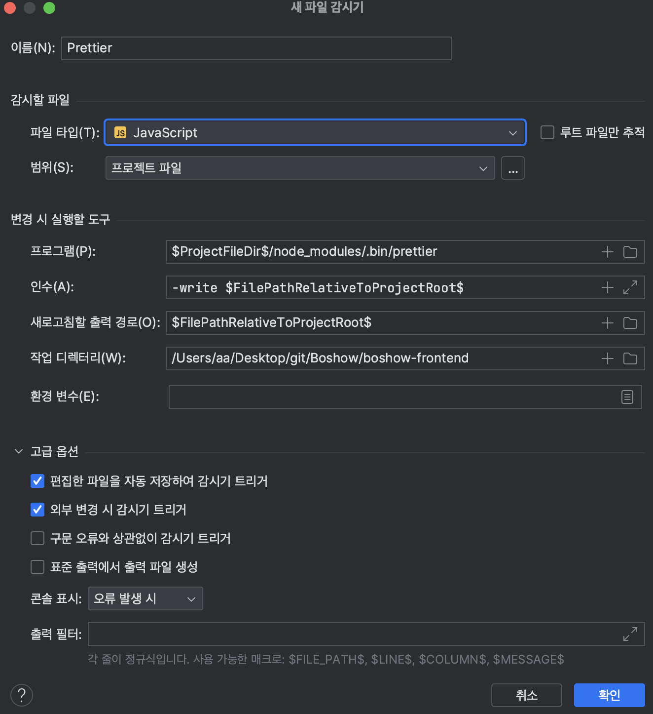
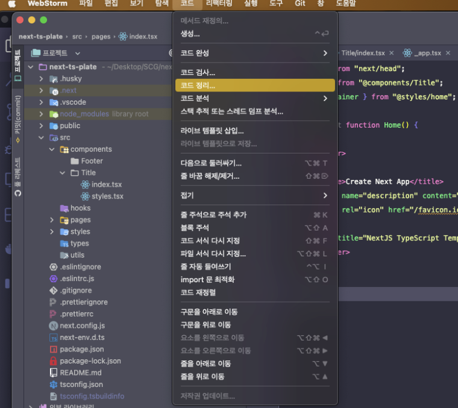
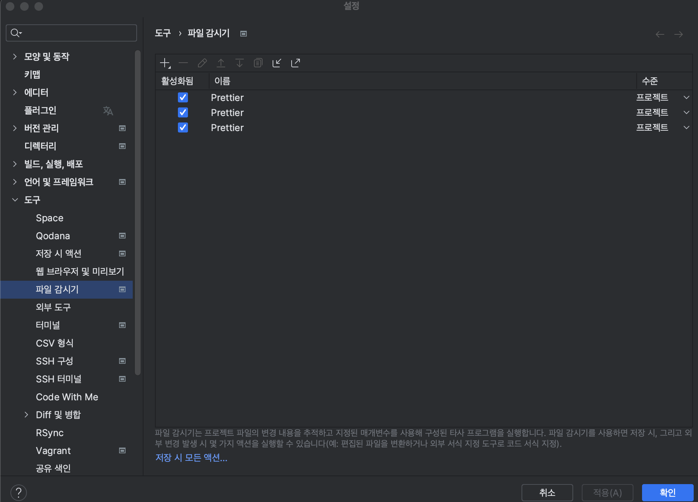
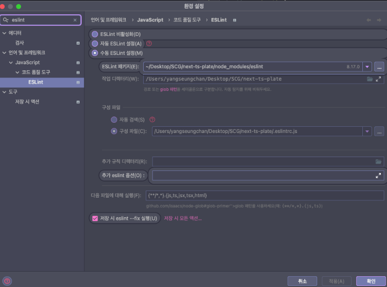

# ESLint

```
https://velog.io/@mayinjanuary/Next.js-%EC%84%B8%ED%8C%85%ED%95%98%EA%B8%B0-ESLint-Prettier-%EC%84%A4%EC%A0%95
```

<br />

{: .highlight } 
> - ESLinkt
>   - 자바스크립트에서 문법 에러를 표시해주는 도구 (`일종의 가이드라인`)
> - Prettier
>   - 정해놓은 규칙에 맞게 자동으로 정렬하여 가독성을 높이는 도구


<br />

## Airbnb EsLint , Prettier 설치하기 (1)


{: .highlight } 
> - eslint-config-airbnb 설치하기
>   - `npm info "eslint-config-airbnb@latest" peerDependencies`
>   - 위 명령어를 통해 의존성을 가진 다른 라이브러리를 선행해서 설치해야한다.

<br />

```js
$ npm info "eslint-config-airbnb@latest" peerDependencies
{ eslint: '^5.16.0 || ^6.8.0',
  'eslint-plugin-import': '^2.20.1',
  'eslint-plugin-jsx-a11y': '^6.2.3',
  'eslint-plugin-react': '^7.19.0',
  'eslint-plugin-react-hooks': '^2.5.0 || ^1.7.0' }
```

{: .highlight } 
> - 검색된 peer dependencies 들을 다 같이 설치
>   - `eslint-plugin-import` : ES6 의 import/export syntax 체크
>   - `eslint-plugin-jsx-a11y` : 리액트 element 의 접근성 이슈를 짚어 lint 해주는 플러그인
>   - `eslint-plugin-react` : 리액트 규칙들을 추가해주는 플러그인
>   - `eslint-plugin-import` : 리액트 hooks 규칙들을 추가해 주는 플러그인

<br />

```bash
$ yarn add -D eslint eslint-config-airbnb eslint-plugin-import eslint-plugin-jsx-a11y eslint-plugin-react eslint-plugin-react-hooks

$ yarn add -D @babel-eslint eslint-plugin-babel 
```


<br />
<br />

---

## Prettier 설치 (2)

{: .highlight } 
> - `eslint-config-prettier` : formatting 관련 설정 중 Prettier와 충돌하는 부분을 비활성화
> - `eslint-plugin-prettier` : 원하는 형식의 formatting 을 설정

```bash
$ yarn add -D prettier eslint-config-prettier eslint-plugin-prettier
```

<br />
<br />

---

## ESLint 설정하기 (3)

{: .highlight } 
> - root 프로젝트에서 `.eslintrc.json` 파일을 생성

<br />

```json
// .eslintrc.json

{
  // 활성화하고 싶은 환경 설정
  "env": {
    "browser": true,
    "es6": true,
    "node": true
  },
  //parser 설정
  "parser": "babel-eslint",
  //prettier , airbnb 추가
  "extends": [
    "eslint:recommended",
    "plugin:react/recommended",
    "airbnb",
    "plugin:prettier/recommended"
  ],
  "settings": {
    "react": {
      "version": "detect"
    }
  },
  "parserOptions": {
    "ecmaFeatures": {
      "jsx": true
    },
    "ecmaVersion": 2018,
    "sourceType": "module"
  },
  "plugins": ["react", "react-hooks", "prettier"],
  //1은 사용 , 0은 비사용
  "rules": {
    "react/react-in-jsx-scope": 0,
    "react/prefer-stateless-function": 0,
    "react/jsx-filename-extension": 0,
    "react/jsx-one-expression-per-line": 0,
    "no-nested-ternary": 0
  },
  "globals": {
    "React": "writable"
  }
}
```


<br />
<br />

---

## Prettier 설정하기 (4)

{: .highlight } 
> - .prettierrc 파일 생성

<br />

> .prettierrc

```json
{
    //문자열을 사용 할 때에는 " 를 사용합니다. (홑따옴표가 아닌 겹따옴표 사용)
	"singleQuote": false,
    // 코드는 ; (semi-colon)으로 끝나야합니다.
	"semi": true,
    // tab 대신에 스페이스를 사용합니다.
	"useTabs": false,
    // 들여쓰기 크기는 2칸입니다. (space 2칸)
	"tabWidth": 2,
    //객체나 배열을 작성 할 때, 원소 혹은 key-value 의 맨 뒤에있는 것에도 쉼표를 붙입니다.
	"trailingComma": "all",
    //한 줄이 80칸이 넘지 않도록 합니다
	"printWidth": 80
}
```


<br />
<br />

{: .important-title }
> - 설정 완료


<br />
<br />
<br />


---

# ESLint , Prettier webstorm에 설정하기!


```
https://velog.io/@seungchan__y/Webstorm에서-ESLint-Prettier-적용하기
```

<br />

## Prettier 설치하기

<br />

{: .highlight }
> - Prettier 경로 설정 (1)



<br />

## File watchers 설치 후 3가지 확장자에 대해 설정한다.

{: .highlight }
> - File watchers 플러그인 설치 후 `*.tsx, *.ts, *.js`에 대해 설정한다. (2)
> - 도구 > 파일 검사기
> -  Prettier 패키지의 경로를 현재 프로젝트의 node_modules 내 Prettier로 설정
> - 파일 타입인 Typescript JSX, Typescript, Javascript 각각에 대해서 아래 설정을 동일하게 적용
>   - 프로그램 : `$ProjectFileDir$/node_modules/.bin/prettier`
>   - 인수 : `-write $FilePathRelativeToProjectRoot$`
>   - 새로고침할 출력 경로 : `$FilePathRelativeToProjectRoot$`
>   - 작업 디렉터리 : `프로젝트의 루트 디렉토리`






<br />

## 마지막으로 코드 정리 한다.

{: .highlight }
> - 코드 > 코드 정리 (끝)




<br />
<br />
<br />


## ESLint

<br />

{: .highlight }
> - `webstorm > setting` : eslint 검색 
> - ✅ 수동 ESLint 설정 체크
> - ESLint 패키지에 현재 프로젝트 node_modules 에 설치된 eslint 경로를 명시
> - 작업 디렉터리에 현재 프로젝트의 루트 경로를 명시
> - 구성 파일 항목에 현재 프로젝트의 .eslintrc.js의 경로를 명시
> - 저장 시 eslint —fix 실행 옵션 체크





> code Cleanup 후 완료


<br />
<br />

## WebStorm 내장 저장 시 재정렬 기능 비활성화 (선택적)


{: .highlight }
> - WebStorm에는 내장된 코드 재정렬 기능이 있습니다. Prettier와 충돌을 피하기 위해 이 기능을 비활성화하는 것이 좋습니다.
> - Preferences (또는 Settings)에서 Editor > General > Auto Import으로 이동합니다.
"Optimize imports on the fly" 옵션의 체크를 해제합니다.

..