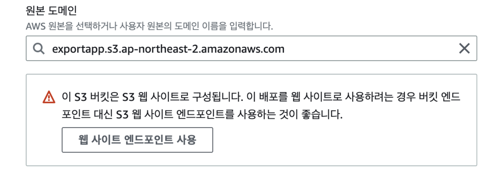
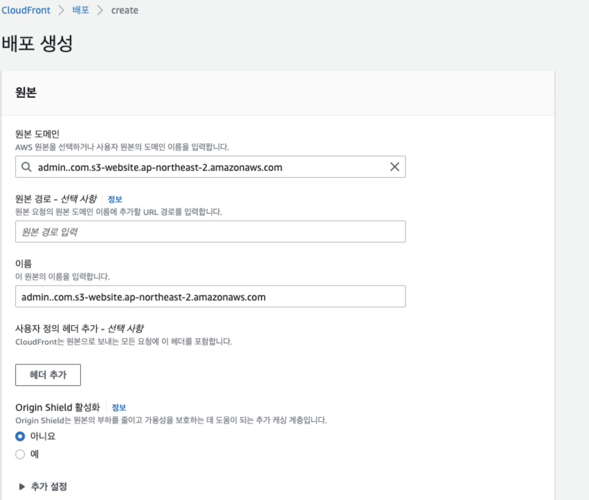
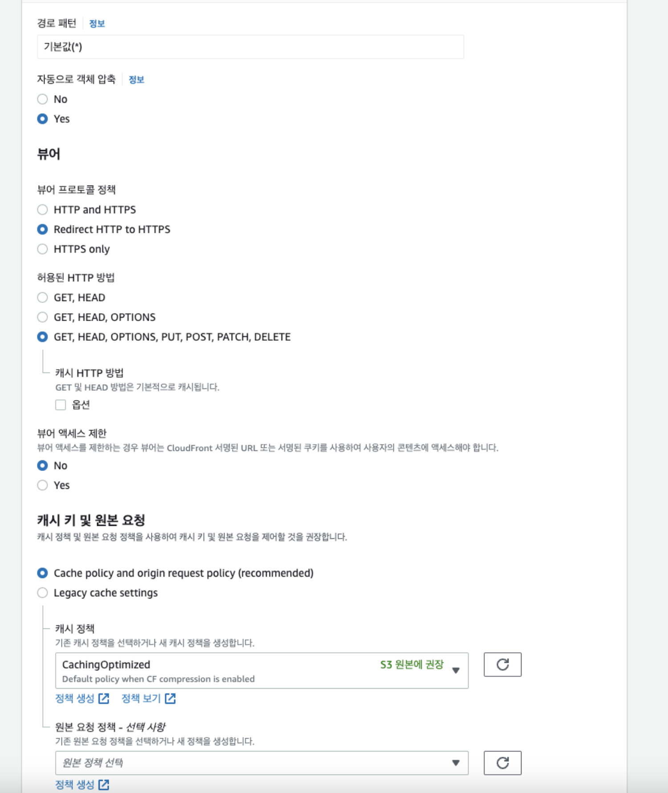
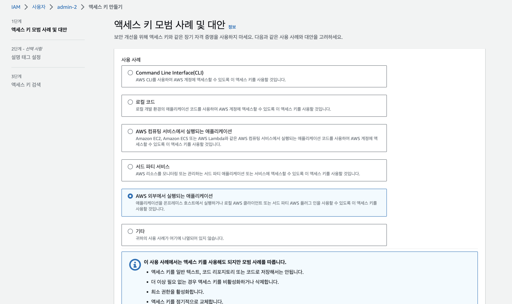
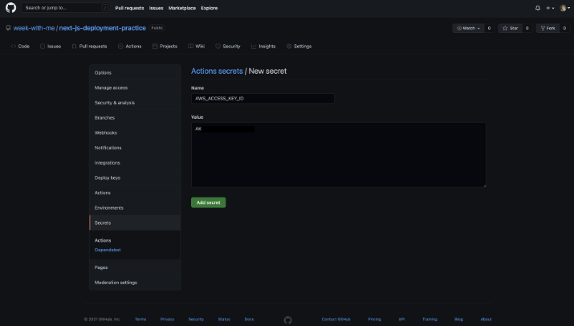
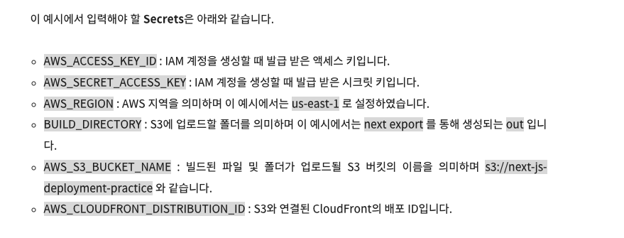

# CloudFront로 https 적용하기

<br />

{: .note }
> - `CloudFront`로 s3에 https를 적용할 수 있다.
> - S3 자체적으로는 HTTPS를 등록할 수 없다
> - `CloudFront` : 서비스하는 지역보다 훨씬 먼 거리의 유저들이 빠르게 콘텐츠를 이용할 수 있게 해줌
>   - S3 연결도 지원한다.

<br />
<br />

---

## CloudFront생성

<br />

{: .note }
> - CloudFront 배포
>   - 기존에 만든 s3선택
>   - `웹 사이트 엔드포인트 사용을 선택`
> - `버킷이름.s3.ap-northeast-2.amazonaws.com -> 버킷이름.s3-website.ap-northeast-2.amazonaws.com로 수정`
> - `뷰어` : `Redirect HTTP to HTTPS`로 선택


- 
- 
- 


<br />
<br />

{: .highlight } 
> `30분~ 6시간후에 https 적용 완료`


<br />
<br />

---

# cicd 구현 (1)


{: .note }
> - 권한 정책 추가
>   - iam에서 권한 추가 후 키 발급

<br />

- 
- 

<br />
<br />

---

# S3 자동 배포 (2)


{: .note }
> - .github/workflows/deploy.yml


<br />

```yml
name: Next.js deploy

on:
  push:
    branches: [ main ]

jobs:
  continuous-deployment:
    runs-on: ubuntu-latest
    steps:
      - name: Git Checkout
        uses: actions/checkout@v2

      - name: Use Node.js version 18.x
        uses: actions/setup-node@v1
        with:
          node-version: 18.x

      - name: Build
        run: |
          npm install -g yarn
          yarn install --frozen-lockfile
          npm run build
          yarn next export

      - name: Configure AWS credentials
        uses: aws-actions/configure-aws-credentials@v1
        with:
          aws-access-key-id: ${{ secrets.AWS_ACCESS_KEY_ID }}
          aws-secret-access-key: ${{ secrets.AWS_SECRET_ACCESS_KEY }}
          aws-region: ${{ secrets.AWS_REGION }}

      - name: Deploy to S3
        run: aws s3 sync ./${{ secrets.BUILD_DIRECTORY }} ${{ secrets.AWS_S3_BUCKET_NAME }} --delete

      - name: CloudFront Invalidate Cache
        run: aws cloudfront create-invalidation --distribution-id ${{ secrets.AWS_CLOUDFRONT_DISTRIBUTION_ID }} --paths '/*'
```


<br />
<br />

---

# gitAction Key

{: .note }
> - 노출되면 안되는 값은 gitSecret에 등록한다
>   - build_directory : `out`
>   - Bucketname : `arn:aws:s3:::12344` (ARN앞에 붙이면 안됨)
>       - `s3/12344`를 적어주면 됨
>   - cloudfront_distribution_id : `arn:awssdkasdk... /[이거를 적어주면 됨]`


<br />

- 
- 
