# Nextjs 정적 배포

 

{: .note }
> - 정적 배포를 위해 `yarn run build` -> `yarn next export` 

- 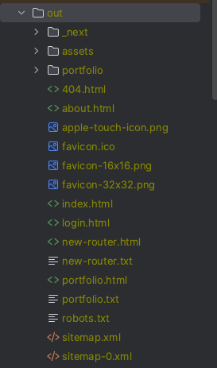

 
 

---

## S3 생성 (1)

{: .note }
> - 체크 : 현재 설정으로 인하여 이 버킷과 그 안에 포함된 객체가 퍼블릭 상태가 될 수 있음을 알고 있습니다

 

- 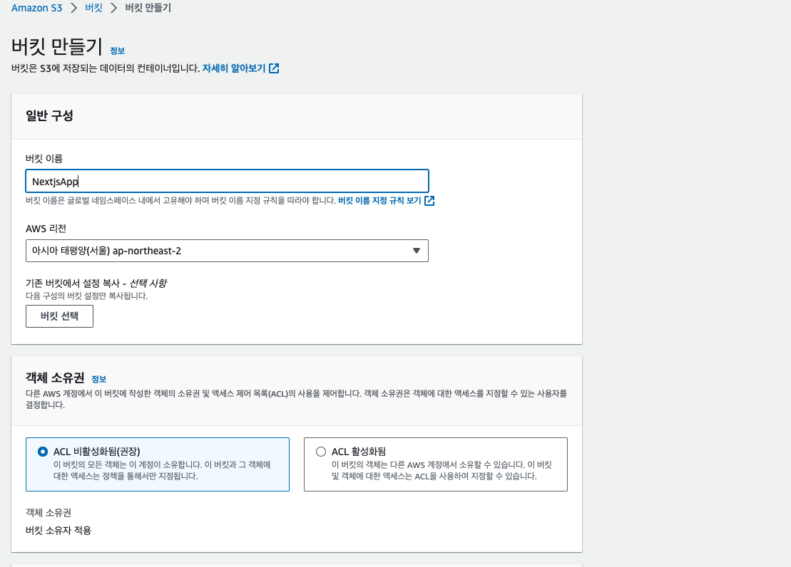
- 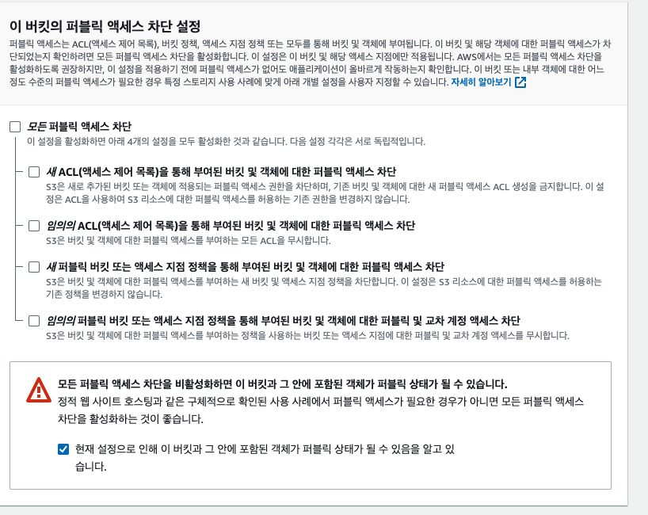
- 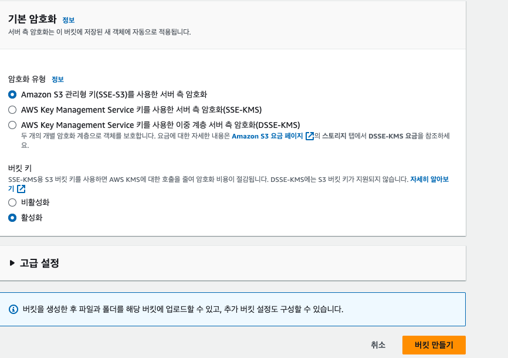
- 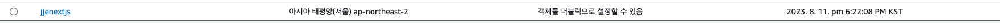

 
 

---

## S3 정적 웹 사이트 호스팅 (2)

{: .note }
> - 정적 웹 사이트 호스팅 설정
> - 객체 > 속성
> - `기본 페이지`
>   - 인덱스 문서 : `index.html`
>   - 오류 문서 : `index.html`
> - 엔드 포인트가 생김

 

- 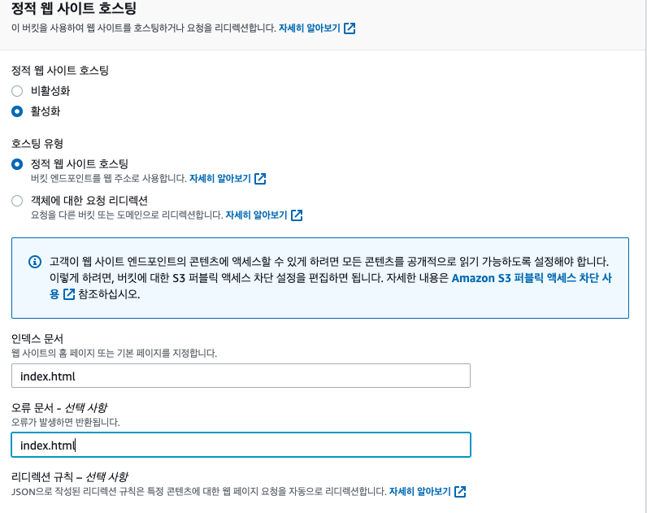
- 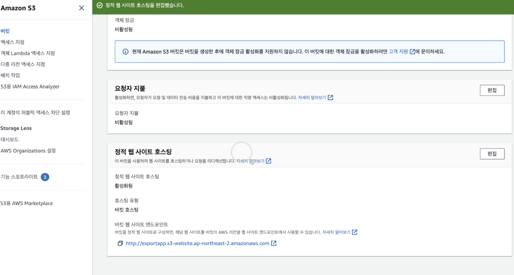

 
 

---

## S3 권한 설정 (3)

{: .note }
> - 정책 생성기 클릭
>   - 아래 이미지 처럼 똑같이 작성 `ARN만 빼고`(만든 arn 적으면 됨)
> - 정책 생성기 json 파일을 버킷 정책에 복븥
>   - `Resource: 맨뒤에 /*를 꼭 붙여 줘야 한다.!`
> - 마지막 변경 사항 저장

 

- 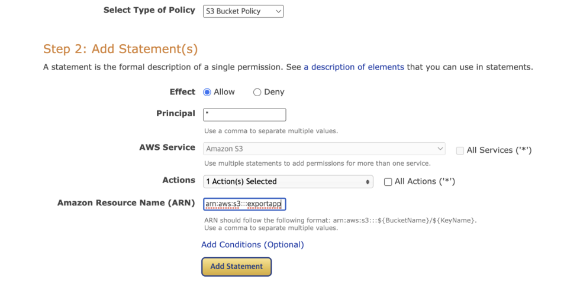
- 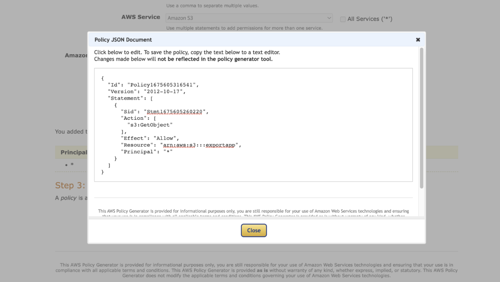
- 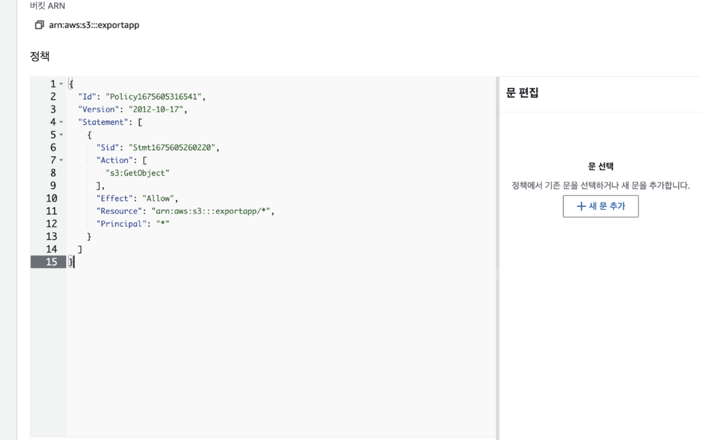
- 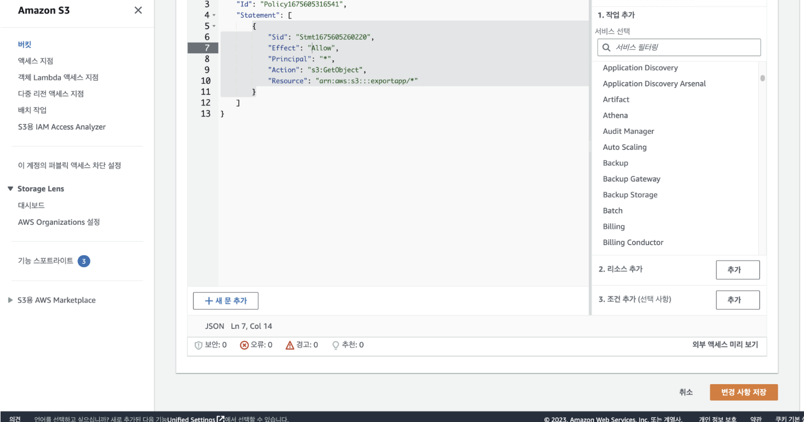

 
 

---

## S3 배포 하기 (4)

{: .note }
> - `객체 > 업로드`에 next export 한 파일을 넣어줌
> - `배포 완료`

 

- 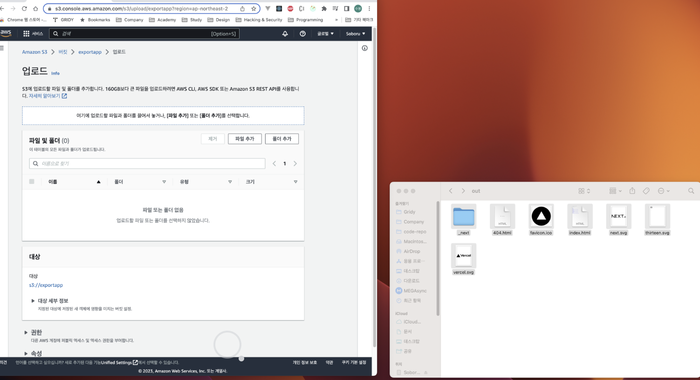